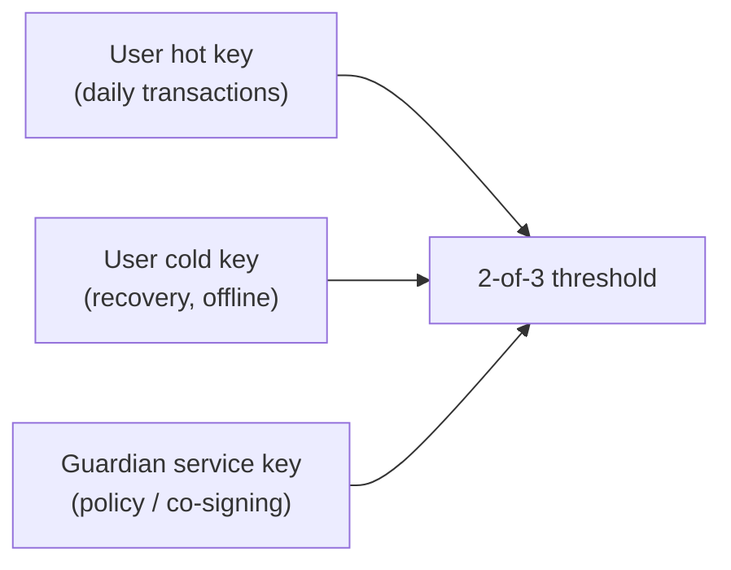
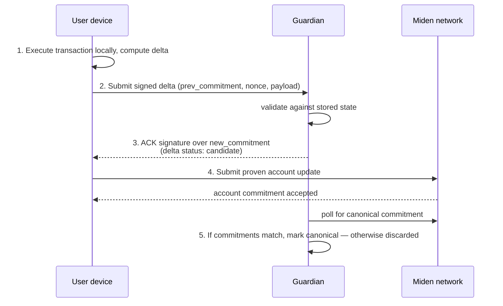
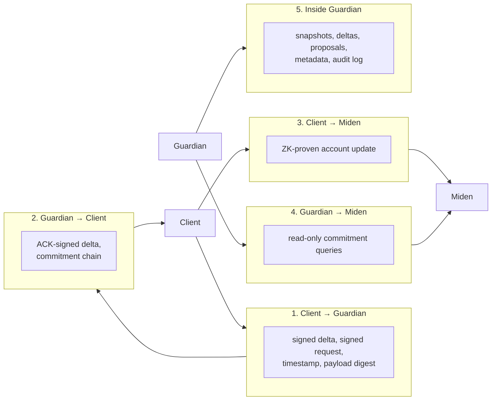
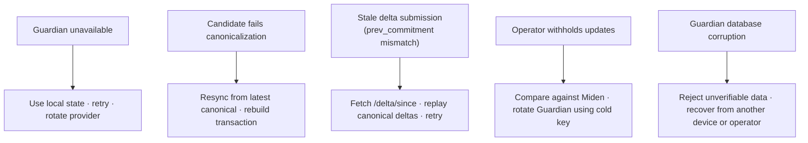

# Guardian Concepts

A conceptual introduction to Guardian. Read this **before** the architecture
docs if you are new to the system — it explains what Guardian is, what it is
*not*, and the trust model that informs every other decision in the
codebase.

For formal definitions and wire shapes, see [`spec/`](../spec/index.md). For
the module-level decomposition, see
[`docs/architecture/services.md`](./architecture/services.md).

## What Guardian is

Guardian is an **off-chain coordination service** for Miden accounts. It
stores account state snapshots and the deltas that mutate them, signs
accepted deltas with an acknowledgement key, and helps multiple clients of
the same account stay in sync.

Guardian is:

- **Non-custodial.** It never holds an account's spending key. The account
  owner does.
- **Not the source of truth.** The Miden network remains authoritative for
  account commitments. Guardian's database is a *coordination cache*, not a
  ledger.
- **Pluggable.** Server, clients, and the multisig SDK are all in this
  repository; operators can run Guardian themselves, and users can rotate
  away from any operator at any time.

## The custody spectrum

Traditional crypto custody is binary — either a full custodian holds the
key, or the user does. Guardian creates a third position by serving as one
signer in a multisig arrangement, typically:

- **Hot + Guardian** signs the everyday transaction path.
- **Cold + hot** (or **cold alone**, depending on policy) lets the user
  recover or rotate Guardian without the current Guardian's cooperation.
- **Guardian alone** can never move funds.

The reference deployment runs as exactly this kind of signer.

## State and Delta

The two primitives Guardian works with:

- **State** — a snapshot of an account at a point in time. Guardian
  tracks the account ID, current commitment, nonce, and authentication
  scheme. The full state payload is opaque to Guardian; the client
  supplies it.
- **Delta** — an append-only change to that state. Every delta
  references the previous commitment (`prev_commitment`) and produces a
  new one, forming an unbroken chain.

These mirror the definitions in
[`spec/index.md`](../spec/index.md#definitions). The supporting concepts
are:

| Term | Role |
|---|---|
| **Commitment** | Hash uniquely identifying a state version. Lets clients detect tampering. |
| **Nonce** | Monotonically increasing counter — orders deltas in the chain. |
| **Account ID** | Unique identifier; one Guardian hosts many accounts. |
| **Delta proposal** | Multi-party coordination object — sits in `pending` until threshold cosigners have signed. |
| **Acknowledgement (ACK)** | Guardian's signature over an accepted delta's new commitment. Clients verify the ACK to confirm a delta was actually accepted by the Guardian they expected. |

## Transaction lifecycle

A single transaction touches Guardian and the Miden network in five steps:

The status transitions for a delta:

| Status | Meaning |
|---|---|
| `candidate` | Guardian accepted and signed it, but the matching Miden update has not yet been observed. |
| `canonical` | Guardian observed the matching commitment on Miden. The delta is now durable for other clients of the same account. |
| `discarded` | Canonicalization failed (timeout or commitment mismatch). The delta is removed from the chain; the client must rebuild from the latest canonical state. |

This is the **canonicalization** process. The default `candidate` mode runs
a background worker that polls Miden and promotes or discards each
candidate. An `optimistic` mode promotes immediately and is appropriate
only when the client and operator trust each other absolutely (e.g.
single-tenant dev setups). See [`spec/processes.md`](../spec/processes.md#canonicalization)
for the formal state machine.

## Trust model

Guardian's trust boundaries layer up like this:

| Boundary | Protected by |
|---|---|
| Client → Guardian | Per-account Falcon/ECDSA signatures, replay protection (±5 min timestamp window + monotonic per-key timestamps), rate limits, request size limits. |
| Guardian → Client | The ACK signature on every accepted delta. Clients verify the ACK and the commitment chain before trusting returned state. |
| Client → Miden | Miden's own ZK proof verification; Guardian is not in this path. |
| Guardian → Miden | Read-only RPC; Miden does not trust Guardian for anything. |
| Inside Guardian | Backend access control, IAM scoping, infrastructure hardening — see [`docs/runbooks/secrets.md`](./runbooks/secrets.md) and [`docs/architecture/infra.md`](./architecture/infra.md). |

What this means in practice:

- **A compromised Guardian cannot steal funds.** It can refuse service or
  serve stale data, but it cannot produce a Miden-accepted update without
  the user's spending key.
- **A compromised Guardian can withhold or lie about state.** Clients are
  expected to compare against Miden before signing anything important.
- **An offline Guardian halts coordination.** Users can still execute
  locally; they just cannot sync with their other devices, and other
  cosigners cannot see their proposals.

## Client verification checklist

When integrating an SDK against a Guardian, clients **must**:

1. **Pin Guardian's pubkey** — fetch `/pubkey` once over a trusted channel
   and refuse to talk to any Guardian that returns a different key.
2. **Verify the ACK signature** on every accepted delta before treating it
   as confirmed.
3. **Validate the commitment chain** — `delta_n.new_commitment` must match
   `delta_{n+1}.prev_commitment`. A break means Guardian is lying or
   corrupted.
4. **Check freshness against Miden** before signing high-value
   transactions — match the latest canonical commitment against the
   account's commitment on-chain.
5. **Treat unexpected pubkey changes as security events.** The Guardian
   you connected to last week should be the same Guardian today. If it
   isn't, halt operations until you can confirm intentional rotation.

The Rust and TypeScript multisig SDKs perform 1–4 automatically; #5 is an
application-level decision.

## Failure and recovery

| Failure | What you see | Recovery |
|---|---|---|
| Guardian unreachable | gRPC `Unavailable` / HTTP 5xx, no ACK | Continue locally, retry; rotate operator if persistent. |
| Stale delta (`commitment_mismatch`) | `400` with `code: commitment_mismatch` | `GET /delta/since` → replay canonical chain → retry the local transaction. |
| Candidate discarded | Delta status flips `candidate` → `discarded` | Refetch state, rebuild and resubmit. Usually means the Miden proof was never submitted or the on-chain commitment diverged. |
| Operator censors / withholds | Other cosigners see stale state | Use the user's cold key to rotate Guardian; the new operator inherits canonical state from Miden. |
| Pubkey changed unexpectedly | `/pubkey` returns a key your client doesn't pin | Treat as compromise. Halt, verify rotation through an out-of-band channel. |

## Provider rotation

Because Guardian is non-custodial and Miden is the source of truth, a user
holding their cold key can switch from one Guardian operator to another
without the current operator's cooperation:

1. Stand up (or contract with) a new Guardian instance.
2. Use the cold key to re-configure the account with the new Guardian
   service key in the multisig set.
3. Point clients at the new endpoint and pubkey.

The multisig SDK's `SwitchGuardian` flow implements this. See
[`docs/MULTISIG_SDK.md`](./MULTISIG_SDK.md).

## What Guardian is *not*

To avoid confusion when reading the architecture docs:

- **Not a custodian.** Cannot move funds.
- **Not a node.** Does not validate Miden transactions. It signs *deltas*
  (off-chain state changes); Miden verifies the on-chain proof.
- **Not authoritative.** If Guardian and Miden disagree, Miden wins.
  Guardian discards mismatched candidates by design.
- **Not a TEE-only system.** Reproducible builds make TEE deployment
  *possible* but the reference deployment runs on ECS/Fargate, not in a
  TEE.
- **Not a privacy layer.** Guardian operators can see metadata (account
  IDs, timestamps, delta size, frequency). Payload privacy comes from
  Miden's ZK execution, not from Guardian.

## Where to read next

- [Local development](./LOCAL_DEV.md) — get a Guardian running locally.
- [Service architecture](./architecture/services.md) — the modules that
  implement everything above.
- [AWS deployment](./architecture/infra.md) — the reference production
  topology.
- [Troubleshooting](./TROUBLESHOOTING.md) — error codes and recovery
  playbooks.
- [`spec/`](../spec/index.md) — formal specification.
