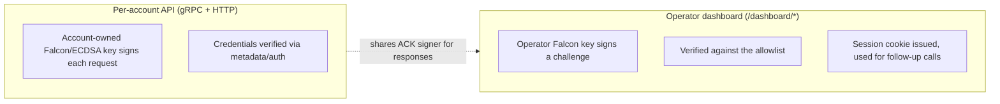
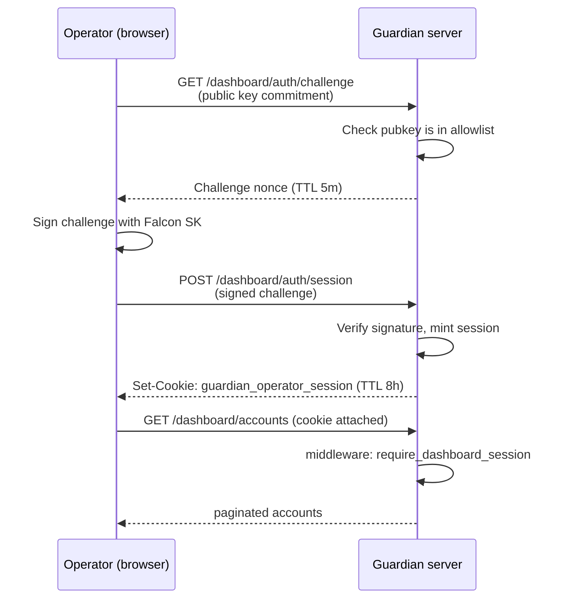

# Operator Dashboard

The operator dashboard is Guardian's read-and-administer surface for
humans. It lives in the same Guardian server process as the gRPC API but
uses a **separate auth domain** and a **separate set of HTTP routes** under
`/dashboard/*`. This doc explains the trust model, how operators enroll,
how the local smoke example wires it up, and how the permission vocabulary
is structured.

Companion docs:
- [Service architecture — Dashboard subsystem](./architecture/services.md#dashboard-subsystem)
- [Secrets runbook — Operator public keys](./runbooks/secrets.md#operator-public-keys)

## What it is

A small HTTP API + browser UI that lets a known set of operators:
- list and inspect accounts known to this Guardian
- read per-account and global delta / proposal feeds
- read account snapshots and metadata
- (gated by permission) pause/unpause accounts and write policies

It is **not** part of the per-account gRPC contract — clients of Guardian
don't talk to it. Only operators do.

## Trust model

Two auth domains coexist in the same server process:



Code references:
- Allowlist loader:
  [`crates/server/src/dashboard/allowlist.rs`](../crates/server/src/dashboard/allowlist.rs)
- Challenge/session issuance:
  [`crates/server/src/dashboard/authz.rs`](../crates/server/src/dashboard/authz.rs)
- Middleware that gates `/dashboard/*`:
  [`crates/server/src/dashboard/middleware.rs`](../crates/server/src/dashboard/middleware.rs)
- Permission vocabulary:
  [`crates/server/src/dashboard/permissions.rs`](../crates/server/src/dashboard/permissions.rs)

The dashboard never sees an account's key material and an account's
client never sees an operator's. They are separate by construction.

## Session flow



Defaults
([`crates/server/src/dashboard/config.rs`](../crates/server/src/dashboard/config.rs)):
- Challenge TTL: 5 minutes
- Session TTL: 8 hours
- Max outstanding challenges per operator: 8
- Cookie name: `guardian_operator_session`
- Pubkey-endpoint rate limit: 5 burst / 30 per minute

Sessions are **in-memory per task** and there is no ALB session
stickiness — so on multi-task deployments an operator may be routed to a
task that did not mint their session and be asked to re-authenticate.
The cookie is signed and can be validated cryptographically, but the
corresponding session record only lives in the task that minted it. A
task restart drops all sessions held by that task.

For multi-replica deployments where you want cursors to validate across
replicas, set `GUARDIAN_DASHBOARD_CURSOR_SECRET` to a 32-byte hex value
shared by every task ([`config.rs:38`](../crates/server/src/dashboard/config.rs#L38)).

## Pagination

All list endpoints
([`services/dashboard_pagination.rs`](../crates/server/src/services/dashboard_pagination.rs))
share the same query-parameter shape:

- `limit` — integer in `[1, 500]`. Default `50` when omitted or empty.
  Out-of-range or non-integer values return HTTP 400 `invalid_limit`.
- `cursor` — opaque, HMAC-signed token returned by the previous page.
  Signed with the cursor secret (see above); tampered, expired, or
  wrong-kind cursors return HTTP 400 `invalid_cursor`. Omit to start
  from the first page.

When `GUARDIAN_DASHBOARD_CURSOR_SECRET` is unset, each task generates a
random secret at startup. Cursors then become invalid the moment a
client is routed to a different task — set the env var on any
multi-replica deployment.

The global-delta feed
([`GET /dashboard/deltas`](../crates/server/src/api/dashboard_feeds.rs))
also accepts a `status` filter
([`services/dashboard_global_deltas.rs`](../crates/server/src/services/dashboard_global_deltas.rs)):

- Allowed values: `candidate`, `canonical`, `discarded` (comma-separated
  to combine, e.g. `?status=candidate,canonical`).
- Omitted or empty → all statuses.
- Duplicates within the filter are silently coalesced.
- Any other token returns HTTP 400 `invalid_status_filter`.

## Permission vocabulary

Permissions are server-defined; unknown strings are rejected at allowlist
load time so a typo surfaces explicitly
([`permissions.rs`](../crates/server/src/dashboard/permissions.rs)).

| Permission | Grants |
|---|---|
| `dashboard:read` | Read access to all `/dashboard/*` read endpoints. |
| `accounts:pause` | Pause/unpause accounts. |
| `policies:write` | Write account policies. |

Wire strings are **case-sensitive** and **must not contain whitespace** —
the parser rejects both.

> **Current scope:** `dashboard:read` gates all read endpoints today.
> `accounts:pause` and `policies:write` are reserved vocabulary — the
> allowlist parser accepts and enforces them, but the only endpoint that
> currently requires `accounts:pause` is the `/dashboard/probe` test route
> ([`dashboard/probe.rs`](../crates/server/src/dashboard/probe.rs)). The
> account-pause and policy-write features themselves are not yet shipped.

## Allowlist payload

The operator allowlist is a Secrets Manager entry whose payload is one of:

**Legacy array form** — every key implicitly gets `dashboard:read`:
```json
["0x<falcon-pubkey-a>", "0x<falcon-pubkey-b>"]
```

**Object array form** (recommended) — explicit permission sets:
```json
[
  {
    "public_key": "0x<falcon-pubkey-a>",
    "permissions": ["dashboard:read", "accounts:pause"]
  },
  {
    "public_key": "0x<falcon-pubkey-b>",
    "permissions": ["dashboard:read"]
  }
]
```

Mixed arrays of bare strings and objects are accepted; duplicate
`public_key` entries across the file are rejected.

The server resolves the allowlist *source* from one of these env vars
at startup ([`allowlist.rs:70`](../crates/server/src/dashboard/allowlist.rs#L70));
the contents are re-read per authenticated request, so adding or
removing operators does not require a task restart:

| Env var | Source |
|---|---|
| `GUARDIAN_OPERATOR_PUBLIC_KEYS_SECRET_ID` | Secrets Manager secret name or ARN (set by Terraform on the ECS task). |
| `GUARDIAN_OPERATOR_PUBLIC_KEYS_FILE` | Local JSON file path — local development only. |

## Enrolling an operator

End-to-end procedure for adding operator Alice to a deployed Guardian.

1. **Alice generates a Falcon keypair** on a trusted device (the same
   keypair format the multisig SDK and the smoke example use; the
   `examples/operator-smoke-web` README has a UI for this).
2. Alice gives the public key (hex `0x…`) to the deploying operator.
3. **Deployer updates the allowlist**:
   - Terraform-managed: append to `guardian_operator_public_keys` and
     redeploy (see [Secrets runbook](./runbooks/secrets.md#adding-or-removing-an-operator)).
   - Externally-managed: `aws secretsmanager update-secret` with the new
     payload — no ECS restart required.
4. **Alice logs in** — challenge → sign → session. The change takes
   effect on her next request; the server refreshes the allowlist on
   every challenge issuance and every authenticated `/dashboard/*` call
   ([`dashboard/state.rs:103-108`](../crates/server/src/dashboard/state.rs#L103),
   [`dashboard/state.rs:284-324`](../crates/server/src/dashboard/state.rs#L284)).

### Removing or revoking an operator

Same shape, no restart:
1. Update the secret payload to drop or change Alice's entry.
2. Effect is immediate — the next challenge or authenticated request
   from any task reloads the allowlist and rejects the removed key.
   Currently-active sessions for the revoked operator are rejected at
   their next authenticated call (the per-request reload catches them).

## Local development

Use [`examples/operator-smoke-web`](../examples/operator-smoke-web) — it
runs a browser harness that exercises challenge issuance, signed-session
issuance, and the account listing endpoints against either a local server
or a remote Guardian.

Run a local Guardian with a file-based allowlist:
```bash
cat > /tmp/operators.json <<'EOF'
[{ "public_key": "0x<your-falcon-pubkey>",
   "permissions": ["dashboard:read", "accounts:pause"] }]
EOF

GUARDIAN_OPERATOR_PUBLIC_KEYS_FILE=/tmp/operators.json \
GUARDIAN_STORAGE_PATH=/tmp/guardian-storage \
GUARDIAN_METADATA_PATH=/tmp/guardian-metadata \
  cargo run --bin server
```

Then in another shell, follow the
[`examples/operator-smoke-web`](../examples/operator-smoke-web) README to
point the harness at `http://localhost:3000`. The
`smoke-test-operator-dashboard` skill drives this end-to-end.

## Storage-mode caveats

The dashboard surfaces a few aggregates (account counts, global feeds)
that are cheap on Postgres but expensive on the filesystem backend. The
server has a defensive cap: above
`DEFAULT_FILESYSTEM_AGGREGATE_THRESHOLD` (1,000 accounts by default,
[`config.rs:16`](../crates/server/src/dashboard/config.rs#L16)),
cross-account aggregates on filesystem deployments may return a degraded
marker rather than a count. This is intentional — filesystem mode is a
dev convenience, not a production backend. See
[Storage modes](./architecture/services.md#storage-modes).

## Operations checklist

When standing up the dashboard for a new stack:

- [ ] Decide Terraform-managed or externally-managed allowlist.
- [ ] Add at least one operator with `dashboard:read` before shipping —
      otherwise the dashboard is unreachable.
- [ ] Set `GUARDIAN_ENVIRONMENT` for the stack
      (`mainnet` / `testnet` / `staging`) — surfaced on
      `GET /dashboard/info`.
- [ ] If running ≥2 ECS tasks, pin
      `GUARDIAN_DASHBOARD_CURSOR_SECRET` to a shared 32-byte hex value.
- [ ] Verify a fresh challenge → session round trip from the smoke
      example before considering the deploy live.
