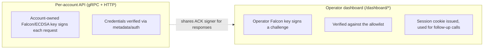
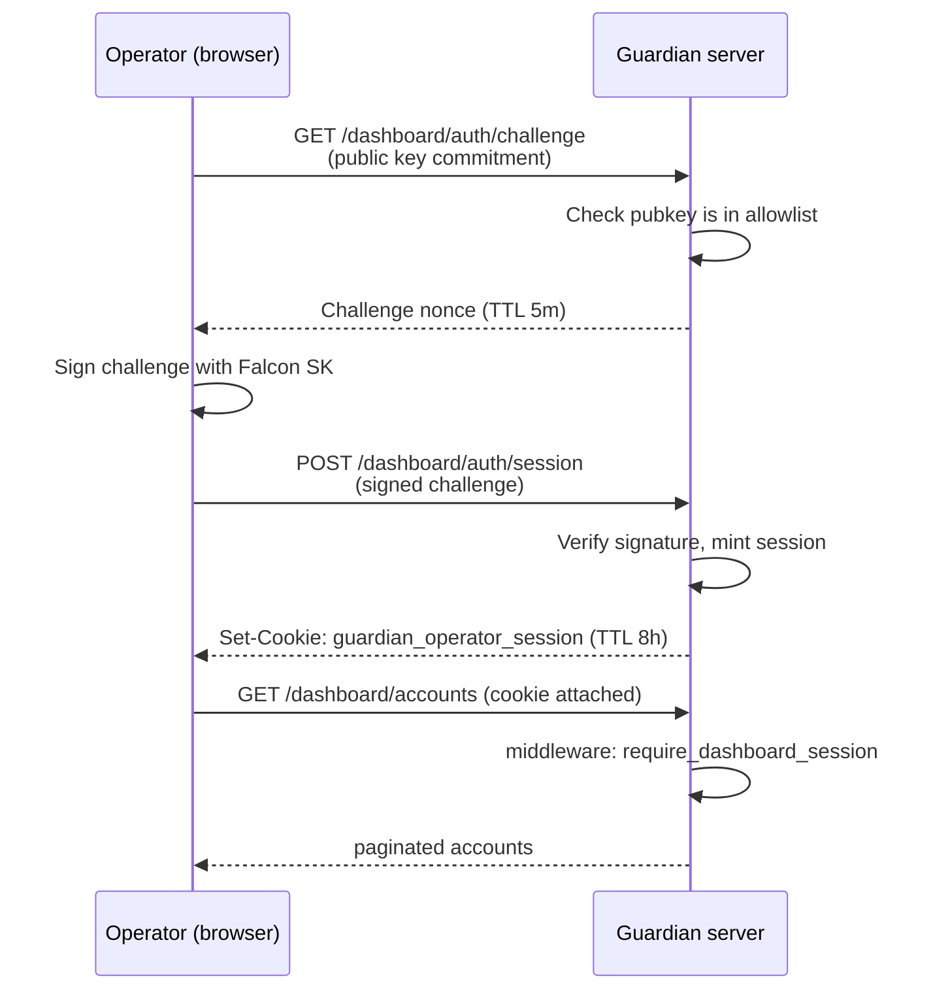

# Operator Dashboard

The operator dashboard is Guardian's read-and-administer surface for
humans. It lives in the same Guardian server process as the gRPC API but
uses a **separate auth domain** and a **separate set of HTTP routes** under
`/dashboard/*`. This doc explains the trust model, how operators enroll,
how the local smoke example wires it up, and how the permission vocabulary
is structured.

Companion docs:
- [Service architecture — Dashboard subsystem](./architecture/services.md#dashboard-subsystem)
- [Secrets runbook — Operator public keys](./runbooks/secrets.md#operator-public-keys)

## What it is

A small HTTP API + browser UI that lets a known set of operators:
- list and inspect accounts known to this Guardian
- read per-account and global delta / proposal feeds
- read account snapshots and metadata
- (gated by permission) pause/unpause accounts

It is **not** part of the per-account gRPC contract — clients of Guardian
don't talk to it. Only operators do.

## Trust model

Two auth domains coexist in the same server process:


```mermaid
flowchart LR
  subgraph PerAccount["Per-account API (gRPC + HTTP)"]
    A1["Account-owned Falcon/ECDSA key signs each request"]
    A2["Credentials verified via metadata/auth"]
  end

  subgraph Operator["Operator dashboard (/dashboard/*)"]
    B1["Operator Falcon key signs a challenge"]
    B2["Verified against the allowlist"]
    B3["Session cookie issued, used for follow-up calls"]
  end

  PerAccount -. shares ACK signer for responses .-> Operator
```

Code references:
- Allowlist loader:
  [`crates/server/src/dashboard/allowlist.rs`](../crates/server/src/dashboard/allowlist.rs)
- Challenge/session issuance:
  [`crates/server/src/dashboard/authz.rs`](../crates/server/src/dashboard/authz.rs)
- Middleware that gates `/dashboard/*`:
  [`crates/server/src/dashboard/middleware.rs`](../crates/server/src/dashboard/middleware.rs)
- Permission vocabulary:
  [`crates/server/src/dashboard/permissions.rs`](../crates/server/src/dashboard/permissions.rs)

The dashboard never sees an account's key material and an account's
client never sees an operator's. They are separate by construction.

## Session flow


```mermaid
sequenceDiagram
  participant O as Operator (browser)
  participant S as Guardian server
  O->>S: GET /dashboard/auth/challenge<br/>(public key commitment)
  S->>S: Check pubkey is in allowlist
  S-->>O: Challenge nonce (TTL 5m)
  O->>O: Sign challenge with Falcon SK
  O->>S: POST /dashboard/auth/session<br/>(signed challenge)
  S->>S: Verify signature, mint session
  S-->>O: Set-Cookie: guardian_operator_session (TTL 8h)
  O->>S: GET /dashboard/accounts (cookie attached)
  S->>S: middleware: require_dashboard_session
  S-->>O: paginated accounts
```

Defaults
([`crates/server/src/dashboard/config.rs`](../crates/server/src/dashboard/config.rs)):
- Challenge TTL: 5 minutes
- Session TTL: 8 hours
- Max outstanding challenges per operator: 8
- Cookie name: `guardian_operator_session`
- Per-commitment auth budget: 6 burst / 30 per minute, partitioned by
  `GUARDIAN_MAX_REPLICAS` in multi-replica deployments

Session records use the configured coordination backend. Postgres-backed
deployments share sessions across replicas, so ALB stickiness is not required
and task replacement does not invalidate an unexpired session. Filesystem-backed
development uses the in-memory coordination backend and remains single-process.

For multi-replica deployments where you want cursors to validate across
replicas, set `GUARDIAN_DASHBOARD_CURSOR_SECRET` to a 32-byte hex value
shared by every task ([`config.rs:38`](../crates/server/src/dashboard/config.rs#L38)).

## Pagination

All list endpoints
([`services/dashboard_pagination.rs`](../crates/server/src/services/dashboard_pagination.rs))
share the same query-parameter shape:

- `limit` — integer in `[1, 500]`. Default `50` when omitted or empty.
  Out-of-range or non-integer values return HTTP 400 `invalid_limit`.
- `cursor` — opaque, HMAC-signed token returned by the previous page.
  Signed with the cursor secret (see above); tampered, expired, or
  wrong-kind cursors return HTTP 400 `invalid_cursor`. Omit to start
  from the first page.

When `GUARDIAN_DASHBOARD_CURSOR_SECRET` is unset, each task generates a
random secret at startup. Cursors then become invalid the moment a
client is routed to a different task — set the env var on any
multi-replica deployment.

The global-delta feed
([`GET /dashboard/deltas`](../crates/server/src/api/dashboard_feeds.rs))
also accepts a `status` filter
([`services/dashboard_global_deltas.rs`](../crates/server/src/services/dashboard_global_deltas.rs)):

- Allowed values: `candidate`, `canonical`, `retained`, `discarded`
  (comma-separated to combine, e.g. `?status=candidate,canonical`).
- Omitted or empty → all statuses.
- Duplicates within the filter are silently coalesced.
- Any other token returns HTTP 400 `invalid_status_filter`.

Present `retained` rows as **"Unresolved / account unlocked"**, never as
failed: the guardian stopped actively verifying and released the account
slot, but the on-chain outcome is still uncertain and background
reconciliation may promote the row to `canonical` until its retention
TTL expires. The triage fields:

- `status_reason` (feed + detail): why the row left the active candidate
  path — `retry_exhausted` / `diverged` on `retained` rows (a `diverged`
  row that later reconciles is direct evidence the divergence verdict
  was spurious), `client_abandoned` on `discarded` rows.
- `retained_expires_at` (detail): when the recovery net gives up for
  good. Retained age is `now − status_timestamp`.
- `base_matches_stored_state` (detail): whether the row still chains
  from the stored account state; `false` means it is structurally
  obsolete and can only age out.
- The latest reconciliation activity is in the worker logs as stable
  `event=reconcile_*` records (see TROUBLESHOOTING.md).

`GET /dashboard/info` exposes the reconciliation settings
(`retained_ttl_seconds`, `reconcile_interval_seconds`,
`reconcile_page_size`) so operators can tell why retained rows are or
are not being reconsidered — note that individual accounts back off as
their recoverable rows age, so a retained row being probed less often
than the configured interval is expected.

## Aggregate stats

`GET /dashboard/stats` (issue #371) answers the two questions the
cross-operator dashboard asks of every Guardian — *how many accounts of
what kind* and *what assets are under guard* — in **one request**. Before
it existed the dashboard walked the full account list and fetched one
snapshot per recently-updated account (≈1,100 requests per refresh on a
2,400-account server), which the code-default HTTP rate limits cut off.

The response carries:

- `accounts` — unfiltered counts: `total`, mutually exclusive
  `by_lifecycle` (`released` if `released_at` is set, else `paused` if
  `paused_at` is set, else `active`), `by_auth_method`,
  `by_auth_method_and_signer_count` (so a consumer can reproduce its own
  account-shape heuristics without Guardian claiming what client a shape
  belongs to), and `updated_within_7d` / `updated_within_30d` anchored to
  `as_of`.
- `assets` — Miden vault totals over *eligible* accounts: fungible base
  units per `faucet_id` as **base-10 decimal strings** (sums are computed
  in 128-bit and may exceed `u64` / JavaScript safe integers) and
  non-fungible counts per `faucet_id`. No decimals normalization, token
  metadata, pricing, or fiat valuation — those stay consumer concerns.
- Coverage: `eligible`, `covered`, `skipped` (by stable reason —
  `state_unavailable` for a missing state row, `state_undecodable` for a
  row that does not decrypt or does not deserialize) and `complete`.
  `covered + Σskipped == eligible` always holds, and any skipped account
  makes `complete: false`. A missing or corrupt state is never reported
  as a zero balance.
- `as_of` and `version` of the published snapshot, the echoed
  `updated_since` (or `null`), and the configured
  `refresh_interval_seconds`. `accounts` and `assets` are published
  atomically, so there is no partial-degradation marker on this
  endpoint; the inventory aggregates the same walk feeds into
  `/dashboard/info` report their degradation there.

`?updated_since=<RFC3339>` restricts the **asset** aggregate to accounts
whose metadata `updated_at` — the same value `GET /dashboard/accounts`
exposes as `updated_at` — is `>=` the cutoff. Account counts are always
unfiltered. A blank value is treated as absent; anything else that is
not RFC3339 is `400 invalid_timestamp`. Percent-encode the value: a
literal `+` in a UTC offset decodes as a space and is rejected, so send
`2026-09-04T00:00:00Z` or `...%2B00:00`. Eligibility is Miden-only: EVM
accounts have no Miden vault and never count as eligible or skipped.
Lifecycle does not affect eligibility (a paused or released account's
vault is still under guard).

### One published snapshot per fleet

The aggregate is computed by **one replica** and read by all of them, so
requests routed to different replicas never disagree on totals or
`as_of`:

- The holder of the `dashboard_stats` row in `worker_leases` (the same
  lease mechanism as the canonicalization worker, with its own lease
  name) walks the inventory and publishes the result to the shared
  store — the `dashboard_stats_snapshots` / `dashboard_stats_control`
  tables on Postgres, an in-process store on the filesystem backend.
  Publication is fenced: it validates the lease inside the same
  transaction as the write and refuses to overwrite a snapshot
  published under a newer fence token, so a holder that lost leadership
  mid-walk can never replace a newer result. When storage encryption is
  configured (`GUARDIAN_STORAGE_ENCRYPTION_KEY` or its Secrets Manager
  counterpart) the published payload — a copy of every account's vault
  totals — is sealed with the same cipher as `states.state_json`, bound
  to its publication version, so the snapshot never widens the at-rest
  boundary. The snapshot is derived data: a stored row the cipher cannot
  open (plaintext from before encryption was enabled, a retired key id,
  a restore under different key material, a corrupt payload) is ignored
  and replaced by the next walk rather than pinning every replica to
  it.
- Every replica polls the store's head version every 5 seconds and
  loads a new publication into memory. Requests read only that copy:
  no storage reads, no vault decoding, and an `updated_since` cutoff
  folds at most one 256-record prefix block on top of precomputed
  cumulative aggregates, so per-request work does not grow with the
  inventory.
- Requests that straddle a publication may observe different versions
  (`version` tells them apart); the shared snapshot removes the
  differences that independent per-replica refresh schedules would
  cause.

### Freshness

The lease holder starts a new walk every
`GUARDIAN_DASHBOARD_STATS_REFRESH_INTERVAL_SECS` (default **300 s**;
this revises the original 60-second target of issue #371 FR-7) after the
previous publication, or sooner when an operator requests one. The
interval is **not** a bound on snapshot age: a slow walk publishes when
it finishes, and a walk that fails at any systemic storage read
(metadata listing, a batched state pull, a key-provider failure, or
every previously decodable state suddenly failing to decode) leaves the
previous snapshot published, increments
`guardian_dashboard_stats_refresh_failures_total`, releases the lease so
a healthy replica can take over on its next tick, and is retried by
this replica only after a 60-second backoff. `as_of` is therefore
the only truthful age signal; the last successful one is exported as
`guardian_dashboard_stats_refresh_timestamp_seconds` and the walk
duration as `guardian_dashboard_stats_refresh_duration_seconds`. Until
the first publication after a fresh deployment the endpoint returns
`503 data_unavailable` (retryable) rather than zeros.

### Operator-triggered refresh

`POST /dashboard/stats/refresh` (requires the `stats:refresh`
permission) asks the lease holder for an out-of-cycle walk and returns
`202 Accepted` with `status: "queued"` (also when a request was already
pending) or `status: "in_progress"` (a walk started within the last two
minutes is running; nothing is duplicated), plus `current_as_of` so the caller can poll
`GET /dashboard/stats` for a newer value. Accepted requests are spaced by
a 60-second cooldown that is **fleet-wide, not per operator** (the
walk it triggers is shared work); a request inside it is refused with
`429 rate_limit_exceeded` and a `Retry-After` header. Automatic and
operator-triggered refreshes share the same lease and control row, and
every request writes a `stats.refresh` audit event.

### Bounded walk cost

The walk reads metadata in one in-memory snapshot (filesystem) or in
indexed pages of 200 (Postgres), batch-pulls the Miden accounts' states
in chunks of 200, and decodes a vault only when its state commitment
differs from the previous snapshot; only successful decodes are reused,
so a repaired blob is picked up on the next walk. A failed batch is
retried one account at a time so a single corrupt or undecryptable row
becomes explicit `state_undecodable` coverage while a systemic failure
aborts the walk. Decoding runs on Tokio's blocking pool, and the lease
is renewed every 15 seconds while a walk runs (60-second TTL, so a
crashed holder is replaced within a minute).

### Relationship to `/dashboard/info`

Every cross-account aggregate on `/dashboard/info` —
`total_account_count`, `accounts_by_auth_method`, `delta_status_counts`,
`in_flight_proposal_count`, and `latest_activity` — is served from the
same published snapshot, and the response reports its time as
`aggregates_as_of`. The two endpoints therefore never contradict each
other, the per-method counts always sum to the total, and the old
filesystem inventory threshold no longer degrades those fields on its
own: the walk applies the threshold to the fan-out aggregates it reads
and lists anything it declined or failed to compute in
`degraded_aggregates`, keeping the fields it did get. Until the first
publication the snapshot-served aggregates are all listed as degraded
(the live account count is still returned). This deliberately trades
freshness — Postgres used to compute the delta and proposal aggregates
live — for one consistent cached overview.

The operator client exposes `getDashboardStats({ updatedSince })` and
`requestDashboardStatsRefresh()`, and `examples/operator-smoke-web` has
buttons for the unfiltered, 7-day, invalid-cutoff, and refresh paths.

## Permission vocabulary

Permissions are server-defined; unknown strings are rejected at allowlist
load time so a typo surfaces explicitly
([`permissions.rs`](../crates/server/src/dashboard/permissions.rs)).

| Permission | Grants |
|---|---|
| `dashboard:read` | Read access to all `/dashboard/*` read endpoints. |
| `accounts:pause` | Pause/unpause accounts. |
| `policies:write` | Reserved for future policy writes — no endpoint currently requires it. |
| `stats:refresh` | Request an out-of-cycle refresh of the `/dashboard/stats` aggregate (`POST /dashboard/stats/refresh`, issue #371). |

Wire strings are **case-sensitive** and **must not contain whitespace** —
the parser rejects both.

> **Current scope:** `dashboard:read` gates all read endpoints.
> `accounts:pause` gates the pause/unpause endpoints (see [Account
> pausing](#account-pausing) below). `policies:write` is reserved
> vocabulary — accepted by the allowlist parser but no endpoint requires
> it yet.

## Account pausing

Operators holding `accounts:pause` can halt and resume an account's
state-changing operations. While paused, the server rejects calls on
the state-transition, proposal, and EVM mutation paths
(`PushDelta`, `PushDeltaProposal`, `SignDeltaProposal`, and the
matching EVM proposal/session operations) with `409 GUARDIAN_ACCOUNT_PAUSED`
and gRPC `FailedPrecondition`
([`error.rs:97-101`](../crates/server/src/error.rs#L97)). Read endpoints
and `ConfigureAccount` remain available so an account can be
reconfigured while paused.

| Route | Permission | Body |
|---|---|---|
| `POST /dashboard/accounts/{id}/pause` | `accounts:pause` | `{ "reason": "<non-empty string>" }` — required and validated. |
| `POST /dashboard/accounts/{id}/unpause` | `accounts:pause` | `{ "reason": "<optional string>" }` — optional. |

Both endpoints are **idempotent**: pausing an already-paused account or
unpausing a not-paused account succeeds without state change. Each
transition is recorded in the audit log with the operator's commitment,
the timestamp, and the supplied reason
([`services/pause_account.rs`](../crates/server/src/services/pause_account.rs),
[`services/unpause_account.rs`](../crates/server/src/services/unpause_account.rs)).

Pause state lives in the account metadata (`paused_at`,
`paused_reason`) — survives task restarts and follows the account across
multi-stack deploys that share metadata storage.

When a paused account is touched by a write path (`PushDelta`,
`SignDeltaProposal`, `PushDeltaProposal`, …), the server returns
`GUARDIAN_ACCOUNT_PAUSED` with the original `paused_reason` in the
response body. See
[`TROUBLESHOOTING.md`](./TROUBLESHOOTING.md#error-code-reference).

## Allowlist payload

The operator allowlist is a Secrets Manager entry whose payload is one of:

**Legacy array form** — every key implicitly gets `dashboard:read`:
```json
["0x<falcon-pubkey-a>", "0x<falcon-pubkey-b>"]
```

**Object array form** (recommended) — explicit permission sets:
```json
[
  {
    "public_key": "0x<falcon-pubkey-a>",
    "permissions": ["dashboard:read", "accounts:pause"]
  },
  {
    "public_key": "0x<falcon-pubkey-b>",
    "permissions": ["dashboard:read"]
  }
]
```

Mixed arrays of bare strings and objects are accepted; duplicate
`public_key` entries across the file are rejected.

> **Terraform-managed allowlists are limited to the legacy array form.**
> The `guardian_operator_public_keys` variable is typed `list(string)`
> and Terraform writes `jsonencode(...)` of the list verbatim
> ([`infra/operator_secrets.tf:12`](../infra/operator_secrets.tf#L12)),
> so every entry implicitly gets `dashboard:read` only. To grant
> `accounts:pause` you must use the object form via a file
> (`GUARDIAN_OPERATOR_PUBLIC_KEYS_FILE`) or an externally managed
> secret referenced by `guardian_operator_public_keys_secret_arn`.

The server resolves the allowlist *source* from one of these env vars
at startup ([`allowlist.rs:70`](../crates/server/src/dashboard/allowlist.rs#L70));
the contents are re-read per authenticated request, so adding or
removing operators does not require a task restart:

| Env var | Source |
|---|---|
| `GUARDIAN_OPERATOR_PUBLIC_KEYS_SECRET_ID` | Secrets Manager secret name or ARN (set by Terraform on the ECS task). |
| `GUARDIAN_OPERATOR_PUBLIC_KEYS_FILE` | Local JSON file path: local development, or self-managed deployments without Secrets Manager ([production guide](./guides/production/README.md#track-b-self-managed-docker-image-no-aws)). |

## Enrolling an operator

End-to-end procedure for adding operator Alice to a deployed Guardian.

1. **Alice generates a Falcon keypair** on a trusted device (the same
   keypair format the multisig SDK and the smoke example use; the
   `examples/operator-smoke-web` README has a UI for this).
2. Alice gives the public key (hex `0x…`) to the deploying operator.
3. **Deployer updates the allowlist**:
   - Terraform-managed: append the bare key to
     `guardian_operator_public_keys` and redeploy (see [Secrets
     runbook](./runbooks/secrets.md#adding-or-removing-an-operator)).
     This path grants `dashboard:read` only.
   - Externally-managed: `aws secretsmanager update-secret` with the new
     payload — no ECS restart required.
4. **Alice logs in** — challenge → sign → session. The change takes
   effect on her next request; the server refreshes the allowlist on
   every challenge issuance and every authenticated `/dashboard/*` call
   ([`dashboard/state.rs:103-108`](../crates/server/src/dashboard/state.rs#L103),
   [`dashboard/state.rs:284-324`](../crates/server/src/dashboard/state.rs#L284)).

### Removing or revoking an operator

Same shape, no restart:
1. Update the secret payload to drop or change Alice's entry.
2. Effect is immediate — the next challenge or authenticated request
   from any task reloads the allowlist and rejects the removed key.
   Currently-active sessions for the revoked operator are rejected at
   their next authenticated call (the per-request reload catches them).

## Local development

To run the real operator UI ([`0xMiden/guardian-dashboard`](https://github.com/0xMiden/guardian-dashboard))
against a local server with Docker Compose, follow
[`guides/miden-dashboard`](./guides/miden-dashboard/README.md).

For a lightweight check of the API itself, use
[`examples/operator-smoke-web`](../examples/operator-smoke-web) — it
runs a browser harness that exercises challenge issuance, signed-session
issuance, and the account listing endpoints against either a local server
or a remote Guardian.

Run a local Guardian with a file-based allowlist:
```bash
cat > /tmp/operators.json <<'EOF'
[{ "public_key": "0x<your-falcon-pubkey>",
   "permissions": ["dashboard:read", "accounts:pause"] }]
EOF

GUARDIAN_NETWORK_TYPE=MidenLocal \
GUARDIAN_OPERATOR_PUBLIC_KEYS_FILE=/tmp/operators.json \
GUARDIAN_STORAGE_PATH=.guardian/storage \
GUARDIAN_METADATA_PATH=.guardian/metadata \
  cargo run --bin server
```

Then in another shell, follow the
[`examples/operator-smoke-web`](../examples/operator-smoke-web) README to
point the harness at `http://localhost:3000`. The
`smoke-test-operator-dashboard` skill drives this end-to-end.

## Storage-mode caveats

The dashboard surfaces a few aggregates (delta status counts, in-flight
proposals, latest activity, global feeds) that are cheap on Postgres but
expensive on the filesystem backend. The server has a defensive cap:
above `DEFAULT_FILESYSTEM_AGGREGATE_THRESHOLD` (1,000 accounts by
default, [`config.rs`](../crates/server/src/dashboard/config.rs)),
those cross-account aggregates on filesystem deployments return a
degraded marker rather than a count. This is intentional — filesystem
mode is a dev convenience, not a production backend. See
[Storage modes](./architecture/services.md#storage-modes).

The threshold is applied by the `/dashboard/stats` walk when it reads
the fan-out inventory aggregates; the affected names surface in
`degraded_aggregates` on `/dashboard/info`; account counts are always
complete and asset totals carry their own explicit coverage
(`complete` / `skipped`). See
[Aggregate stats](#aggregate-stats).

## Operations checklist

When standing up the dashboard for a new stack:

- [ ] Decide Terraform-managed or externally-managed allowlist.
- [ ] Add at least one operator with `dashboard:read` before shipping —
      otherwise the dashboard is unreachable.
- [ ] Set `GUARDIAN_NETWORK_TYPE` for the stack; the dashboard
      environment reported by `GET /dashboard/info` is derived from it.
- [ ] If running ≥2 ECS tasks, pin
      `GUARDIAN_DASHBOARD_CURSOR_SECRET` to a shared 32-byte hex value.
- [ ] Verify a fresh challenge → session round trip from the smoke
      example before considering the deploy live.
