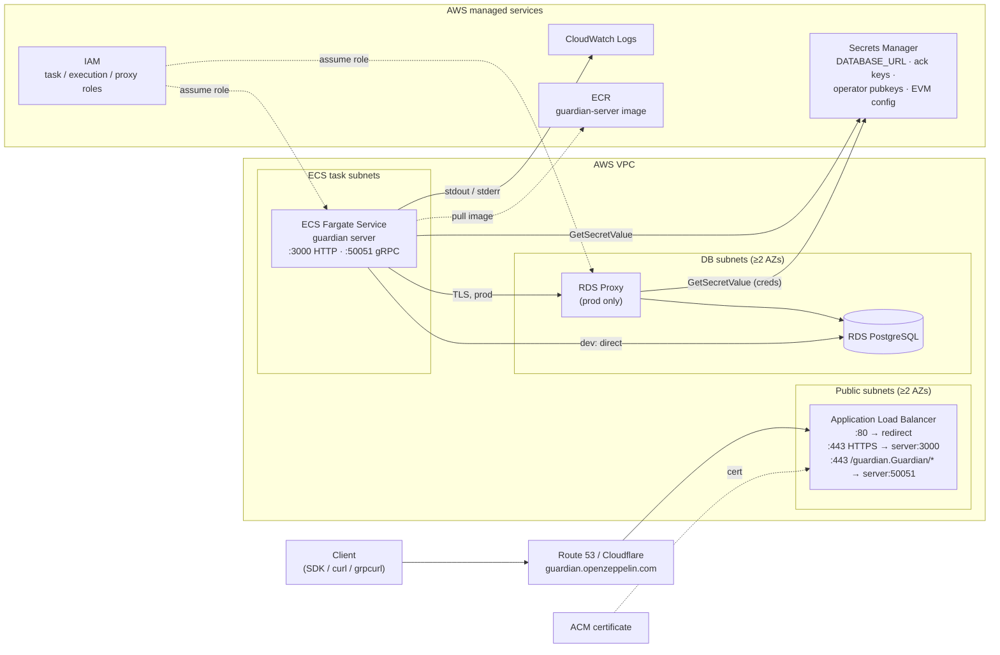
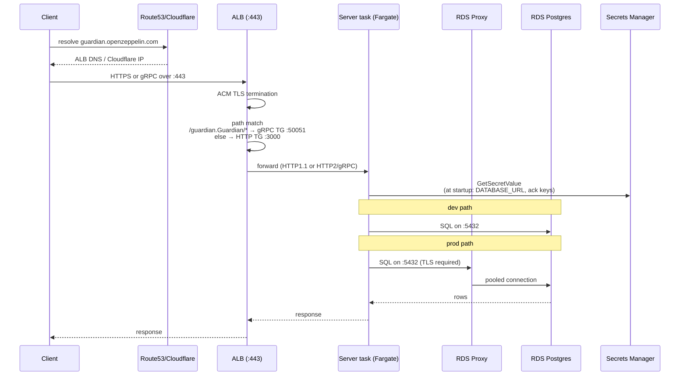
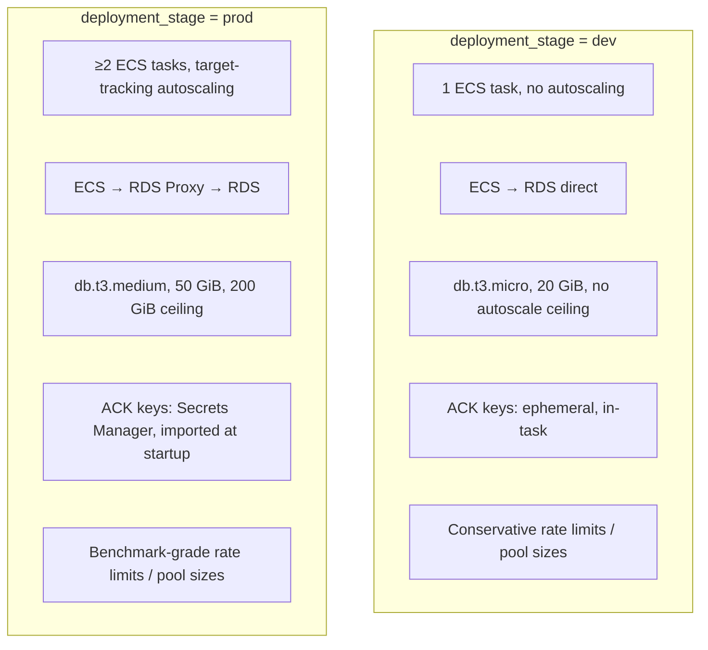
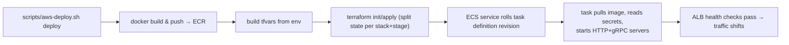

# Guardian AWS Deployment Architecture

This document explains how the Guardian server is deployed on AWS and how the
resources in [`infra/`](../../infra/) fit together. It is a map for engineers
who already know the application and want to understand the runtime topology,
or for operators who need to know which Terraform file owns which AWS resource.

Companion docs:
- [`infra/README.md`](../../infra/README.md) — Terraform variables reference and
  raw `terraform apply` workflow.
- [`docs/SERVER_AWS_DEPLOY.md`](../SERVER_AWS_DEPLOY.md) — end-to-end deploy
  guide via `scripts/aws-deploy.sh`.
- [`docs/architecture/services.md`](./services.md) — logical service
  decomposition inside the server process.

## TL;DR

The stack is a single Fargate service behind an Application Load Balancer,
backed by RDS PostgreSQL, with secrets in AWS Secrets Manager and DNS managed
through Route 53 and/or Cloudflare. The same Terraform configuration deploys
both `dev` and `prod` profiles — `prod` adds autoscaling, RDS Proxy, and
storage autoscaling on top of the same base topology.

## Topology



### Why this shape

- **One service, one image.** Guardian is a single Rust binary that exposes
  HTTP and gRPC from the same process. There is no API gateway, no sidecar.
  The ALB does layer-7 routing on path so HTTPS clients and gRPC clients
  share port `443` on the public hostname.
- **State lives in Postgres.** Authentication, account state, deltas,
  proposals, audit logs all persist in RDS. The server itself is stateless;
  scaling is "add more tasks".
- **Identity lives in Secrets Manager.** ACK signing keys (Falcon + ECDSA)
  used to authenticate Guardian's responses are stored in Secrets Manager in
  `prod` and bootstrapped into the container's filesystem keystore at
  startup. In `dev` the server auto-generates ephemeral keys.
- **Stage profile toggles capacity, not topology.** `dev` and `prod` deploy
  the same set of resource types; `prod` flips autoscaling on, sizes RDS up,
  and inserts RDS Proxy between ECS and RDS. There is no separate `prod`
  Terraform module.

## Request flow



Health checks: the HTTP target group probes `GET /` ([`alb.tf:33`](../../infra/alb.tf#L33));
the gRPC target group probes `/guardian.Guardian/GetPubkey` with matcher `0`
([`alb.tf:55`](../../infra/alb.tf#L55)).

## Resource inventory

Mapping AWS resources to the Terraform files that own them:

| AWS resource | Terraform file | Notes |
|---|---|---|
| ECS cluster | [`ecs.tf:2`](../../infra/ecs.tf#L2) | Container Insights enabled, ECS Exec logging to CloudWatch. |
| ECS service `guardian server` | [`ecs.tf:152`](../../infra/ecs.tf#L152) | Fargate, public IP, two target group attachments when HTTPS is on. |
| ECS task definition | [`ecs.tf:32`](../../infra/ecs.tf#L32) | One container, ports `3000` + `50051`, env + secret env from Secrets Manager. |
| ECS autoscaling target + policies | [`ecs_autoscaling.tf`](../../infra/ecs_autoscaling.tf) | CPU + memory target-tracking, only created when `effective_server_autoscaling_enabled`. |
| ALB | [`alb.tf:2`](../../infra/alb.tf#L2) | Internet-facing, at least two subnets enforced as precondition. |
| HTTP target group (`:3000`) | [`alb.tf:20`](../../infra/alb.tf#L20) | Health check `GET /`. |
| gRPC target group (`:50051`) | [`alb.tf:39`](../../infra/alb.tf#L39) | Created only when an ACM cert is present. |
| HTTP listener `:80` | [`alb.tf:61`](../../infra/alb.tf#L61) | Forwards when no cert, redirects to HTTPS when cert is present. |
| HTTPS listener `:443` | [`alb.tf:95`](../../infra/alb.tf#L95) | TLS 1.3-1.2 policy; default action → HTTP target group. |
| gRPC listener rule | [`alb.tf:110`](../../infra/alb.tf#L110) | Path `/guardian.Guardian/*` → gRPC target group, priority `10`. |
| RDS Postgres instance | [`rds.tf:20`](../../infra/rds.tf#L20) | Storage encrypted, backups retained per `rds_backup_retention_days`. |
| RDS subnet group | [`rds.tf:8`](../../infra/rds.tf#L8) | Requires ≥2 subnets. |
| `DATABASE_URL` secret | [`rds.tf:43`](../../infra/rds.tf#L43) | Always created; consumed by the server task. |
| RDS Proxy + credentials secret | [`rds.tf:48`](../../infra/rds.tf#L48), [`rds.tf:70`](../../infra/rds.tf#L70) | Prod-only via `effective_rds_proxy_enabled`. |
| RDS Proxy target / pool config | [`rds.tf:106`](../../infra/rds.tf#L106), [`rds.tf:118`](../../infra/rds.tf#L118) | 80% max connections, 50% max idle. |
| Operator public keys secret | [`operator_secrets.tf`](../../infra/operator_secrets.tf) | Optional dashboard operator Falcon pubkey list. |
| ACK Falcon/ECDSA secrets (existing) | [`data.tf`](../../infra/data.tf) | Looked up via `data` in `prod`; created out-of-band by `aws-deploy.sh bootstrap-ack-keys`. |
| EVM allowed chains + RPC URLs secrets | [`data.tf`](../../infra/data.tf) | Optional; populated by deploy script from `config/evm/chains.json`. |
| ALB SG | [`security_groups.tf:2`](../../infra/security_groups.tf#L2) | Ingress `80/443` from `alb_ingress_cidrs`. |
| Server SG | [`security_groups.tf:35`](../../infra/security_groups.tf#L35) | Ingress `3000`/`50051` only from ALB SG; egress all. |
| RDS Proxy SG | [`security_groups.tf:67`](../../infra/security_groups.tf#L67) | Prod-only; ingress `5432` from server SG. |
| Postgres SG | [`security_groups.tf:92`](../../infra/security_groups.tf#L92) | Ingress `5432` from server SG, plus RDS Proxy SG in prod. |
| ECS task execution role | [`iam.tf:2`](../../infra/iam.tf#L2) | Pulls images, reads DB / EVM secrets at task start. |
| ECS task runtime role | [`iam.tf:53`](../../infra/iam.tf#L53) | App-level `GetSecretValue` for ACK + operator secrets; SSM channels for ECS Exec. |
| ACK secrets policy | [`iam.tf:70`](../../infra/iam.tf#L70) | Gated on `local.is_prod` — dev never reads ACK secrets. |
| Operator pubkeys policy | [`iam.tf:93`](../../infra/iam.tf#L93) | Created if user supplies an existing ARN or a managed list. |
| RDS Proxy role | [`iam.tf:136`](../../infra/iam.tf#L136) | Reads the proxy's credentials secret. |
| CloudWatch log groups | [`logs.tf`](../../infra/logs.tf) | `server` group and `cluster` (ECS Exec) group. |
| Route 53 alias | [`dns.tf:12`](../../infra/dns.tf#L12) | Created when `route53_zone_id` is set. |
| Cloudflare CNAME | [`dns.tf:27`](../../infra/dns.tf#L27) | Created when `cloudflare_zone_id` is set; can be proxied. |
| Variables / locals | [`variables.tf`](../../infra/variables.tf), [`data.tf`](../../infra/data.tf) | `local.is_prod`, `effective_*` locals derive the stage profile. |

ECR is **not** managed by Terraform — it is created and pushed to by
[`scripts/aws-deploy.sh`](../../scripts/aws-deploy.sh) before
`terraform apply`.

## Stage profiles

Both stages run from the same Terraform; `deployment_stage` flips a small set
of `effective_*` locals.



Concrete defaults are in
[`infra/README.md`](../../infra/README.md#variables-reference) and
[`docs/SERVER_AWS_DEPLOY.md`](../SERVER_AWS_DEPLOY.md#stage-profiles).

## Identity and secrets

Five categories of secret participate in a deploy:

1. **`DATABASE_URL`** — written by Terraform from RDS connection details
   ([`rds.tf:55`](../../infra/rds.tf#L55)). Server task reads it via the
   execution role at task start; injected as the `DATABASE_URL` env var
   ([`ecs.tf:121`](../../infra/ecs.tf#L121)).
2. **RDS Proxy credentials** (prod) — separate JSON secret consumed by the
   proxy's IAM role ([`rds.tf:60`](../../infra/rds.tf#L60),
   [`iam.tf:155`](../../infra/iam.tf#L155)).
3. **ACK signing keys** (prod) — Falcon + ECDSA secret keys for Guardian's
   own response signing. Created out-of-band by
   `aws-deploy.sh bootstrap-ack-keys`, referenced via `data` blocks,
   read by the runtime role ([`iam.tf:70`](../../infra/iam.tf#L70)) and
   imported into the filesystem keystore at process start.
4. **Operator public keys** — Falcon public keys allowed to authenticate to
   the dashboard. Either Terraform-managed (from a variable list) or an
   existing ARN; either way exposed as
   `GUARDIAN_OPERATOR_PUBLIC_KEYS_SECRET_ID` to the task
   ([`ecs.tf:100`](../../infra/ecs.tf#L100)).
5. **EVM allowed chains + RPC URLs** — Secrets Manager entries optionally
   populated from `config/evm/chains.json`, exposed to the task as
   `GUARDIAN_EVM_ALLOWED_CHAIN_IDS` and `GUARDIAN_EVM_RPC_URLS`
   ([`ecs.tf:125`](../../infra/ecs.tf#L125)).

The IAM split is deliberate:
- The **execution role** only reads secrets the AWS-ECS agent needs *before*
  the container starts (DB URL, EVM secrets surfaced as env).
- The **task role** owns secret reads the *application* performs at runtime
  (ACK keys, operator pubkeys) and SSM channels for ECS Exec.

## Networking

The stack uses the default VPC by default and picks subnets from
[`data.tf`](../../infra/data.tf) unless `vpc_id` / `subnet_ids` are set.
Public-subnet selection for the ALB sorts subnets lexicographically, which
can surface a private subnet ahead of a public one if subnet naming differs
across AZs — pin `subnet_ids` explicitly when you hit AZ surprises. RDS
Proxy additionally requires explicit opt-in for unsupported AZs via
`rds_proxy_subnet_ids` (e.g. `us-east-1e` / `use1-az3` in `us-east-1`).

Security-group chain:
```
internet → alb SG (80/443) → server SG (3000, 50051)
server SG ─┬─→ postgres SG (5432)            (dev path)
           └─→ rds_proxy SG (5432) → postgres SG (5432)  (prod path)
```

Egress is wide-open from the server SG so the task can pull images, talk to
Secrets Manager, talk to Miden RPC, and emit CloudWatch logs.

## Deploy lifecycle



State is kept **locally** per stack+stage at
`infra/terraform.<stack>.<stage>.tfstate`. There is no remote backend
configured; the deploy script is the source of truth for which state file is
in use.

## Observability surface

Today: CloudWatch container logs ([`logs.tf`](../../infra/logs.tf)),
Container Insights metrics ([`ecs.tf:6`](../../infra/ecs.tf#L6)), and
ECS Exec session logging ([`ecs.tf:10`](../../infra/ecs.tf#L10)). There are
no Terraform-managed dashboards, alarms, or tracing exporters yet — that
remains an open production-hardening gap.

## Things that are deliberately not here

- **No remote Terraform backend.** State files are local; the deploy script
  treats them as authoritative. Switch to S3+DynamoDB before multiple
  operators apply concurrently.
- **No WAF, no Shield Advanced.** The ALB is reachable from
  `alb_ingress_cidrs`, default `0.0.0.0/0`.
- **No RDS read replica, no automated DR drill.** Backups are
  configured via `rds_backup_retention_days` (default 7) and a manual
  restore checklist lives in
  [`docs/runbooks/restore.md`](../runbooks/restore.md), but there is no
  rehearsed, automated DR path.
- **No KMS-managed Secrets Manager keys.** Secrets use the default AWS-owned
  key. Rotation is manual.
