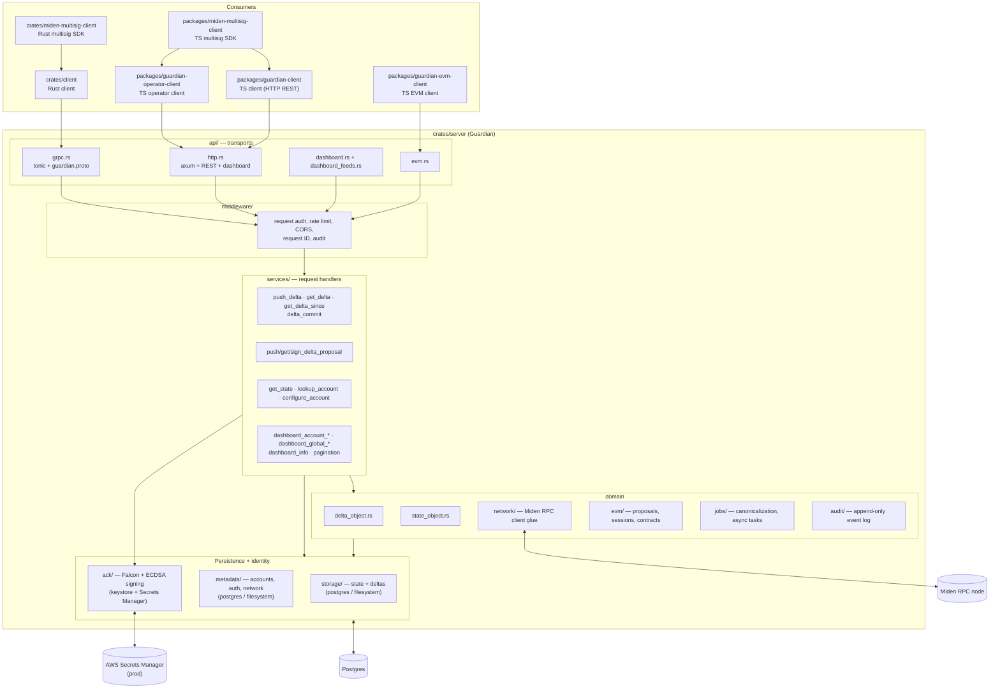
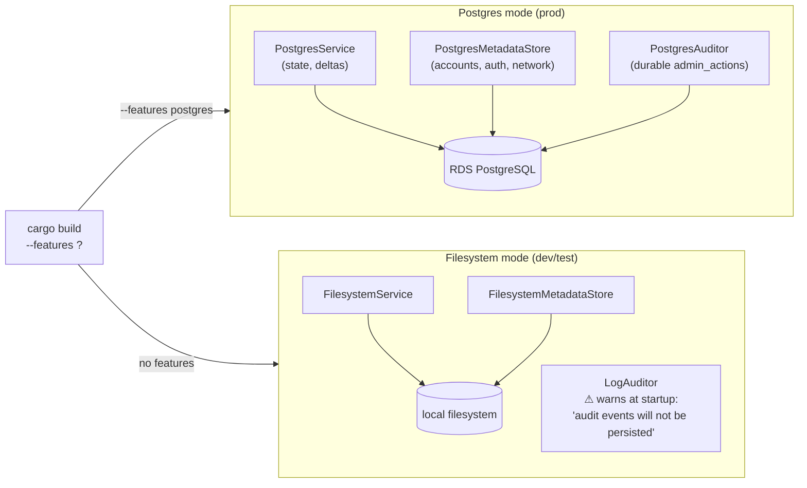
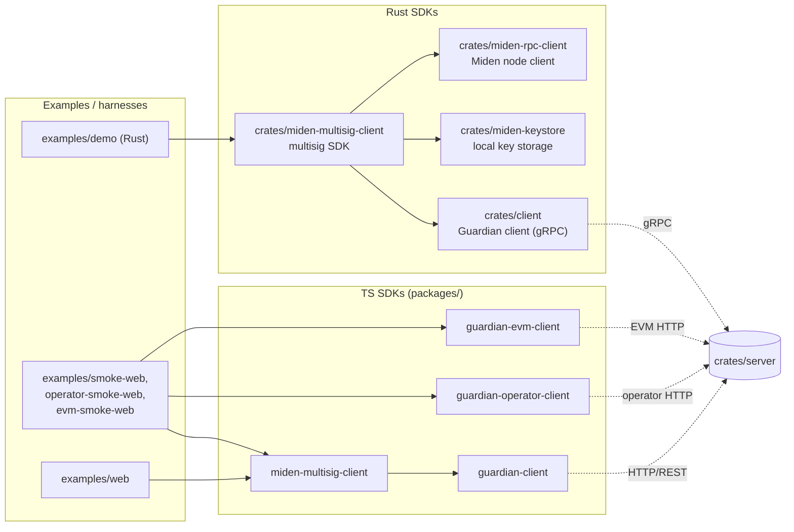

# Guardian Service Architecture

This document describes the logical decomposition of the Guardian system —
the modules inside the server process and the clients/SDKs that talk to it.
It complements [`docs/architecture/infra.md`](./infra.md), which covers how
that same process is packaged and deployed on AWS.

## TL;DR

Guardian is one Rust binary
([`crates/server`](../../crates/server)) that fronts two transports
(HTTP + gRPC) over a shared service layer, persists Miden account state and
deltas in Postgres, signs its responses with ACK keys, and is consumed by
Rust and TypeScript clients plus the multisig SDKs that build on top.

## Layered view

Sources for the boxes: server module declarations in
[`crates/server/src/lib.rs:3-30`](../../crates/server/src/lib.rs#L3),
API submodules in
[`crates/server/src/api/mod.rs`](../../crates/server/src/api/mod.rs),
service handlers in
[`crates/server/src/services/mod.rs`](../../crates/server/src/services/mod.rs).

## Components

### Transports — `api/`

Two transports, one set of service handlers. Default ports are `:50051`
(gRPC) and `:3000` (HTTP/dashboard); both are configurable via the server
builder.

- **gRPC** ([`api/grpc.rs`](../../crates/server/src/api/grpc.rs)) is the
  primary surface for the Rust client. Schema lives in
  `crates/server/proto/guardian.proto`. Default bind: `:50051`.
- **HTTP** ([`api/http.rs`](../../crates/server/src/api/http.rs)) hosts the
  REST routes for the TypeScript clients **and** the operator dashboard.
  Default bind: `:3000`.
  `axum` based. The TS Guardian client (`@openzeppelin/guardian-client`)
  is HTTP-only — it does **not** speak gRPC. This Rust-vs-TS transport
  split is the most common integration pitfall in the codebase.
- **Dashboard** ([`api/dashboard.rs`](../../crates/server/src/api/dashboard.rs),
  [`api/dashboard_feeds.rs`](../../crates/server/src/api/dashboard_feeds.rs))
  carries operator endpoints: accounts list, account detail, proposals,
  deltas, snapshot, info. Uses session auth distinct from Guardian's
  per-account auth.
- **EVM** ([`api/evm.rs`](../../crates/server/src/api/evm.rs)) is the
  feature-gated EVM proposal API exposed when the server is built with the
  `evm` feature.

Both transports share the **middleware** stack
([`crates/server/src/middleware`](../../crates/server/src/middleware)):
request authentication, rate limiting, CORS, request IDs, audit-log
emission.

### Service handlers — `services/`

Per-RPC handlers. Each file owns one verb of the Guardian contract.

| Service file | Purpose |
|---|---|
| `push_delta.rs` | Apply a signed delta to an account's state. |
| `get_delta.rs`, `get_delta_since.rs` | Read deltas by id / by cursor. |
| `delta_commit.rs` | Final commit step turning a proposal into a delta. |
| `push_delta_proposal.rs`, `get_delta_proposal*.rs`, `sign_delta_proposal.rs` | Multisig proposal lifecycle. |
| `get_state.rs`, `lookup_account.rs`, `configure_account.rs` | State and account lifecycle. |
| `dashboard_account_*.rs`, `dashboard_global_*.rs`, `dashboard_info.rs`, `dashboard_pagination.rs` | Operator dashboard queries. |

The transport layer (gRPC or HTTP) decodes the request, the middleware
authenticates and audits it, then dispatches into one of these handlers.

### Domain types

- **`state_object.rs` + `delta_object.rs`** ([`crates/server/src/state_object.rs`](../../crates/server/src/state_object.rs),
  [`crates/server/src/delta_object.rs`](../../crates/server/src/delta_object.rs))
  — canonical in-memory shapes for an account's state and the deltas applied
  to it. The proto-level shapes are normalized into these before any
  persistence touches them.
- **`network/`** — wraps the Miden RPC client used to verify on-chain
  proofs / submit transactions.
- **`evm/`** ([`crates/server/src/evm`](../../crates/server/src/evm)) —
  EVM proposal lifecycle, session auth, on-chain contract interaction.
  Feature-gated.
- **`jobs/`** ([`crates/server/src/jobs`](../../crates/server/src/jobs)) —
  background work, currently canonicalization tasks that normalize proposals
  before commit.
- **`audit/`** ([`crates/server/src/audit`](../../crates/server/src/audit))
  — append-only structured event log written alongside mutating operations.

### Persistence — `storage/` and `metadata/`

Two parallel module trees, each with a `postgres.rs` and `filesystem.rs`
backend selected at startup:

- **`storage/`** ([`crates/server/src/storage`](../../crates/server/src/storage))
  owns the heavy data: account state objects and delta history.
- **`metadata/`** ([`crates/server/src/metadata`](../../crates/server/src/metadata))
  owns accounts, auth credentials
  ([`metadata/auth/`](../../crates/server/src/metadata/auth)), and
  network/peer info.

In production both back ends are Postgres on RDS, sharing pool sizing
controlled by `GUARDIAN_DB_POOL_MAX_SIZE` and
`GUARDIAN_METADATA_DB_POOL_MAX_SIZE` (see
[`infra.md`](./infra.md#stage-profiles)). The filesystem backends are kept
for local development and tests.

### Storage modes

The backend is selected at **compile time** via Cargo features in
[`crates/server/src/builder/storage.rs`](../../crates/server/src/builder/storage.rs) —
not at runtime, not via env vars. Pick the right feature set for your build
target.

| Mode | Feature | Storage | Metadata | Audit | Required env |
|---|---|---|---|---|---|
| **Postgres** (prod, staging) | `postgres` | `PostgresService` | `PostgresMetadataStore` | `PostgresAuditor` — durable rows in `admin_actions` | `DATABASE_URL` |
| **Filesystem** (dev, tests) | _none_ | `FilesystemService` | `FilesystemMetadataStore` | `LogAuditor` — structured logs only, **no durable audit** | `GUARDIAN_STORAGE_PATH`, `GUARDIAN_METADATA_PATH` |

#### Production must use Postgres

Filesystem mode is unsafe for production for three reasons:

1. **No durable audit trail.** The filesystem build wires up `LogAuditor`
   and emits a one-shot startup warning that audit events flow only to
   structured logs ([`builder/storage.rs:129-137`](../../crates/server/src/builder/storage.rs#L129)).
   Postgres mode persists them in the `admin_actions` table.
2. **No migrations, no schema guarantees.** The Postgres path runs
   `postgres::run_migrations` at startup
   ([`builder/storage.rs:109`](../../crates/server/src/builder/storage.rs#L109));
   the filesystem path has none.
3. **No horizontal scaling.** Multiple ECS tasks behind the ALB cannot
   share filesystem state — each task would diverge. Postgres on RDS is the
   only shared substrate in the deployment topology
   ([`infra.md`](./infra.md#topology)).

The AWS deploy path therefore builds with `GUARDIAN_SERVER_FEATURES=postgres`
(plus `evm` when needed). See
[`SERVER_AWS_DEPLOY.md`](../SERVER_AWS_DEPLOY.md#quick-start).

#### When filesystem mode is fine

- Single-process examples under [`examples/`](../../examples).
- Unit and integration tests that need a real backend but not a real DB.
- Quick local iteration on non-storage code paths before spinning up Postgres.

For local development that exercises Postgres behavior, run a local
Postgres (e.g. `docker run -e POSTGRES_PASSWORD=… postgres`) and build with
`--features postgres` rather than relying on the filesystem backend.

### Identity — `ack/`

Guardian signs its responses so that clients (and the multisig SDKs in
particular) can verify the server is the same Guardian they trust.

- [`ack/mod.rs`](../../crates/server/src/ack/mod.rs) wires the signer.
- [`ack/miden_falcon_rpo/`](../../crates/server/src/ack/miden_falcon_rpo)
  and [`ack/miden_ecdsa/`](../../crates/server/src/ack/miden_ecdsa) hold the
  two scheme implementations.
- [`ack/secrets_manager.rs`](../../crates/server/src/ack/secrets_manager.rs)
  pulls secret payloads into the filesystem keystore at startup. In `dev`
  keys are auto-generated; in `prod` they are loaded from the Secrets
  Manager IDs in `GUARDIAN_ACK_FALCON_SECRET_ID` /
  `GUARDIAN_ACK_ECDSA_SECRET_ID`, falling back to
  `guardian-prod/server/ack-{falcon,ecdsa}-secret-key` when unset
  ([`secrets_manager.rs:10-13`](../../crates/server/src/ack/secrets_manager.rs#L10)).
  Terraform sets these env vars per stack so multi-stack deployments use
  scoped IDs.

### Dashboard subsystem

The dashboard layer is a small system in its own right inside
[`crates/server/src/dashboard`](../../crates/server/src/dashboard):
its own session/auth ([`authz.rs`](../../crates/server/src/dashboard/authz.rs),
[`middleware.rs`](../../crates/server/src/dashboard/middleware.rs)),
allowlist of operator public keys ([`allowlist.rs`](../../crates/server/src/dashboard/allowlist.rs)),
permission model ([`permissions.rs`](../../crates/server/src/dashboard/permissions.rs)),
shared state ([`state.rs`](../../crates/server/src/dashboard/state.rs)),
and pagination cursor logic
([`cursor.rs`](../../crates/server/src/dashboard/cursor.rs)).

It piggybacks on the same Postgres backend as the rest of the server but
authenticates operators through Falcon-signed challenges rather than the
per-account credentials used by Guardian's primary API.

## Consumers

- **Rust client** ([`crates/client`](../../crates/client)) — gRPC client with
  auth ([`crates/client/src/auth`](../../crates/client/src/auth)) and a
  pluggable keystore ([`crates/client/src/keystore`](../../crates/client/src/keystore)).
- **Rust multisig SDK** ([`crates/miden-multisig-client`](../../crates/miden-multisig-client))
  — builds on the Rust client; owns proposal creation, signing, execution,
  export/import, and the `SwitchGuardian` flow.
- **TS Guardian client** ([`packages/guardian-client`](../../packages/guardian-client))
  — **HTTP REST** client (`GuardianHttpClient`) used directly by browser
  apps and by the TS multisig SDK. Targets the server's HTTP routes on
  `:3000`, **not** gRPC. This is the common transport split to be aware
  of: the Rust client speaks gRPC; the TS client speaks HTTP.
- **TS multisig SDK** ([`packages/miden-multisig-client`](../../packages/miden-multisig-client))
  — TS counterpart of the Rust multisig SDK; browser-friendly.
- **Operator client** ([`packages/guardian-operator-client`](../../packages/guardian-operator-client))
  — talks to the dashboard endpoints (HTTP, not gRPC).
- **EVM client** ([`packages/guardian-evm-client`](../../packages/guardian-evm-client))
  — talks to `api/evm.rs` when the server is built with EVM support.

Smoke harnesses under [`examples/`](../../examples) drive each SDK
end-to-end; see the matching `smoke-test-*` skills for how to run them.

## Authentication shape

Two distinct auth domains:

1. **Per-account auth** — every mutating Guardian RPC is signed by the
   account's Falcon or ECDSA key. Verified in the auth middleware via
   [`metadata/auth/`](../../crates/server/src/metadata/auth) which loads
   credentials from the metadata store and dispatches to the right scheme
   ([`miden_falcon_rpo.rs`](../../crates/server/src/metadata/auth/miden_falcon_rpo.rs),
   [`miden_ecdsa.rs`](../../crates/server/src/metadata/auth/miden_ecdsa.rs)).
2. **Operator auth** — dashboard endpoints use Falcon-signed challenges
   against an allowlist of operator public keys, producing session cookies.
   Lives entirely in
   [`dashboard/authz.rs`](../../crates/server/src/dashboard/authz.rs).

Both paths share the same ACK signer when emitting *responses*; only the
*incoming* credentials differ.

## Where to look next

- For build-and-deploy: [`docs/SERVER_AWS_DEPLOY.md`](../SERVER_AWS_DEPLOY.md).
- For the deployment topology: [`docs/architecture/infra.md`](./infra.md).
- For the multisig SDK: [`docs/MULTISIG_SDK.md`](../MULTISIG_SDK.md).
- For protocol-level contracts: `crates/server/proto/guardian.proto`. When
  changing the proto, regenerate language bindings and re-run the SDK smoke
  tests in `examples/` before publishing.
