# RFC 0001: Guardian executes, proves and submits transactions

| | |
|---|---|
| **Status** | Accepted for implementation — comments welcome, no closing date |
| **Feature** | [#254](https://github.com/OpenZeppelin/guardian/issues/254) (parent [#253](https://github.com/OpenZeppelin/guardian/issues/253), "Transaction Orchestration") |
| **Audience** | Integrators, operators, and upstream reviewers (Miden team or anyone reading publicly) |
| **Working artifacts** | [`speckit/features/254-guardian-prove-and-commit/`](../../speckit/features/254-guardian-prove-and-commit/) — see appendix |
| **Revision** | 13 (2026-07-31) |

> **Implementation status:** this RFC describes the **proposed end state**. The wire API, execution lifecycle, and SDK changes are not implemented yet; the one exception is the Gate 0 witness-assembly spike (`crates/server/src/network/miden/execution/`), which exists and passes its tests. The linked working artifacts are the implementation plan, and numeric defaults given here are proposals unless the linked contract marks them normative.

---

## Executive Summary & What Changes

Today, the **client** must build the transaction, execute it against account state, collect cosigner signatures, obtain Guardian's acknowledgment, generate the ZK proof, and submit it to the Miden node. This forces every client or triggering caller to maintain full Miden execution and proving capabilities.

**After this work**, three roles separate. A **Miden-capable party builds the proposal** once, attaching the serialized `TransactionRequest`. **Cosigners sign it to threshold** through Guardian — signing a summary commitment needs keys, not a Miden stack. Then **any authenticated cosigner triggers execution and polls the outcome with no Miden capabilities at all**: Guardian carries the proposal the rest of the way — verifies signatures, reproduces the exact transaction against account state, proves via remote prover, submits to the Miden node, and tracks confirmation. What becomes thin is the signing and triggering side; building the proposal remains a Miden-capable step.

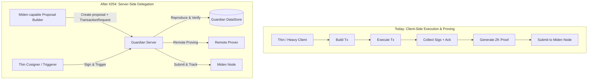

**What stays the same:**
- **Zero forgery power**: Guardian cannot alter transaction outputs or forge updates. The executed transaction must reproduce, bit for bit, the summary commitment signed by cosigners.
- **Self-execution is preserved**: Local self-execution remains fully supported and is the default behavior in SDKs. Server-side execution is an opt-in capability.

---

## 1. How It Looks (End-State Design & Experience)

### 1.1 High-Level Sequence Flow

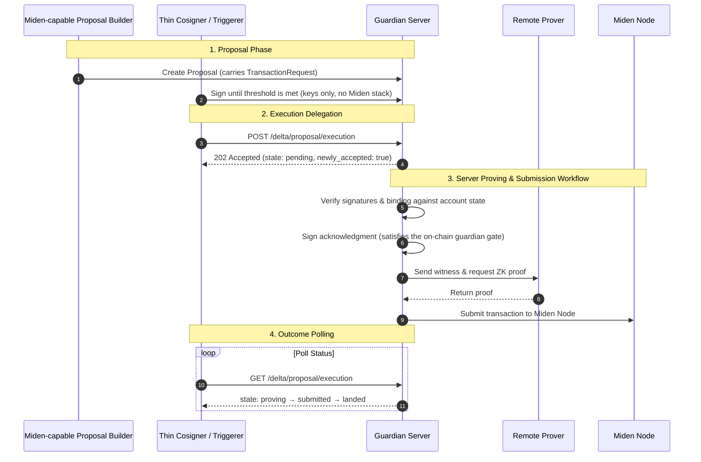

### 1.2 End-to-End Execution Lifecycle & State Machine

Every delegated execution progresses through an explicit five-state lifecycle:

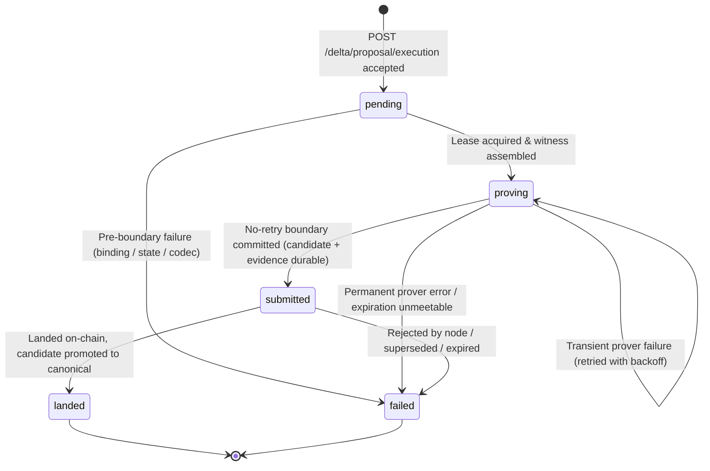

| State | Terminal | Meaning & Caller Action |
|---|---|---|
| `pending` | No | Accepted; the durable reservation already exists — waiting for a worker to pick it up. **Action: Poll.** |
| `proving` | No | Witness assembled, remote proving in progress (6–20s per attempt; transient prover failures are retried server-side). **Action: Poll.** |
| `submitted` | No | No-retry boundary crossed; the candidate delta and submission evidence are durable. The network send may be pending, attempted, or of unknown outcome. **Action: Poll, DO NOT retry.** |
| `landed` | **Yes** | Transaction landed on-chain; Guardian's candidate delta promoted to canonical. **Action: Success complete.** |
| `failed` | **Yes** | Execution stopped or rejected. **Action: Retry ONLY IF `proposal_exists == true`.** |

#### Core Execution Rules:
1. **`submitted` is an irreversible boundary**: The state changes to `submitted` when the boundary evidence *commits*, which is before the first byte of the network send — so `submitted` never implies the transaction reached the node, only that retry is forbidden. From that commit on, a definite application-level rejection may settle the execution immediately; every absent or ambiguous send outcome is resolved by chain observation. Nothing is ever re-submitted. The caller MUST NOT retry a `submitted` execution.
2. **`proposal_exists` controls retry**: Post-boundary failures may delete the proposal. Retry is valid only when `state == "failed"` AND `proposal_exists == true`.
3. **Synchronous refusals never create an execution**: conditions determinable at request time — proposal not Guardian-executable (no stored `TransactionRequest`), signature set below the effective threshold (invalid, duplicate, or non-cosigner signature entries are ignored and counted, not fatal), caller not a cosigner, account paused or released, pending candidate, conflicting reservation, or proving capability unavailable — are refused synchronously and queue nothing. Binding and state mismatches are **not** synchronous: they are detected while reproducing the transaction after acceptance and settle as asynchronous `failed` outcomes (the `pending → failed` edge above).
4. **Transient proving failures are retried server-side**: A prover failure at the transport level — connection error, i/o timeout, deadline exceeded — does not fail the execution. Guardian retries proving with capped backoff under the same held reservation, without leaving `proving` and without caller involvement. The execution settles `failed` only on a permanent prover error, or once the transaction's own expiration can no longer be met. The finite expiration chosen at build time (see the Expiration Guard in US3) **is** the retry budget; there is deliberately no separate retry-count or retry-window configuration.

#### How `submitted` Terminates

Before sending the first byte of a submission, Guardian durably records the evidence it will reconcile against: the transaction id, the base account commitment, the expected resulting account commitment, the reference block, and the expiration block taken from the proven transaction itself. A `submitted` execution then terminates in one of four ways:

- **Rejected** — the node returns a definite application-level rejection. The execution owner discards the candidate and settles `failed` immediately; no chain watch is needed.
- **Landed** — the expected account commitment (or the transaction's inclusion) is observed on chain. The candidate delta is promoted to canonical through the normal canonicalization lifecycle, and the execution settles `landed`.
- **Superseded** — the account is observed at a commitment that is neither the base nor the expected result. The transaction can no longer land; the execution settles `failed`.
- **Expired** — the chain height passes the recorded expiration block while the account still sits at its base commitment. The transaction can never land; the execution settles `failed`.

The finite-expiration requirement gives the last outcome a finite **chain-height** bound rather than a wall-clock deadline. Once Guardian can obtain trustworthy chain observations beyond that block, the watch terminates even if the send never started or the node silently dropped the transaction. During a node outage Guardian keeps the execution `submitted`, retains the reservation, retries observation with capped backoff, and alerts operators; restoring or failing over RPC is the only safe operator recovery. Elapsed time alone never permits release or re-submission. This is also why boundary-crossed executions need no re-submission machinery: Guardian knows exactly what it prepared and the chain height after which it cannot land.

### 1.3 Wire API Surface

The feature adds three unified operations available on both HTTP and gRPC:

| Endpoint (HTTP) | gRPC Method | Auth Domain | Purpose |
|---|---|---|---|
| `POST /delta/proposal/execution` | `ExecuteDeltaProposal` | Cosigner (`x-pubkey`, `x-signature`, `x-timestamp`) | Trigger delegated execution, proving, and submission |
| `GET /delta/proposal/execution` | `GetDeltaProposalExecution` | Cosigner (`x-pubkey`, `x-signature`, `x-timestamp`) | Fetch current status of a specific proposal execution |
| `GET /delta/execution/current` | `GetCurrentExecution` | Cosigner (`x-pubkey`, `x-signature`, `x-timestamp`) | Fetch the active in-flight execution for an account |

The two per-proposal operations return the execution envelope directly — `state`, `newly_accepted`, `proposal_exists`, `delta_nonce`, and `error` (when failed). `GET /delta/execution/current` wraps it as `{"execution": <envelope> | null}`: it asks a question about the *account*, and "nothing in flight" is a successful answer (`200`, never `404`), whereas the per-proposal read treats a never-executed proposal as a missing resource. The pair `(account_id, proposal_id)` is the canonical handle.

> **API style note.** Guardian's HTTP surface is deliberately RPC-over-HTTP rather than resource-oriented REST, and these endpoints follow it. Every endpoint must exist with equivalent semantics on gRPC, which is method-oriented; keeping the HTTP shape flat keeps the two surfaces isomorphic — one request message, one handler, one contract. Identifiers (`account_id`, `proposal_id`) travel in the signed payload, never in the URL path, because the authentication signature covers the canonical JSON of the body (or query object), not the path — a path-templated identifier would sit outside the signed bytes. This also preserves the idempotent handle: executions are addressed by `(account_id, proposal_id)` with no separate execution-resource identity, so a repeated trigger returns the same execution rather than creating a new resource.

---

## 2. Per User Story & Persona Configuration

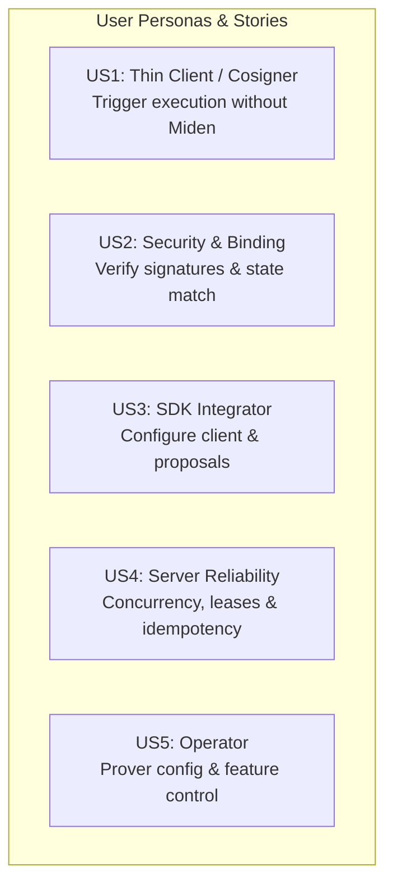

---

### US1 — Thin Client / Cosigner: Trigger Execution Without Miden

A cosigner or light client monitors proposal signature collection. Once threshold is reached, it requests Guardian execution. The triggering client needs **no Miden client SDK or WASM executor**.

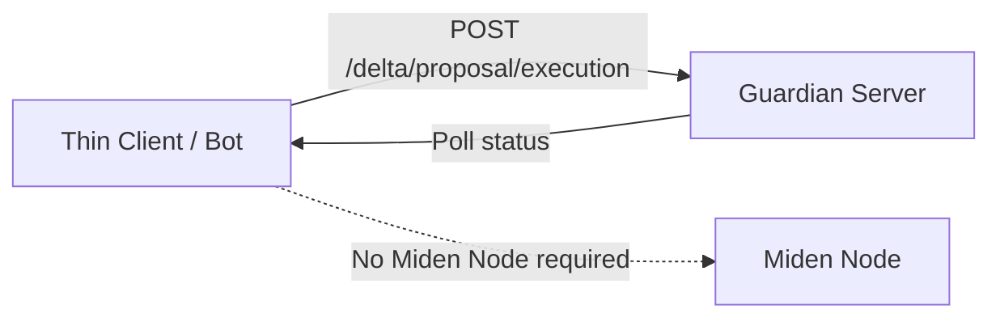

#### Base HTTP Client Invocation (no Miden dependencies required):
```ts
// Proposed API — not yet implemented; see contracts/sdk-api.md
import { GuardianHttpClient } from "@openzeppelin/guardian-client";

const client = new GuardianHttpClient("https://guardian.example.com");
client.setSigner(signer); // cosigner credentials sign every request

// Request Guardian to prove and submit a threshold-met proposal
const res = await client.executeDeltaProposal("0x1234...", "0x5678...");

console.log("Execution state:", res.state); // "pending"
```

---

### US2 — Security & Binding: Verifying Signed State Commitments

Before initiating remote proving or writing to chain, Guardian reproduces the transaction against current account state and verifies that the generated summary commitment matches what cosigners signed.

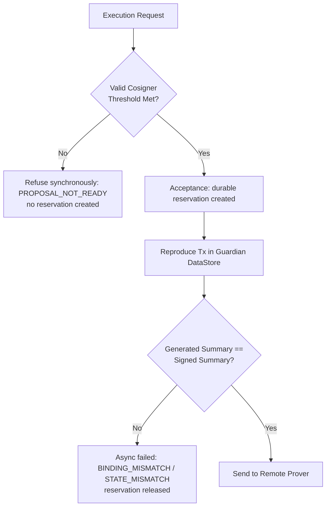

**Guarantees:**
- Mismatched state (e.g. account nonce advanced elsewhere) halts execution **before** remote proving starts.
- Pre-boundary failures leave proposal unlocked and available for re-execution or fallback local execution.

---

### US3 — SDK Integrator: Configuring Client & Proposal Execution Mode

SDK integrators choose the execution mode at client creation. Default mode remains local self-execution (`self_executed`). Opting into `guardian_executable` embeds the serialized `TransactionRequest` on proposal creation and enforces finite expiration limits.

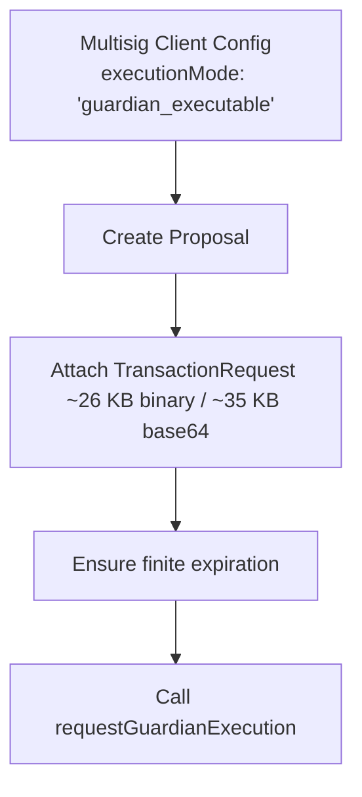

#### TypeScript SDK (`@openzeppelin/miden-multisig-client`)
```ts
// Proposed API — not yet implemented; see contracts/sdk-api.md
import { MultisigClient } from "@openzeppelin/miden-multisig-client";

// 1. Configure server-execution support at construction (defaults to "self_executed")
const client = new MultisigClient(midenClient, {
  /* …existing configuration… */
  executionMode: "guardian_executable",
});

// 2. Obtain the account's Multisig and create the proposal through a typed,
//    request-building method exactly as today — the configured mode attaches the
//    serialized TransactionRequest and, for built-in proposal families, adds
//    the shared finite expiration internally
const multisig = /* …load the account's Multisig as today… */;
const proposal = await multisig.createP2idProposal(/* …unchanged… */);

// 3. Request Guardian execution once threshold is met
await multisig.requestGuardianExecution(proposal.id);

// 4. Track status
const status = await multisig.executionStatus(proposal.id);
console.log(`Current state: ${status.state}`);
```

#### Rust SDK (`miden-multisig-client`)
```rust
// Proposed API — not yet implemented; see contracts/sdk-api.md
use miden_multisig_client::{MultisigClientBuilder, ProposalExecutionMode};

// 1. Initialize client with server-execution support
let client = MultisigClientBuilder::new()
    /* …existing required configuration: Miden endpoint, Guardian endpoint,
       account directory, key manager… */
    .execution_mode(ProposalExecutionMode::GuardianExecutable)
    .build()
    .await?;

// 2. Request execution & track state
client.request_guardian_execution(&proposal_id).await?;
let status = client.execution_status(&proposal_id).await?;
println!("Execution state: {:?}", status.state);
```

| Config Rule | Detail |
|---|---|
| **Opt-in** | Omitting `executionMode` uses `self_executed`. Existing behavior is unchanged. |
| **Payload Attachment** | `guardian_executable` attaches a serialized `TransactionRequest` (~26 KB binary; ~35 KB after base64 in JSON). |
| **Expiration Guard** | For built-in proposal families, both SDKs construct the transaction with the shared 256-block finite expiration. An opaque custom request cannot be generically rewritten on Miden 0.15, so its producer must construct it to expire finitely. Guardian verifies the executed transaction's resulting expiration and refuses a non-expiring or out-of-horizon transaction before the boundary. |

---

### US4 — Server Reliability: Concurrency, Lease Reservation & Idempotency

When multiple cosigners trigger execution simultaneously or a server replica crashes mid-proof, Guardian guarantees, across all replicas: **at most one lease-authorized proving attempt at a time, and at most one on-chain submission** — enforced by durable storage-backed reservations with renewable leases and monotonic fence tokens. On the Postgres backend the fencing is transactional and holds across replicas; the filesystem backend is single-process and validates the active reservation's holder and fence under the existing account-scoped write lock. It deliberately does **not** claim at most one *active* attempt: the remote prover is an external service Guardian cannot cancel, so an expired owner's proof request may still be running while a new owner starts another. Stale owners are fenced out of every write. Wasted prover cost is accepted; a second submission is not.

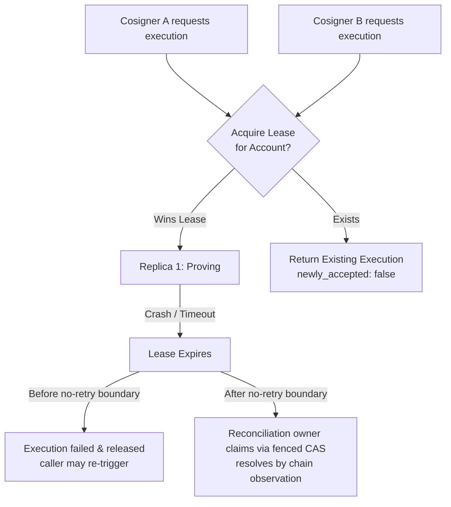

**Reliability Contracts:**
- **Idempotent Requests**: Re-posting `/delta/proposal/execution` for an active proposal returns the existing execution record (`newly_accepted: false`).
- **Lease Timeout**: A stalled worker's lease expires. **Before the no-retry boundary** the execution is failed and released — never silently resumed, so the caller decides whether to re-trigger. **After the boundary** a reconciliation owner takes over the live reservation by fenced compare-and-set and resolves the outcome by chain observation; nothing is ever re-submitted.

---

### US5 — Operator Configuration & Infrastructure Setup

Operators control whether server-side proving is enabled by specifying a remote prover endpoint and timeouts. Guardian **never proves in-process**: "local" proving is an operator running a prover next to Guardian (e.g. a sidecar) and pointing `GUARDIAN_TX_PROVER_URL` at it, not an alternate code path in the server.

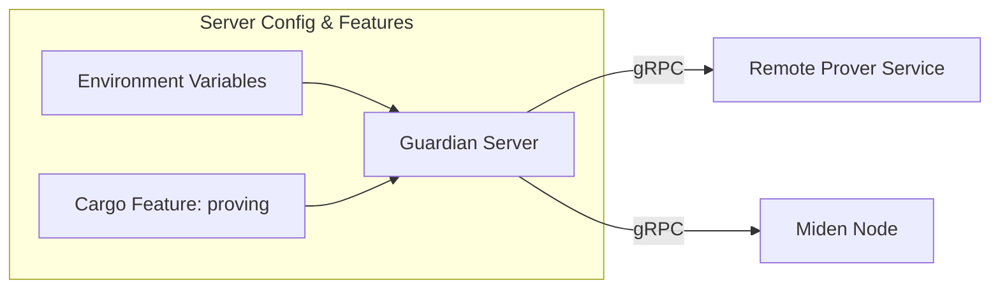

#### Operator Configuration Parameters

Defaults below are **proposed by this RFC**; the normative contract ([`contracts/execution-api.md`](../../speckit/features/254-guardian-prove-and-commit/contracts/execution-api.md) § Configuration) fixes the variable set and one constraint — the prover timeout must default well above the upstream client library's 10 s.

| Parameter | Required | Proposed Default | Description |
|---|---|---|---|
| `GUARDIAN_TX_PROVER_URL` | **Yes** (to enable) | None | Remote transaction prover endpoint URL. Unset disables the capability (no fallback). |
| `GUARDIAN_TX_PROVER_TIMEOUT_SECS` | No | `300` | Remote prover RPC timeout per attempt (observed proving: 6–20 s; upstream client default of 10 s is too low). |
| `GUARDIAN_PROVING_ENABLED` | No | `true` | Kill-switch to disable proving without unsetting prover URL. |
| `GUARDIAN_MAX_PROPOSAL_REQUEST_BYTES` | No | TBD | Size cap on a stored `TransactionRequest`; an oversized proposal is refused at creation, not at execution. |
| `GUARDIAN_MAX_ACCOUNT_REQUEST_BYTES` | No | TBD | Aggregate cap on stored requests per account. |
| `GUARDIAN_EXECUTION_LEASE_SECS` | No | `120` | Duration of the reservation lease before a stalled worker times out. |
| `GUARDIAN_EXECUTION_RECONCILE_INTERVAL_SECS` | No | `30` | How often reconciliation re-checks unresolved submissions against the chain. |
| `GUARDIAN_EXECUTION_EXPIRATION_HORIZON_BLOCKS` | No | TBD | Maximum allowed distance from the reference block to expiration; exceeding it prevents crossing the no-retry boundary. This is a chain-height bound; resolution still requires eventual trustworthy chain observation. |

#### Example `.env` Configuration
```bash
# Feature enablement
GUARDIAN_TX_PROVER_URL=https://tx-prover.testnet.miden.io
GUARDIAN_TX_PROVER_TIMEOUT_SECS=300
GUARDIAN_PROVING_ENABLED=true

# Execution & Lease Controls
GUARDIAN_EXECUTION_LEASE_SECS=120
GUARDIAN_EXECUTION_RECONCILE_INTERVAL_SECS=30
```

> **Warning for Operators:** The upstream prover client's own default timeout (10 seconds) is below real testnet proving times (6–20 s), which is why the proposed Guardian default is far higher. If you override `GUARDIAN_TX_PROVER_TIMEOUT_SECS`, keep it well above observed proving times for your prover.
>
> **Canonicalization mode is required.** Guardian execution depends on the candidate → canonical delta lifecycle to establish whether a submitted transaction landed. A server running in optimistic delta-commit mode refuses execution requests with the capability-unavailable error class, and the misconfiguration is reported at startup rather than discovered by the first caller.

**Prover capacity is the principal throughput constraint to size.** Each observed proof took 6–20 seconds, and executions across all accounts use the configured prover endpoint. Exploratory load runs against the public testnet prover produced transport-level i/o timeouts under concurrency rather than well-formed errors (Appendix A.4, finding 4) — which is why the server-side retry policy above classifies transport failures as transient. These runs are not presented as a reproducible capacity benchmark because their raw report is not committed. A deployment expecting sustained execution throughput should provision its own prover (or prover pool) and size it against the expected number of concurrent executions.

---

## 3. Architecture Decision Matrix

Two architectural options were evaluated for server-side transaction execution:

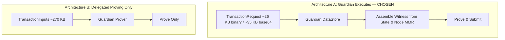

| Dimension | Architecture A (Chosen) | Architecture B (Delegated Proving) |
|---|---|---|
| **Client Sends** | Serialized `TransactionRequest` (~26 KB binary; ~35 KB base64) | Serialized `TransactionInputs` (~270 KB binary) |
| **Witness Built By** | **Guardian** (server-side `miden-tx::DataStore` & node MMR) | A Miden-capable party outside Guardian, per transaction |
| **Triggering Caller Needs Miden SDK** | **NO** (thin cosigners trigger and poll) | No for the literal trigger — but some external party must execute locally to build each witness |
| **Eliminates Per-Execution Miden Requirement** | **YES** (only proposal *creation* stays Miden-capable) | No |

**Decision**: **Architecture A is chosen** because it achieves the primary project goal: allowing thin, non-Miden clients (such as web frontends or light cosigners) to delegate execution and proving completely to Guardian.

### 3.1 Chain View & Witness Assembly — the Inner Flow

The apparent complexity has two parts. The **account and reference-chain snapshot is required for every transaction**. Historical block authentication is **only required for authenticated input notes**. Guardian makes that decision from the prepared Miden `InputNotes`, because a serialized `TransactionRequest` contains note bodies but does not say which notes have authenticated inclusion proofs. No-input-note transactions, and transactions containing only unauthenticated notes, skip `SyncNotes` and all historical note-path work.

The chain view is ephemeral: it is assembled for one worker attempt and discarded afterward. There is no long-lived per-account sync loop.

**Future optimization:** if production measurements show that repeated chain or note-reference lookups are material, Guardian may keep a rebuildable shared cache of validated references to shorten later assembly. This is not a v1 requirement or a commitment to a particular storage design; node data remains authoritative and correctness must not depend on the cache.

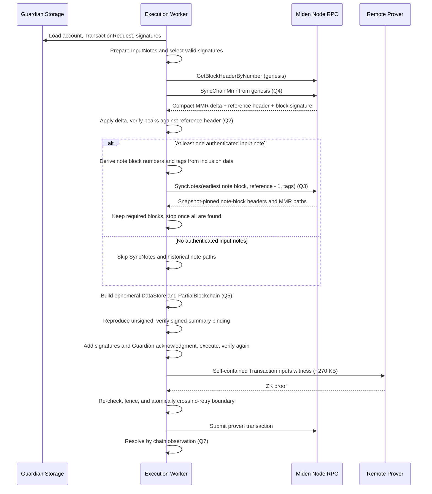

Reading guide for the upstream questions:

- **Q2** anchors at the peaks verification and the response's existing block signature.
- **Q3** anchors at the conditional `SyncNotes` branch. Its `block_to + 1` forest rule is why execution at reference block `N` requests through `N - 1`.
- **Q4** anchors at the `SyncChainMmr` call — one genesis-anchored cold sync per execution, by choice, instead of a persistent cross-execution MMR cache.
- **Q5** anchors at the `DataStore` note — the seam Guardian implements directly.
- **Q7** anchors at outcome observation — inclusion is inferred from the observed account commitment.

---

## 4. Protocol Questions for Upstream (Miden Team)

Each question below states what Guardian does, what we observed, and the specific confirmation or guidance we are asking for. Verification tags follow Appendix A.1, and §3.1 diagrams the witness-assembly flow the questions anchor to.

1. **Finite expiration, its binding, and custom scripts.** A transaction built without an explicit expiration is non-expiring — the proven transaction reports the `u32::MAX` sentinel **[RAN]**. Guardian resolves an absent or ambiguous send only by chain observation, and the recorded expiration block supplies the finite chain height at which that watch can terminate once trustworthy observation is available. Guardian therefore refuses to cross the no-retry boundary for a non-expiring or out-of-horizon transaction. For built-in proposal families, the SDKs construct transactions with a shared 256-block finite expiration. For opaque custom requests, Miden 0.15 exposes no mutation API, and `TransactionRequestBuilder` rejects combining `expiration_delta` with a custom script; the producer must currently include an expiration update in its script. Separately, `TransactionSummary` commits to account delta, input notes, output notes, and salt — not expiration **[READ]** (`miden-protocol-0.15.3/src/transaction/tx_summary.rs:20-24,77-86`). Thus expiration does not change the signed summary or proposal id, and Guardian's v1 rule not to rewrite it is an architectural ownership/reproducibility choice, not a binding limitation. **Questions**: (a) is a finite expiration on every delegated-execution transaction the recommended pattern? (b) is expiration intentionally outside `TransactionSummary`, and may a delegated executor safely tighten it after cosigners sign? (c) what is the supported way to impose finite expiration on an existing custom-script request — should the producer call `tx::update_expiration_block_delta`, or would upstream consider a request transformation API? (d) is a transaction-status or inclusion lookup planned, and would it distinguish "not yet included" from "will never be included"? Expiration would remain the terminal backstop unless such an API provides definitive absence.

2. **Reference block authentication and trust root.** Guardian assembles the `PartialBlockchain` per execution from node RPC: fetch the genesis header, seed a one-leaf `PartialMmr`, call `SyncChainMmr` from genesis, and adopt the **sync-target header returned by that response** as the reference block. We verify the applied delta by checking `hash_peaks()` against the header's `chain_commitment` **[RAN]** (`live_cold_start_chain_mmr_matches_the_reference_block`). This proves internal consistency between two values returned by the same node; it does not independently authenticate the header. `SyncChainMmrResponse` also already carries `block_signature`, which the current spike does not validate **[READ]** (`miden-node-proto-build-0.15.0/proto/rpc.proto:546-558`). **Questions**: (a) is a sync-target reference header with no MMR path the correct executor construction? (b) what validator key set or other trust root should a server use to validate `block_signature`, including key rotation, and is signature validation the intended way to bind this snapshot to the canonical chain?

3. **Authenticated note-block paths for a stateless executor.** This branch is conditional: Guardian derives it from prepared `InputNotes`; no-input-note and unauthenticated-note-only transactions make no `SyncNotes` call. `GetBlockHeaderByNumber` cannot pin its proof forest, and a live check showed its current proof at stable tip had `chain_length = reference + 1`, not the `reference`-leaf forest required by `TransactionInputs`. `SyncNotes` does provide an explicit upper bound: its paths are valid at forest `block_to + 1`, so execution against reference block `N` requests through `N - 1` **[READ]**. The off-by-one and paths were validated against public testnet at reference block 1,174,436 **[RAN]** (`live_sync_notes_paths_track_against_the_execution_reference_forest`). The spike starts at the earliest required note block, queries the authenticated notes' tags, retains only required blocks, follows pagination only until all are found, and then stops. However, `SyncNotes` filters by tags rather than exact note IDs; a diagnostic full-range query for just tag `0` returned 91,465 matching blocks and took 59.9 s. **Questions**: (a) is this bounded `SyncNotes` use the recommended stateless assembly path? (b) would upstream consider an exact-note or exact-block MMR-proof query against an explicit target forest, avoiding potentially broad tag scans? (c) should Guardian additionally match each returned `NoteSyncRecord` by exact note ID before accepting its block, or is verifying the already-held note inclusion proof against the returned block header sufficient?

4. **`SyncChainMmr` load.** There is no RPC that returns MMR peaks at a block from scratch — `SyncChainMmr` is by construction a delta against a height the caller already holds **[READ]**. A stateless executor therefore cold-starts each execution with `SyncChainMmr` from genesis (seeding the `PartialMmr` with the genesis block commitment first). The delta payload is logarithmic in chain length — peaks plus merge siblings (`miden-crypto-0.25.1/src/merkle/mmr/tests.rs:1241-1245`) **[READ]** — and a cold start against a 1,002,185-block chain completed in ~0.6 s **[RAN]** (`live_cold_start_chain_mmr_matches_the_reference_block`), so we chose one cold `SyncChainMmr` call per execution over maintaining a persistent MMR cache across executions and replicas. Two separate questions: **(a) Load guidance** — is one genesis-anchored `SyncChainMmr` call per execution acceptable node load at high execution throughput, and is there a request rate at which you would want executors to cache instead? **(b) API** — would upstream consider a direct peaks accessor (a peaks field on the block header response, or a `GetChainMmrPeaks` RPC)? Nothing blocks on it — it would save the genesis seeding step and one round trip.

5. **Architecture A alignment and the `DataStore` seam.** Guardian implements the five `miden_tx::DataStore` methods plus the `MastForestStore::get` supertrait obligation directly over its own stored account state (`PartialAccount::from(&Account)`, header and peaks from RPC as above) and drives `TransactionExecutor` with it, bypassing the `miden-client` `Client` façade entirely — no sync loop, no long-lived per-account store. We could not reuse `ClientDataStore`: its module is crate-private (`miden-client-0.15.0/src/store/mod.rs:62` declares `pub(crate) mod data_store;` with no re-export — the struct itself is `pub` but unreachable from outside the crate; unchanged in `0.16.0-alpha.1`) **[READ]**, and even if it were exported, it is constructed over the full `Store` trait — 57 methods, 46 required, on the pinned 0.15.0 line (`store/mod.rs:119-686`) **[READ]** — far more surface than an ephemeral per-execution store needs. Spike tests validated unsigned reproduction, signature-advice injection, the on-chain Guardian authorization gate, authorized execution, and proving (`crates/server/src/network/miden/execution/tests.rs`) **[RAN]**; separately, a witness assembled from live testnet data executed and proved through the public remote prover (`live_prove_a_guardian_assembled_witness`) **[RAN]**. Service-level stored-signature selection, proposal binding, and the internal acknowledgment path remain implementation work, and live submission remains deferred. **Questions**: (a) is direct third-party implementation of `miden_tx::DataStore` an intended, supported seam that upstream will keep stable? (b) would upstream consider a smaller maintained chain-view / transaction-input assembly helper that does not require the complete `Store` interface, so server-side executors don't each re-derive the same assembly logic?

6. **Prover concurrency expectations.** Exploratory load runs against the public testnet prover produced transport-level i/o timeouts under concurrency rather than well-formed prover errors (Appendix A.4, finding 4) **[RAN]**. The raw report is not committed, so we treat this as a qualitative observation, not a capacity measurement. Guardian retries transient prover failures server-side (§1.2, rule 4), but retries do not add capacity. **Question**: what concurrency should a single prover endpoint be expected to sustain, and is running a dedicated prover (or pool) the intended pattern for server-side executors like Guardian?

---

## Appendix A: Evidence & Spike Research

This appendix contains the reviewable technical evidence and spike findings gathered during prototyping against public Miden testnet.

### A.1 Claim Verification Tags
Technical assertions carry verification tags:
- **[RAN]**: Verified by executing automated tests or live testnet scripts.
- **[READ]**: Verified against dependency source code in `Cargo.lock`.
- **[INFERRED]**: Reasoned from protocol specifications.

### A.2 Dependency Versions (from `Cargo.lock`)

| Crate | Version | Crate | Version |
|---|---|---|---|
| `miden-protocol` | 0.15.3 | `miden-processor` | 0.23.3 |
| `miden-client` | 0.15.0 | `miden-node-proto` | 0.15.0 |
| `miden-tx` | 0.15.3 | `miden-remote-prover-client` | 0.15.0 |
| `miden-crypto` | 0.25.1 | `miden-testing` | 0.15.3 |

### A.3 Historical Corrections Record
- **Revision 1 Claim (Withdrawn)**: Initially claimed that fetching chain MMR peaks via `SyncChainMmr` was linear in chain length and blocked server execution.
- **Correction (Revision 2)**: Source code inspection of `miden-crypto` (`.../mmr/tests.rs:1241`) proved that `SyncChainMmr` delta size is **logarithmic in chain length** (returning peaks and merge siblings). Cold start against public testnet at block 1,002,185 took **0.6 seconds** **[RAN]**.
- **Earlier Expiration Claim (Withdrawn)**: Earlier design text said adding an expiration after
  signing would change the signed transaction summary and proposal id.
- **Correction (Revision 13)**: On the pinned Miden line, `TransactionSummary` contains the
  account delta, input notes, output notes, and salt, but not expiration. Expiration is therefore
  an unsigned liveness constraint. Built-in SDK builders apply the shared finite policy; opaque
  custom producers encode it in their scripts; Guardian verifies the executed/proven result and
  preserves the stored request bytes for reproducibility.

### A.4 Testnet Benchmark Findings
1. **Payload Overhead**: `TransactionRequest` is ~26 KB binary (~35 KB after base64 in JSON), while the full binary `TransactionInputs` witness is ~270 KB (~10× larger) **[RAN]**.
2. **Proving Latency**: Measured remote proving times on public testnet (`https://tx-prover.testnet.miden.io`): **6.2s, 13.8s, and 20.1s** **[RAN]**.
3. **Default Timeout Hazard**: Default 10s timeout in `miden-remote-prover-client` caused an observed failure. With a 300s timeout, three consecutive runs passed **[RAN]**. This establishes the default-timeout hazard, not an endpoint reliability rate.
4. **Provisional Prover-Concurrency Observation** (2026-07-29 exploratory load runs): concurrent writers against the public testnet prover produced predominantly transport-level `connection error: i/o timeout` failures rather than well-formed prover error responses — an error family a naive transient-failure classifier can miss **[RAN]**. Methodology: the repository's distributed benchmark client harness (`benchmarks/prod-server/`), with each writer independently executing and proving its own transactions. The raw report is not committed, so this RFC deliberately makes no quantitative success-rate or endpoint-capacity claim from those runs.

---

## Appendix B: Working Artifacts Index

Detailed implementation spec artifacts live in [`speckit/features/254-guardian-prove-and-commit/`](../../speckit/features/254-guardian-prove-and-commit/):

| File | Content |
|---|---|
| [`spec.md`](../../speckit/features/254-guardian-prove-and-commit/spec.md) | Requirements, scenarios, and success criteria |
| [`plan.md`](../../speckit/features/254-guardian-prove-and-commit/plan.md) | Architecture plan and workstream breakdown |
| [`data-model.md`](../../speckit/features/254-guardian-prove-and-commit/data-model.md) | DB schema, leases, and state transition atomic units |
| [`contracts/execution-api.md`](../../speckit/features/254-guardian-prove-and-commit/contracts/execution-api.md) | Complete OpenAPI/gRPC wire specification |
| [`contracts/sdk-api.md`](../../speckit/features/254-guardian-prove-and-commit/contracts/sdk-api.md) | TypeScript & Rust SDK interfaces |
| [`quickstart.md`](../../speckit/features/254-guardian-prove-and-commit/quickstart.md) | Integrator & operator step-by-step walkthrough |
