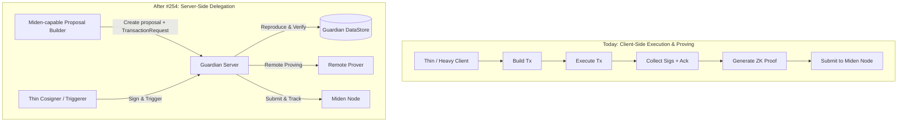
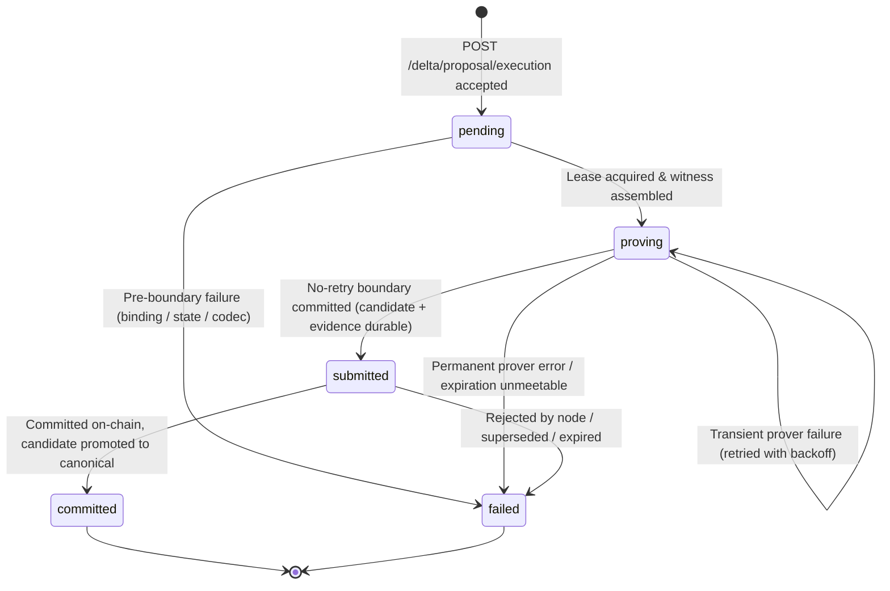
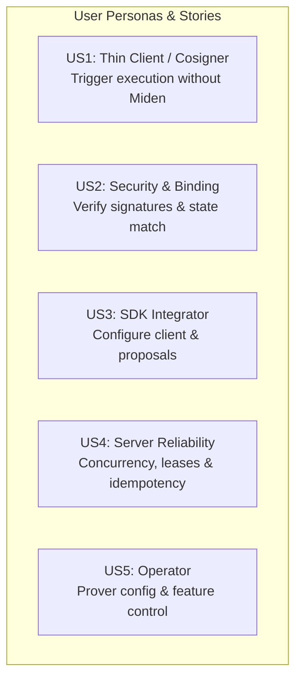
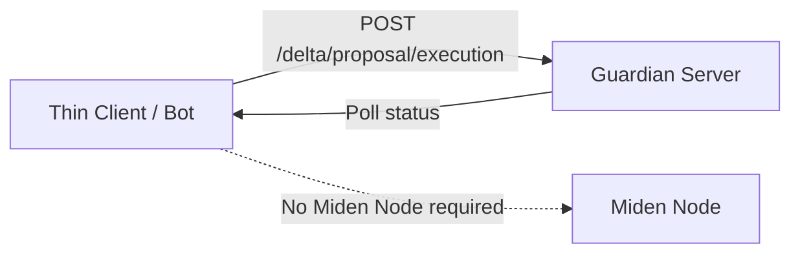
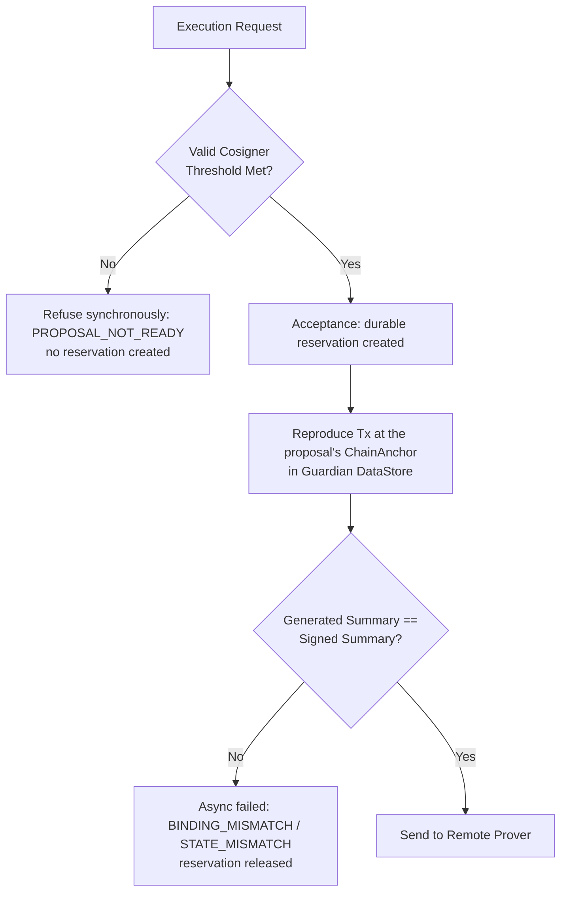
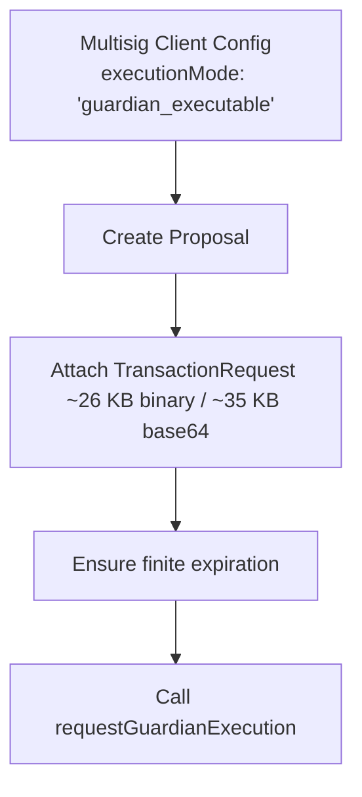
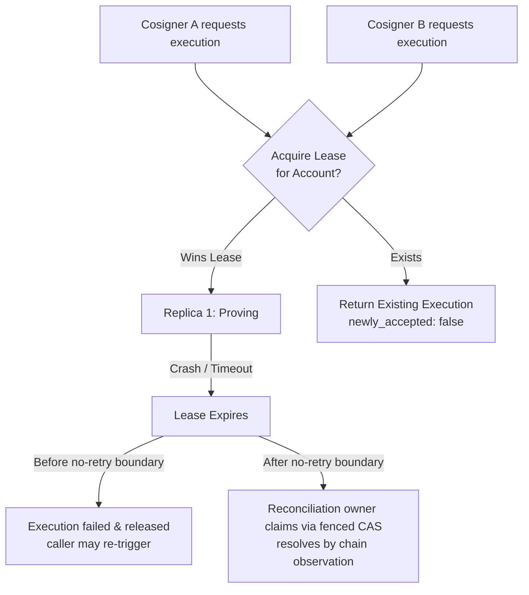
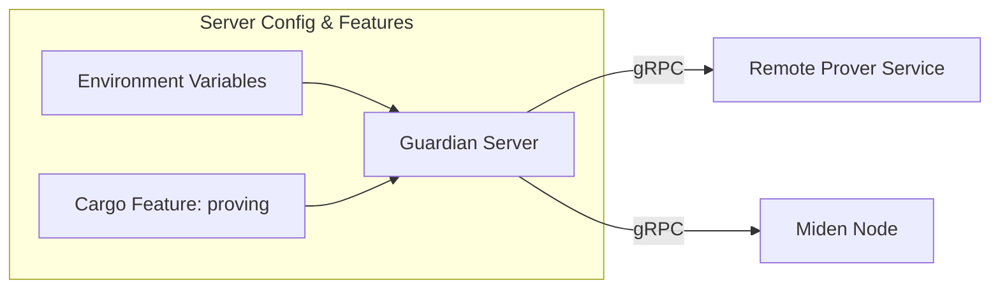
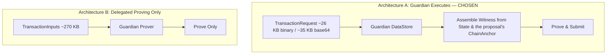

# RFC 0001: Guardian executes, proves and submits transactions

| | |
|---|---|
| **Status** | Accepted for implementation — comments welcome, no closing date |
| **Feature** | [#254](https://github.com/OpenZeppelin/guardian/issues/254) (parent [#253](https://github.com/OpenZeppelin/guardian/issues/253), "Transaction Orchestration") |
| **Audience** | Integrators, operators, and upstream reviewers (Miden team or anyone reading publicly) |
| **Working artifacts** | [`speckit/features/254-guardian-prove-and-commit/`](../../speckit/features/254-guardian-prove-and-commit/) — see appendix |
| **Revision** | 16 (2026-09-15): re-verified against the stable Miden 0.16 pins on `main`. The signed summary now binds the reference block and the expiration delta, so reproduction runs at the proposal's `ChainAnchor` and the revision 13 expiration correction is itself withdrawn (Appendix A.3). Gate 0 spike code moved to the `254-execution-spike` branch; this document and its working artifacts are the only content merged to `main` |

> **Implementation status:** this RFC describes the **proposed end state**. The wire API, execution lifecycle, and SDK changes are not implemented yet; the one exception is the Gate 0 witness-assembly spike, which lives on the [`254-execution-spike`](https://github.com/OpenZeppelin/guardian/tree/254-execution-spike) branch (commit `769e2a90`) and is **not on `main`**. Every spike code path and test name cited in this document (`crates/server/src/network/miden/execution/`, `crates/miden-rpc-client/src/`) resolves against that branch; its tests passed there against the Miden 0.16 rc pins. The linked working artifacts are the implementation plan, and numeric defaults given here are proposals unless the linked contract marks them normative.

---

## Executive Summary & What Changes

Today, the **client** must build the transaction, execute it against account state, collect cosigner signatures, obtain Guardian's acknowledgment, generate the ZK proof, and submit it to the Miden node. This forces every client or triggering caller to maintain full Miden execution and proving capabilities.

**After this work**, three roles separate. A **Miden-capable party builds the proposal** once, attaching the serialized `TransactionRequest`. **Cosigners sign it to threshold** through Guardian — signing a summary commitment needs keys, not a Miden stack. Then **any authenticated cosigner triggers execution and polls the outcome with no Miden capabilities at all**: Guardian carries the proposal the rest of the way — verifies signatures, reproduces the exact transaction against account state, proves via remote prover, submits to the Miden node, and tracks confirmation. What becomes thin is the signing and triggering side; building the proposal remains a Miden-capable step.



**What stays the same:**
- **Zero forgery power**: Guardian cannot alter transaction outputs or forge updates. The executed transaction must reproduce, bit for bit, the summary commitment signed by cosigners.
- **Self-execution is preserved**: Local self-execution remains fully supported and is the default behavior in SDKs. Server-side execution is an opt-in capability.

---

## 1. How It Looks (End-State Design & Experience)

### 1.1 High-Level Sequence Flow


#### Proposal admission and explicit execution

For v1, the client builds the transaction request, derives the summary locally, and
submits the summary with its signatures and metadata. Opting into delegated execution
also attaches the serialized request. Client-side preparation and execution remain the
default.

Proposal creation does not execute the request. The existing Miden validation parses
the supplied summary and verifies that the stored account state matches its recorded
commitment. Guardian records that commitment as the proposal's base. Since protocol 0.16 the
proposal also carries the serialized `ChainAnchor` it was built at (wire field `chain_anchor`,
`crates/miden-multisig-client/src/payload.rs:82-88` on `main`), and the signed summary binds
that anchor's block commitment. Today only the SDKs check that the two agree, before signing
(Rust `crates/miden-multisig-client/src/client/helpers.rs:239-249`, TypeScript
`requireProposalAnchor` in `packages/miden-multisig-client/src/multisig.ts`); the server stores
the anchor without reading it. This RFC adds the same check, plus a tracked-block check, to server
admission (working artifacts FR-056). These checks do
not establish that the request produces the supplied summary. Guardian reproduces the
request and checks the signed-summary binding after delegated execution is accepted,
before acknowledgment or remote proving.

The wallet makes two calls: create the proposal, then request execution. If the
proposal already contains enough valid signatures, the calls can run consecutively
without another signature-collection round. An SDK convenience operation could compose
these calls, but v1 does not automatically execute when the final signature arrives.
Creating or signing a proposal does not acquire an execution reservation.

The effective cosigner threshold is checked before Guardian adds its separate
acknowledgment. The acknowledgment does not fill a missing cosigner signature. The
mapping to a wallet described as 2-of-3 with Guardian as one signer requires agreement
with the wallet team; see the upstream signer-model question below.

#### Competing proposals and admission limits

Multiple proposals can coexist without reserving the account. V1 records each proposal's
base commitment and treats it as stale once the canonical state advances. Only one
proposal can hold the execution reservation. A conflicting execution request is refused;
creating further proposals is also refused while an active candidate exists.

V1 adds a viable-proposal quota per account and authenticated proposer alongside the existing
account-wide count cap and the request-byte limits. A signer must not consume the count
capacity allocated to another signer. Admission must check limits and insert atomically
on both storage backends. Two viable proposals per proposer is a proposed default;
final configuration and the allocation of account-wide capacity must be specified before
implementation. Byte limits remain separate resource limits, so this is not a guarantee
against every denial of service by an authorized signer.

### 1.2 End-to-End Execution Lifecycle & State Machine

Every delegated execution progresses through an explicit five-state lifecycle.
`committed` is the terminal execution status for on-chain success and candidate
canonicalization. Committing submission evidence to storage only produces `submitted`;
it does not establish on-chain success. Existing delta statuses and error codes are unchanged.



| State | Terminal | Meaning & Caller Action |
|---|---|---|
| `pending` | No | Accepted; the durable reservation already exists — waiting for a worker to pick it up. **Action: Poll.** |
| `proving` | No | Witness assembled, remote proving in progress (6–20s per attempt; transient prover failures are retried server-side). **Action: Poll.** |
| `submitted` | No | No-retry boundary crossed; the candidate delta and submission evidence are durable. The network send may be pending, attempted, or of unknown outcome. **Action: Poll, DO NOT retry.** |
| `committed` | **Yes** | Transaction committed on-chain; Guardian's candidate delta promoted to canonical. **Action: Success complete.** |
| `failed` | **Yes** | Execution stopped or rejected. **Action: Retry ONLY IF `proposal_exists == true`.** |

#### Core Execution Rules:
1. **`submitted` is an irreversible boundary**: The state changes to `submitted` when the boundary evidence *commits*, which is before the first byte of the network send — so `submitted` never implies the transaction reached the node, only that retry is forbidden. From that commit on, a definite application-level rejection may settle the execution immediately; every absent or ambiguous send outcome is resolved by chain observation. Nothing is ever re-submitted. The caller MUST NOT retry a `submitted` execution.
2. **`proposal_exists` controls retry**: Post-boundary failures may delete the proposal. Retry is valid only when `state == "failed"` AND `proposal_exists == true`.
3. **Synchronous refusals never create an execution**: conditions determinable at request time — proposal not Guardian-executable (no stored `TransactionRequest`), signature set below the effective threshold (invalid, duplicate, or non-cosigner signature entries are ignored and counted, not fatal), caller not a cosigner, account paused or released, pending candidate, conflicting reservation, or proving capability unavailable — are refused synchronously and queue nothing. Binding and state mismatches are **not** synchronous: they are detected while reproducing the transaction after acceptance and settle as asynchronous `failed` outcomes (the `pending → failed` edge above).
4. **Transient proving failures are retried server-side**: A prover failure at the transport level — connection error, i/o timeout, deadline exceeded — does not fail the execution. Guardian retries proving with capped backoff under the same held reservation, without leaving `proving` and without caller involvement. The execution settles `failed` only on a permanent prover error, or once the transaction's own expiration can no longer be met. The finite expiration chosen at build time (see the Expiration Guard in US3) **is** the retry budget; there is deliberately no separate retry-count or retry-window configuration.

#### How `submitted` Terminates

Before sending the first byte of a submission, Guardian durably records the evidence it will reconcile against: the transaction id, the base account commitment, the expected resulting account commitment, the reference block, and the expiration block taken from the proven transaction itself. A `submitted` execution then terminates in one of four ways:

- **Rejected** — the node returns a definite application-level rejection. The execution owner discards the candidate and settles `failed` immediately; no chain watch is needed.
- **Committed** — the expected account commitment (or the transaction's inclusion) is observed on chain. The candidate delta is promoted to canonical through the normal canonicalization lifecycle, and the execution settles `committed`.
- **Superseded** — the account is observed at a commitment that is neither the base nor the expected result. The transaction can no longer land; the execution settles `failed`.
- **Expired** — the chain height passes the recorded expiration block while the account still sits at its base commitment. The transaction can never land; the execution settles `failed`.

The finite-expiration requirement gives the last outcome a finite **chain-height** bound rather than a wall-clock deadline. Once Guardian can obtain trustworthy chain observations beyond that block, the watch terminates even if the send never started or the node silently dropped the transaction. During a node outage Guardian keeps the execution `submitted`, retains the reservation, retries observation with capped backoff, and alerts operators; restoring or failing over RPC is the only safe operator recovery. Elapsed time alone never permits release or re-submission. This is also why boundary-crossed executions need no re-submission machinery: Guardian knows exactly what it prepared and the chain height after which it cannot land.

### 1.3 Wire API Surface

The feature adds three unified operations available on both HTTP and gRPC:

| Endpoint (HTTP) | gRPC Method | Auth Domain | Purpose |
|---|---|---|---|
| `POST /delta/proposal/execution` | `ExecuteDeltaProposal` | Cosigner (`x-pubkey`, `x-signature`, `x-timestamp`) | Trigger delegated execution, proving, and submission |
| `GET /delta/proposal/execution` | `GetDeltaProposalExecution` | Cosigner (`x-pubkey`, `x-signature`, `x-timestamp`) | Fetch current status of a specific proposal execution |
| `GET /delta/execution/current` | `GetCurrentExecution` | Cosigner (`x-pubkey`, `x-signature`, `x-timestamp`) | Fetch the active in-flight execution for an account |

The two per-proposal operations return the execution envelope directly — `state`, `newly_accepted`, `proposal_exists`, `delta_nonce`, and `error` (when failed). `GET /delta/execution/current` wraps it as `{"execution": <envelope> | null}`: it asks a question about the *account*, and "nothing in flight" is a successful answer (`200`, never `404`), whereas the per-proposal read treats a never-executed proposal as a missing resource. The pair `(account_id, proposal_id)` is the canonical handle.

> **API style note.** Guardian's HTTP surface is deliberately RPC-over-HTTP rather than resource-oriented REST, and these endpoints follow it. Every endpoint must exist with equivalent semantics on gRPC, which is method-oriented; keeping the HTTP shape flat keeps the two surfaces isomorphic — one request message, one handler, one contract. Identifiers (`account_id`, `proposal_id`) travel in the signed payload, never in the URL path, because the authentication signature covers the canonical JSON of the body (or query object), not the path — a path-templated identifier would sit outside the signed bytes. This also preserves the idempotent handle: executions are addressed by `(account_id, proposal_id)` with no separate execution-resource identity, so a repeated trigger returns the same execution rather than creating a new resource.

---

## 2. Per User Story & Persona Configuration



---

### US1 — Thin Client / Cosigner: Trigger Execution Without Miden

A cosigner or light client monitors proposal signature collection. Once threshold is reached, it requests Guardian execution. The triggering client needs **no Miden client SDK or WASM executor**.



#### Base HTTP Client Invocation (no Miden dependencies required):
```ts
// Proposed API — not yet implemented; see contracts/sdk-api.md
import { GuardianHttpClient } from "@openzeppelin/guardian-client";

const client = new GuardianHttpClient("https://guardian.example.com");
client.setSigner(signer); // cosigner credentials sign every request

// Request Guardian to prove and submit a threshold-met proposal
const res = await client.executeDeltaProposal("0x1234...", "0x5678...");

console.log("Execution state:", res.state); // "pending"
```

---

### US2 — Security & Binding: Verifying Signed State Commitments

Before initiating remote proving or writing to chain, Guardian reproduces the transaction at the proposal's `ChainAnchor` against current account state and verifies that the generated summary commitment matches what cosigners signed. The anchor is not optional on protocol 0.16: the signed summary binds the reference block commitment, so re-executing at any other block yields a different commitment.



**Guarantees:**
- Mismatched state (e.g. account nonce advanced elsewhere) halts execution **before** remote proving starts.
- Pre-boundary failures leave proposal unlocked and available for re-execution or fallback local execution.

---

### US3 — SDK Integrator: Configuring Client & Proposal Execution Mode

SDK integrators choose the execution mode at client creation. Default mode remains local self-execution (`self_executed`). Opting into `guardian_executable` embeds the serialized `TransactionRequest` on proposal creation and enforces finite expiration limits.



#### TypeScript SDK (`@openzeppelin/miden-multisig-client`)
```ts
// Proposed API — not yet implemented; see contracts/sdk-api.md
import { MultisigClient } from "@openzeppelin/miden-multisig-client";

// 1. Configure server-execution support at construction (defaults to "self_executed")
const client = new MultisigClient(midenClient, {
  /* …existing configuration… */
  executionMode: "guardian_executable",
});

// 2. Obtain the account's Multisig and create the proposal through a typed,
//    request-building method exactly as today — the configured mode attaches the
//    serialized TransactionRequest and, for built-in proposal families, adds
//    the shared finite expiration internally
const multisig = /* …load the account's Multisig as today… */;
const proposal = await multisig.createP2idProposal(/* …unchanged… */);

// 3. Request Guardian execution once threshold is met
await multisig.requestGuardianExecution(proposal.id);

// 4. Track status
const status = await multisig.executionStatus(proposal.id);
console.log(`Current state: ${status.state}`);
```

#### Rust SDK (`miden-multisig-client`)
```rust
// Proposed API — not yet implemented; see contracts/sdk-api.md
use miden_multisig_client::{MultisigClientBuilder, ProposalExecutionMode};

// 1. Initialize client with server-execution support
let client = MultisigClientBuilder::new()
    /* …existing required configuration: Miden endpoint, Guardian endpoint,
       account directory, key manager… */
    .execution_mode(ProposalExecutionMode::GuardianExecutable)
    .build()
    .await?;

// 2. Request execution & track state
client.request_guardian_execution(&proposal_id).await?;
let status = client.execution_status(&proposal_id).await?;
println!("Execution state: {:?}", status.state);
```

| Config Rule | Detail |
|---|---|
| **Opt-in** | Omitting `executionMode` uses `self_executed`. Existing behavior is unchanged. |
| **Payload Attachment** | `guardian_executable` attaches a serialized `TransactionRequest` (~26 KB binary; ~35 KB after base64 in JSON). |
| **Expiration Guard** | For built-in proposal families, both SDKs construct the transaction with the shared 256-block finite expiration. On protocol 0.16 the expiration delta is part of the signed summary (`miden-protocol-0.16.1/src/transaction/tx_summary.rs:29-36`), so the same effects produce a different proposal id under `guardian_executable` than under `self_executed`, and nobody can change the expiration after cosigners sign. An opaque custom request cannot be generically rewritten on the pinned 0.16 line either, so its producer must construct it to expire finitely. Guardian verifies the proven transaction's resulting expiration and refuses a non-expiring or out-of-horizon transaction before the boundary. |

---

### US4 — Server Reliability: Concurrency, Lease Reservation & Idempotency

When multiple cosigners trigger execution simultaneously or a server replica crashes mid-proof, Guardian guarantees, across all replicas: **at most one lease-authorized proving attempt at a time, and at most one on-chain submission** — enforced by durable storage-backed reservations with renewable leases and monotonic fence tokens. On the Postgres backend the fencing is transactional and holds across replicas; the filesystem backend is single-process and validates the active reservation's holder and fence under the existing account-scoped write lock. It deliberately does **not** claim at most one *active* attempt: the remote prover is an external service Guardian cannot cancel, so an expired owner's proof request may still be running while a new owner starts another. Stale owners are fenced out of every write. Wasted prover cost is accepted; a second submission is not.



**Reliability Contracts:**
- **Idempotent Requests**: Re-posting `/delta/proposal/execution` for an active proposal returns the existing execution record (`newly_accepted: false`).
- **Lease Timeout**: A stalled worker's lease expires. **Before the no-retry boundary** the execution is failed and released — never silently resumed, so the caller decides whether to re-trigger. **After the boundary** a reconciliation owner takes over the live reservation by fenced compare-and-set and resolves the outcome by chain observation; nothing is ever re-submitted.

---

### US5 — Operator Configuration & Infrastructure Setup

Operators control whether server-side proving is enabled by specifying a remote prover endpoint and timeouts. Guardian **never proves in-process**: "local" proving is an operator running a prover next to Guardian (e.g. a sidecar) and pointing `GUARDIAN_TX_PROVER_URL` at it, not an alternate code path in the server.



#### Operator Configuration Parameters

Defaults below are **proposed by this RFC**; the normative contract ([`contracts/execution-api.md`](../../speckit/features/254-guardian-prove-and-commit/contracts/execution-api.md) § Configuration) fixes the variable set and one constraint — the prover timeout must default well above the upstream client library's 10 s.

| Parameter | Required | Proposed Default | Description |
|---|---|---|---|
| `GUARDIAN_TX_PROVER_URL` | **Yes** (to enable) | None | Remote transaction prover endpoint URL. Unset disables the capability (no fallback). |
| `GUARDIAN_TX_PROVER_TIMEOUT_SECS` | No | `300` | Remote prover RPC timeout per attempt (observed proving: 6–20 s; the upstream client default of 10 s, `miden-client-0.16.0/src/remote_prover/tx_prover.rs:43`, is too low). |
| `GUARDIAN_PROVING_ENABLED` | No | `true` | Kill-switch to disable proving without unsetting prover URL. |
| `GUARDIAN_MAX_PROPOSAL_REQUEST_BYTES` | No | TBD | Size cap on a stored `TransactionRequest`; an oversized proposal is refused at creation, not at execution. |
| `GUARDIAN_MAX_ACCOUNT_REQUEST_BYTES` | No | TBD | Aggregate cap on stored requests per account. |
| `GUARDIAN_EXECUTION_LEASE_SECS` | No | `120` | Duration of the reservation lease before a stalled worker times out. |
| `GUARDIAN_EXECUTION_RECONCILE_INTERVAL_SECS` | No | `30` | How often reconciliation re-checks unresolved submissions against the chain. |
| `GUARDIAN_EXECUTION_EXPIRATION_HORIZON_BLOCKS` | No | TBD | Maximum allowed distance from the reference block to expiration; exceeding it prevents crossing the no-retry boundary. This is a chain-height bound; resolution still requires eventual trustworthy chain observation. |

#### Example `.env` Configuration
```bash
# Feature enablement
GUARDIAN_TX_PROVER_URL=https://tx-prover.testnet.miden.io
GUARDIAN_TX_PROVER_TIMEOUT_SECS=300
GUARDIAN_PROVING_ENABLED=true

# Execution & Lease Controls
GUARDIAN_EXECUTION_LEASE_SECS=120
GUARDIAN_EXECUTION_RECONCILE_INTERVAL_SECS=30
```

> **Warning for Operators:** The upstream prover client's own default timeout (10 seconds) is below real testnet proving times (6–20 s), which is why the proposed Guardian default is far higher. If you override `GUARDIAN_TX_PROVER_TIMEOUT_SECS`, keep it well above observed proving times for your prover.
>
> **Canonicalization mode is required.** Guardian execution depends on the candidate → canonical delta lifecycle to establish whether a submitted transaction committed. A server running in optimistic delta-commit mode refuses execution requests with the capability-unavailable error class, and the misconfiguration is reported at startup rather than discovered by the first caller.

**Prover capacity is the principal throughput constraint to size.** Each observed proof took 6–20 seconds, and executions across all accounts use the configured prover endpoint. Exploratory load runs against the public testnet prover produced transport-level i/o timeouts under concurrency rather than well-formed errors (Appendix A.4, finding 4) — which is why the server-side retry policy above classifies transport failures as transient. These runs are not presented as a reproducible capacity benchmark because their raw report is not committed. A deployment expecting sustained execution throughput should provision its own prover (or prover pool) and size it against the expected number of concurrent executions.

---

## 3. Architecture Decision Matrix

Two architectural options were evaluated for server-side transaction execution:



| Dimension | Architecture A (Chosen) | Architecture B (Delegated Proving) |
|---|---|---|
| **Client Sends** | Serialized `TransactionRequest` (~26 KB binary; ~35 KB base64) | Serialized `TransactionInputs` (~270 KB binary) |
| **Witness Built By** | **Guardian** (server-side `miden-tx::DataStore` over stored state plus the proposal's `ChainAnchor`) | A Miden-capable party outside Guardian, per transaction |
| **Triggering Caller Needs Miden SDK** | **NO** (thin cosigners trigger and poll) | No for the literal trigger — but some external party must execute locally to build each witness |
| **Eliminates Per-Execution Miden Requirement** | **YES** (only proposal *creation* stays Miden-capable) | No |

**Decision**: **Architecture A is chosen** because it achieves the primary project goal: allowing thin, non-Miden clients (such as web frontends or light cosigners) to delegate execution and proving completely to Guardian.

### 3.1 Chain View & Witness Assembly — the Inner Flow

The **account and reference-chain snapshot is required for every transaction**, and historical block authentication is **only required for authenticated input notes**. Since protocol 0.16 both come from the proposal itself. The proposer captures a `ChainAnchor` at the block it derived the summary at: the reference `BlockHeader` plus a `PartialBlockchain` that tracks the creation block of every authenticated input note (`miden-client-0.16.0/src/transaction/chain_anchor.rs:45-48`, `.../transaction/mod.rs:470-500`) **[READ]**. The anchor ships with the proposal, and the signed summary binds its block commitment (`miden-protocol-0.16.1/src/transaction/tx_summary.rs:29-36`) **[READ]**, so it supplies the chain data `TransactionInputs` needs at the only block that reproduces what the cosigners signed. It is not sufficient on its own: the summary binds the header commitment, not the tracked-block set, so an anchor with a matching header and an empty or wrong `PartialBlockchain` passes every check the anchor makes itself. Guardian has to check the tracked set against the request's authenticated notes, and it has to do so at admission, or a signature-complete proposal can hold the account's reservation only to fail closed at execution.

Guardian therefore does not assemble the chain view from node RPC. It deserializes the anchor, which already rejects a `PartialBlockchain` whose length or peaks disagree with its header or that tracks more blocks than a transaction may reference (`ChainAnchor::new`, `chain_anchor.rs:58-84`; deserialization routes through it, `:161`) **[READ]**; checks the anchor's block commitment against the one bound into the signed summary, the same check the SDKs make before signing (Rust `crates/miden-multisig-client/src/client/helpers.rs:239-249`, TypeScript `requireProposalAnchor` in `packages/miden-multisig-client/src/multisig.ts`, both on `main`); checks that the anchor tracks the creation block of every authenticated input note; and authenticates the anchored header against the node by fetching the header at that height (`GetBlockHeaderByNumber`, `miden-node-proto-build-0.16.0/proto/rpc.proto:225-242`) and comparing commitments. That last step is what turns a proposer-supplied anchor into a chain-anchored one; see question 2 below for the trust root it rests on.

The anchor pins the reference block only. The mode each input note is consumed in, authenticated or unauthenticated, also enters the summary, and `miden-client` classifies notes from the executing client's own store unless the request pins them through `TransactionRequestBuilder::explicit_input_notes` (`miden-client-0.16.0/src/transaction/mod.rs:357-360`) **[READ]**. Guardian has no store, and the SDKs' consume-notes path today classifies from the local store and imports proofs to force authenticated mode (`crates/miden-multisig-client/src/transaction/consume.rs:108-120` on `main`); neither SDK uses `explicit_input_notes` yet. A Guardian-executable consume-notes request therefore has to carry its notes pinned in the request, or a storeless executor consumes them unauthenticated, reproduces a different summary, and fails the binding check on the honest path. This is the consume-notes residue Gate 0 named, restated for 0.16; see question 3.

The chain view remains ephemeral: it is built for one worker attempt and discarded afterward. There is no long-lived per-account sync loop. The genesis-seeded `SyncChainMmr` and bounded `SyncNotes` assembly that the Gate 0 spike validated (Appendix A) is historical evidence, not part of the v1 design: a proposal without an anchor is refused at admission, and Guardian never substitutes the chain tip for the anchored block.

**Future optimization:** if production measurements show that the per-execution header authentication read is material, Guardian may keep a rebuildable cache of validated headers to shorten later executions. This is not a v1 requirement or a commitment to a particular storage design; node data remains authoritative and correctness must not depend on the cache.

Two further 0.16 inputs are the executor's responsibility because Guardian drives `TransactionExecutor` directly rather than through the `miden-client` façade:

- **Fee conversion info.** The `AuthGuardedMultisig` auth procedure pays fees before it builds the summary, reading `hash(CONVERSION_INFO || SALT)` from the auth arg and the preimage from the advice map. The SDKs declare the salt on the request (`fee_conversion_salt`, serialized with the request), and the pinned client derives the chain-native conversion info from the anchored header and commits it at execution time (`miden-client-0.16.0/src/transaction/mod.rs:1528-1560`, `.../request/mod.rs:278-284`) **[READ]**. The outer helper is private and the commit step `pub(crate)`, and the client leaves a request that already carries an auth arg untouched, so Guardian must reproduce that exact decision itself; see question 8.
- **Expiration.** The delta counts from the anchored reference block, so a stale anchor can yield an already-expired transaction. `miden-client` refuses that after execution, when the executed transaction's expiration block is at or below the sync height (`.../transaction/mod.rs:393-402`) **[READ]**. The horizon rule does not catch it: a 256-block delta on an anchor 300 blocks behind the tip is already expired yet inside a horizon measured from the reference block, so it would be proved and then rejected by the node, and after the no-retry boundary that strands the account. Guardian therefore makes the client's check a distinct pre-proving step against the observed chain height, repeated before every proving retry and reported as its own error (working artifacts FR-058, FR-055), alongside the horizon rule.

```mermaid
sequenceDiagram
  participant GS as Guardian Storage
  participant W as Execution Worker
  participant Node as Miden Node RPC
  participant Prover as Remote Prover

  W->>GS: Load account, TransactionRequest, ChainAnchor, signatures
  W->>W: Deserialize anchor (header/chain consistency enforced on read)
  W->>W: Check anchor block commitment == signed summary block commitment
  W->>Node: GetBlockHeaderByNumber(anchor block)
  Node-->>W: Header at that height
  W->>W: Compare header commitment with the anchor (Q2)
  W->>W: Prepare InputNotes; every authenticated note block must be tracked by the anchor
  W->>W: Derive and inject fee conversion advice from the anchored header (Q8)
  W->>W: Build ephemeral DataStore over stored state + anchor (Q5)
  W->>W: Reproduce unsigned, verify signed-summary binding
  W->>W: Add signatures and Guardian acknowledgment, execute, verify again
  W->>Node: Read chain height; refuse if executed expiration is already reached
  W->>Prover: Self-contained TransactionInputs witness (~270 KB)
  Prover-->>W: ZK proof
  W->>W: Re-check, fence, and atomically cross no-retry boundary
  W->>Node: Submit proven transaction
  W->>W: Resolve by chain observation (Q7)
```

Reading guide for the upstream questions:

- **Q1** anchors at the signed summary: the expiration delta is inside it on 0.16, so it is fixed at signing time.
- **Q2** anchors at the header comparison: the anchor comes from the proposer, the node read is what Guardian trusts, and the response's `block_signatures` are the stronger root we do not yet validate.
- **Q3** anchors at input-note preparation: the anchor carries the note-block paths, but note consumption mode is pinned by the request, not the anchor.
- **Q4** is historical: with the anchor carrying the peaks there is no cold `SyncChainMmr` on the execution path.
- **Q5** anchors at the `DataStore` note, the seam Guardian implements directly.
- **Q7** anchors at outcome observation: inclusion is inferred from the observed account commitment.
- **Q8** anchors at the fee conversion step, the one piece of `miden-client` execution logic Guardian has to re-derive.

---

## Future extensions (outside v1)

- **Optional server preparation.** An authenticated `prepare` operation could accept a
  transaction request and its execution context, derive the summary, and create an
  unsigned proposal. It would return the proposal ID and summary for review and signing
  through the existing signing endpoint. The existing create operation would continue
  to accept client-prepared summaries. Preparation would neither reserve the account nor
  authorize execution. Resource limits and preparation failures need their own contract.
- **Opt-in automatic execution.** A future account policy could queue eligible proposals
  when enough distinct, valid cosigner signatures exist. Explicit execution remains the
  default. The policy must be discoverable by signers, preserve the normal authorization,
  state and conflict checks, and define retry or queue behavior when another execution
  blocks the account. Policy configuration is additional API work, not assumed here.
- **Dependent transaction chains.** Pipelining `A -> B -> C` could reduce the wait between
  transactions. It requires dependencies, speculative states, ordered submission, and
  recovery when a parent fails. V1 waits for canonicalization before advancing the base.
- **Independent proposal ordering.** V1's base-commitment restriction is Guardian policy,
  not a claim that every summary binds to an exact starting account state. A future
  executor could revalidate independent proposals after another transaction commits and
  retain signatures only if execution still reproduces the signed summary. Compatibility
  also depends on the pinned Miden version and signed execution context.
- **Batching.** Compatible transactions could share a network batch. The design must
  preserve each transaction's authorization and define how failures affect the batch.
  This is distinct from both dependency chaining and independent proposal revalidation.

## 4. Protocol Questions for Upstream (Miden Team)

Each question below states what Guardian does, what we observed, and the specific confirmation or guidance we are asking for. Verification tags follow Appendix A.1, and §3.1 diagrams the witness-assembly flow the questions anchor to.

1. **Finite expiration, its binding, and custom scripts.** A transaction built without an explicit expiration is non-expiring: the proven transaction reports the `u32::MAX` sentinel **[RAN]**, and on 0.16 the summary carries an expiration delta of `0` for it (`miden-protocol-0.16.1/src/transaction/tx_summary.rs:99-101`) **[READ]**. Guardian resolves an absent or ambiguous send only by chain observation, and the recorded expiration block supplies the finite chain height at which that watch can terminate, so Guardian refuses to cross the no-retry boundary for a non-expiring or out-of-horizon transaction. For built-in proposal families the SDKs construct transactions with a shared 256-block finite expiration. For opaque custom requests the pinned client still exposes no expiration mutator on `TransactionRequest` (`miden-client-0.16.0/src/transaction/request/mod.rs:145-259`, only `advice_map_mut`) and `TransactionRequestBuilder::build` rejects `expiration_delta` together with a custom script (`.../request/builder.rs:630,644-647`) **[READ]**; the producer must include the expiration update in its own script. **What changed on 0.16**: `TransactionSummary` now commits to the account delta, input notes, output notes, the reference block commitment, the expiration delta, and seven user parameters, the salt among them (`tx_summary.rs:29-36,110-121,235-244`) **[READ]**. Expiration is therefore signed: adding it changes the summary and the proposal id, and no party can tighten it after cosigners sign. Guardian's v1 rule not to rewrite the request is now enforced by the protocol, not only an ownership choice. **Questions**: (a) is a finite expiration on every delegated-execution transaction the recommended pattern? (b) what is the supported way to impose a finite expiration on an existing custom-script request; should the producer call `tx::update_expiration_block_delta`, or would upstream consider a request transformation API that runs before summary derivation? Outcome observation, including whether an inclusion lookup could replace expiration as the terminal backstop, is question 7.

2. **Reference block authentication and trust root.** On 0.16 the reference block is fixed by the proposal: the signed summary binds the block commitment of the `ChainAnchor` the proposer executed at, and the anchor itself enforces that its `PartialBlockchain` has that header's length and hashes to its chain commitment (`miden-client-0.16.0/src/transaction/chain_anchor.rs:58-84`) **[READ]**. That proves internal consistency of proposer-supplied data; it does not show the header is a real block. Guardian authenticates it by reading the header at that height from its configured node and comparing commitments. The Gate 0 spike validated the older construction, a genesis-seeded `SyncChainMmr` whose applied delta hashes to the sync-target header's `chain_commitment` **[RAN]** (`live_cold_start_chain_mmr_matches_the_reference_block`), which has the same limitation: two values from one node. `SyncChainMmrResponse` now carries `repeated BlockSignature block_signatures`, ordered against the validator set committed by the parent header (`miden-node-proto-build-0.16.0/proto/rpc.proto:557-571`, `proto/types/blockchain.proto:112-116`) **[READ]**, and `GetBlockHeaderByNumber` can return an MMR path at the current chain length (`rpc.proto:225-242`) **[READ]**; Guardian validates neither yet. **Questions**: (a) is comparing the anchored header against the node's header at the same height the intended way for an executor to accept a third-party `ChainAnchor`, or should it also require the MMR path? (b) what validator key set or other trust root should a server use to validate `block_signatures`, including rotation, and is signature validation the intended way to bind a header to the canonical chain?

3. **Authenticated note-block paths for a stateless executor.** On 0.16 the proposer's `ChainAnchor` tracks the creation block of every authenticated input note (`miden-client-0.16.0/src/transaction/mod.rs:470-500`) **[READ]**, and `execute_transaction_at` fails when a note's block is not tracked (`.../transaction/mod.rs:370-376`) **[READ]**, so Guardian does not assemble note-block paths from RPC. Two things the anchor does not settle: the signed summary binds the header commitment only, so Guardian checks the tracked-block set against the request's authenticated notes itself; and the mode each note is consumed in enters the summary and is classified from the executing client's store unless the request pins it with `TransactionRequestBuilder::explicit_input_notes` (`.../transaction/mod.rs:357-360`) **[READ]**, which neither Guardian SDK uses today (`crates/miden-multisig-client/src/transaction/consume.rs:108-120` classifies from the local store and imports proofs). A storeless executor needs the notes pinned in the request. Separately, the `DataStore` documentation says the highest entry in `ref_blocks` is the reference block and recommends the latest block available (`miden-tx-0.16.1/src/executor/data_store.rs:20-24`) **[READ]**; a naive implementation executes at the tip and cannot reproduce a 0.16 summary, so Guardian's implementation returns the anchored header regardless. The spike's bounded `SyncNotes` assembly remains validated **[RAN]** (`live_sync_notes_paths_track_against_the_execution_reference_forest`, reference block 1,174,436) and documented in Appendix A: `SyncNotes` paths are valid at forest `block_to + 1`, so execution against reference block `N` requests through `N - 1`, and a diagnostic full-range query for tag `0` returned 91,465 blocks in 59.9 s. **Questions**: (a) is a proposer-captured anchor plus `explicit_input_notes` the recommended way to make a consume-notes summary reproducible by a stateless executor, or should the executor re-derive paths and modes? (b) should the anchor, or the summary, bind the tracked-block set so a verifier need not check it separately? (c) if an executor does have to assemble paths itself, would upstream consider an exact-note or exact-block MMR-proof query against an explicit target forest, avoiding broad tag scans?

4. **`SyncChainMmr` load.** With the anchor carrying the peaks, Guardian makes no `SyncChainMmr` call per execution; one header read replaces it. The spike's finding is recorded for the historical construction: `SyncChainMmr` is a delta against a height the caller already holds (`rpc.proto:547-554`) **[READ]**, its payload is logarithmic in chain length, peaks plus merge siblings (`miden-crypto-0.29.4/src/merkle/mmr/tests.rs:1269-1273`, previously `0.25.1:1241-1245`) **[READ]**, and a cold start against a 1,002,185-block chain completed in ~0.6 s **[RAN]**. **Question**: would upstream consider a direct peaks accessor (a peaks field on the block header response, or a `GetChainMmrPeaks` RPC)? Nothing blocks on it.

5. **Architecture A alignment and the `DataStore` seam.** Guardian implements the five `miden_tx::DataStore` methods (`get_transaction_inputs`, `get_foreign_account_inputs`, `get_vault_asset_witnesses`, `get_storage_map_witness`, `get_note_script`) plus the `MastForestStore` supertrait obligation (`miden-tx-0.16.1/src/executor/data_store.rs:18-72`) **[READ]** directly over its own stored account state and the proposal's anchor, and drives `TransactionExecutor` with it, bypassing the `miden-client` `Client` façade: no sync loop, no long-lived per-account store. We could not reuse `ClientDataStore`: its module is still `pub(crate)` (`miden-client-0.16.0/src/store/mod.rs:65-71`) and the only re-export is inside the `testing` feature module (`.../src/lib.rs:355-370`) **[READ]**, and it is constructed over the full `Store` trait, 61 methods of which 45 are required on 0.16.0 (`store/mod.rs:191-858`; 57 and 46 on 0.15.0) **[READ]**, far more surface than an ephemeral per-execution store needs. Spike tests on the 0.16 rc pins validated unsigned reproduction, signature-advice injection, the on-chain Guardian authorization gate, authorized execution, and proving (`crates/server/src/network/miden/execution/tests.rs` on `254-execution-spike`) **[RAN]**; a witness assembled from live testnet data executed and proved through the public remote prover (`live_prove_a_guardian_assembled_witness`) **[RAN]**. Those tests predate the `ChainAnchor` and fee-conversion inputs and must be re-run with them. **Questions**: (a) is direct third-party implementation of `miden_tx::DataStore` an intended, supported seam that upstream will keep stable? (b) would upstream consider a smaller maintained helper that turns a `ChainAnchor` plus an account into `TransactionInputs` without the complete `Store` interface, so server-side executors do not each re-derive the same assembly logic?

6. **Prover concurrency expectations.** Exploratory load runs against the public testnet prover produced transport-level i/o timeouts under concurrency rather than well-formed prover errors (Appendix A.4, finding 4) **[RAN]**. The raw report is not committed, so we treat this as a qualitative observation, not a capacity measurement. Guardian retries transient prover failures server-side (§1.2, rule 4), but retries do not add capacity. **Question**: what concurrency should a single prover endpoint be expected to sustain, and is running a dedicated prover (or pool) the intended pattern for server-side executors like Guardian?

7. **Outcome observation and inclusion lookup.** Guardian resolves a submission by observing the account commitment on chain and treats the recorded expiration block as the terminal backstop for a send whose fate is unknown (section 1.2). **Question**: is a transaction-status or inclusion lookup planned, and would it distinguish "not yet included" from "will never be included"? Expiration would remain the backstop unless such an API provides definitive absence.

8. **Fee conversion info for a non-`Client` executor.** Since 0.16 the `AuthGuardedMultisig` auth procedure pays fees before building the summary, so the fee note and the vault withdrawal funding it fall inside what cosigners sign, and the auth arg is the commitment `hash(CONVERSION_INFO || SALT)` whose preimage the executor must place in the advice map (see `docs/MIDEN_COMPATIBILITY.md`). The SDKs declare the salt on every built-in request (`TransactionRequestBuilder::fee_conversion_salt`, serialized with the request: `miden-client-0.16.0/src/transaction/request/mod.rs:436-451`) **[READ]**. During request preparation `miden-client` leaves a request that already carries an auth arg untouched (the caller's own commitment), and otherwise, when the anchored header's verification base fee is non-zero or a salt is declared, derives the chain-native 1/1 conversion info from that header and commits it under the declared salt, or under a fixed empty salt for fixed-salt auth components (`.../transaction/mod.rs:1528-1560`, `.../request/mod.rs:278-284`) **[READ]**. The outer helper is a private function and the commit step is `pub(crate)`, so an executor that drives `TransactionExecutor` directly has to re-implement that exact decision, and a mismatch is a binding failure rather than an execution error, because the committed conversion info is part of the reproduced summary. **Questions**: (a) would upstream make `attach_native_fee_conversion_info` (or an equivalent over a `ChainAnchor` and a `TransactionRequest`) public? (b) is the 1/1 chain-native rate the SDKs commit today the long-term contract, or should an executor expect requests committing other assets and rates?

---

## Appendix A: Evidence & Spike Research

This appendix contains the reviewable technical evidence and spike findings gathered during prototyping against public Miden testnet.

### A.1 Claim Verification Tags
Technical assertions carry verification tags:
- **[RAN]**: Verified by executing automated tests or live testnet scripts.
- **[READ]**: Verified against dependency source code in `Cargo.lock`.
- **[INFERRED]**: Reasoned from protocol specifications.

### A.2 Dependency versions used for the original spike

The table below records the historical 0.15 validation environment. The spike itself is
kept on the [`254-execution-spike`](https://github.com/OpenZeppelin/guardian/tree/254-execution-spike) branch (commit `769e2a90`), where it was last built against the
workspace's Miden 0.16 rc pins, converting locally generated RPC types and implementing the
0.16 data-store interfaces. `main` has since moved to the stable 0.16 release
(`miden-protocol`/`miden-tx` 0.16.1, `miden-client`/`miden-node-proto-build` 0.16.0); the
spike has not been rebuilt against those pins.
The remote-prover live test uses `miden_client::remote_prover::RemoteTransactionProver`
under `e2e`; `proving` alone enables `miden-tx` and does not depend on `miden-client`.
Historical live results do not establish compatibility with the current public prover.


| Crate | Version | Crate | Version |
|---|---|---|---|
| `miden-protocol` | 0.15.3 | `miden-processor` | 0.23.3 |
| `miden-client` | 0.15.0 | `miden-node-proto` | 0.15.0 |
| `miden-tx` | 0.15.3 | `miden-remote-prover-client` | 0.15.0 |
| `miden-crypto` | 0.25.1 | `miden-testing` | 0.15.3 |

The **[READ]** citations in this revision were re-verified against the stable pins `main`
carries today (`Cargo.toml` / `Cargo.lock`, 2026-09-15). `miden-remote-prover-client` is no
longer a separate dependency; the remote prover lives in `miden-client::remote_prover`.

| Crate | Version | Crate | Version |
|---|---|---|---|
| `miden-protocol` | 0.16.1 | `miden-processor` | 0.29.4 |
| `miden-client` | 0.16.0 | `miden-node-proto-build` | 0.16.0 |
| `miden-tx` | 0.16.1 | `miden-standards` | 0.16.1 |
| `miden-crypto` | 0.29.4 | `miden-testing` | 0.16.1 |

### A.3 Historical Corrections Record
- **Revision 1 Claim (Withdrawn)**: Initially claimed that fetching chain MMR peaks via `SyncChainMmr` was linear in chain length and blocked server execution.
- **Correction (Revision 2)**: Source code inspection of `miden-crypto` (`.../mmr/tests.rs:1241`) proved that `SyncChainMmr` delta size is **logarithmic in chain length** (returning peaks and merge siblings). Cold start against public testnet at block 1,002,185 took **0.6 seconds** **[RAN]**.
- **Earlier Expiration Claim (Withdrawn)**: Earlier design text said adding an expiration after
  signing would change the signed transaction summary and proposal id.
- **Correction (Revision 13)**: On the pinned Miden line, `TransactionSummary` contains the
  account delta, input notes, output notes, and salt, but not expiration. Expiration is therefore
  an unsigned liveness constraint. Built-in SDK builders apply the shared finite policy; opaque
  custom producers encode it in their scripts; Guardian verifies the executed/proven result and
  preserves the stored request bytes for reproducibility.
- **Revision 13 Correction (Withdrawn, Revision 16)**: that correction was true of `miden-protocol`
  0.15.3 and is false on the 0.16 line the workspace now pins. `TransactionSummary` 0.16.1 commits
  to the account delta, input notes, output notes, the reference block commitment, the expiration
  delta, and seven user parameters (`miden-protocol-0.16.1/src/transaction/tx_summary.rs:29-36,
  110-121`). Expiration is signed; the original design text was right for 0.16. The v1 rule that
  Guardian never rewrites the request stands, now as a protocol constraint as well as an ownership
  choice, and the sdk contract no longer promises an unchanged proposal id across execution modes.
- **Chain-view assembly superseded (Revision 16)**: the genesis-seeded `SyncChainMmr` and bounded
  `SyncNotes` assembly validated by the spike (questions 2 to 4) is no longer the execution path.
  Since 0.16 proposals carry a `ChainAnchor` whose block commitment the signed summary binds, so
  Guardian reproduces at that anchor and authenticates its header against the node instead of
  assembling a chain view at the tip. The spike evidence is historical and non-normative for v1.
- **Fee conversion (Revision 16)**: earlier revisions did not mention transaction fees. On 0.16
  the auth component pays them inside the signed summary and the executor must supply the fee
  conversion advice; question 8 records the gap (question 7 keeps its outcome-observation
  meaning from earlier revisions' reading guide).

### A.4 Testnet Benchmark Findings
1. **Payload Overhead**: `TransactionRequest` is ~26 KB binary (~35 KB after base64 in JSON), while the full binary `TransactionInputs` witness is ~270 KB (~10× larger) **[RAN]**.
2. **Proving Latency**: Measured remote proving times on public testnet (`https://tx-prover.testnet.miden.io`): **6.2s, 13.8s, and 20.1s** **[RAN]**.
3. **Default Timeout Hazard**: Default 10s timeout in `miden-remote-prover-client` caused an observed failure. With a 300s timeout, three consecutive runs passed **[RAN]**. This establishes the default-timeout hazard, not an endpoint reliability rate.
4. **Provisional Prover-Concurrency Observation** (2026-07-29 exploratory load runs): concurrent writers against the public testnet prover produced predominantly transport-level `connection error: i/o timeout` failures rather than well-formed prover error responses — an error family a naive transient-failure classifier can miss **[RAN]**. Methodology: the repository's distributed benchmark client harness (`benchmarks/prod-server/`), with each writer independently executing and proving its own transactions. The raw report is not committed, so this RFC deliberately makes no quantitative success-rate or endpoint-capacity claim from those runs.

---

## Appendix B: Working Artifacts Index

Detailed implementation spec artifacts live in [`speckit/features/254-guardian-prove-and-commit/`](../../speckit/features/254-guardian-prove-and-commit/):

| File | Content |
|---|---|
| [`spec.md`](../../speckit/features/254-guardian-prove-and-commit/spec.md) | Requirements, scenarios, and success criteria |
| [`plan.md`](../../speckit/features/254-guardian-prove-and-commit/plan.md) | Architecture plan and workstream breakdown |
| [`data-model.md`](../../speckit/features/254-guardian-prove-and-commit/data-model.md) | DB schema, leases, and state transition atomic units |
| [`contracts/execution-api.md`](../../speckit/features/254-guardian-prove-and-commit/contracts/execution-api.md) | Complete OpenAPI/gRPC wire specification |
| [`contracts/sdk-api.md`](../../speckit/features/254-guardian-prove-and-commit/contracts/sdk-api.md) | TypeScript & Rust SDK interfaces |
| [`quickstart.md`](../../speckit/features/254-guardian-prove-and-commit/quickstart.md) | Integrator & operator step-by-step walkthrough |
