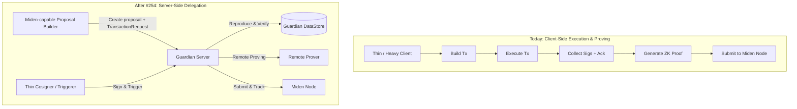
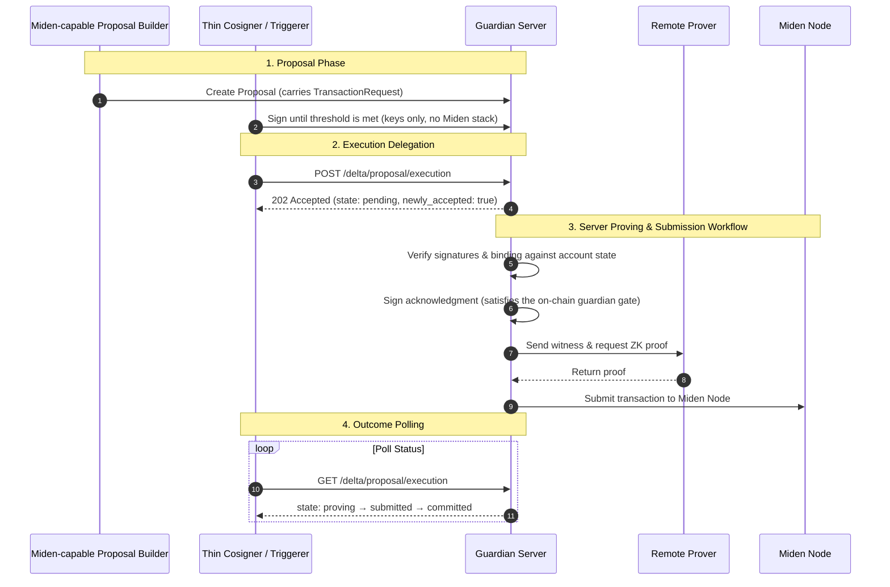
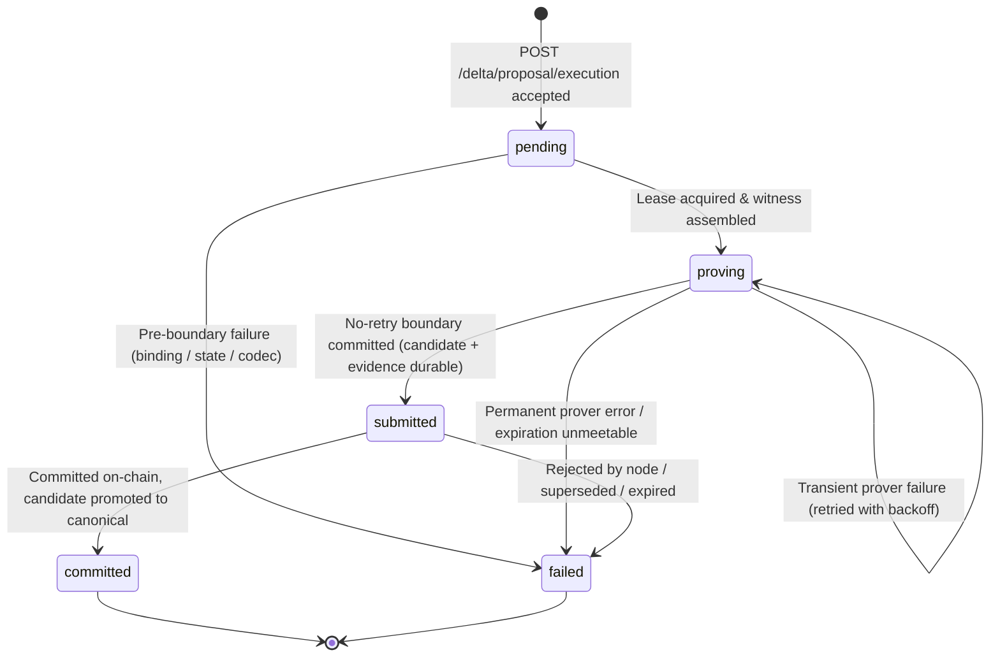
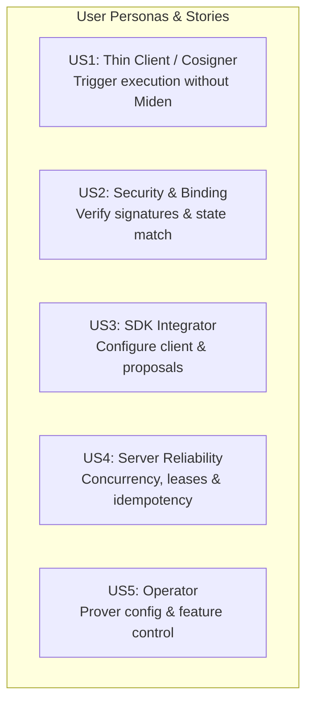
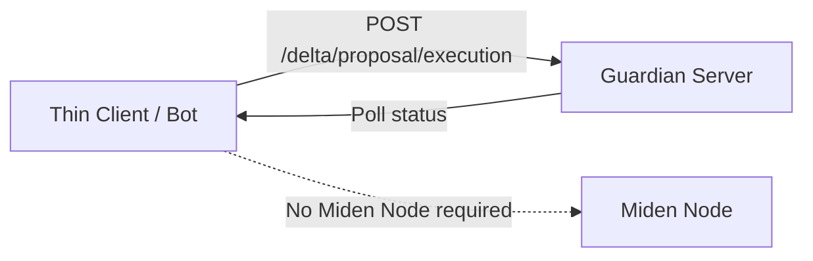
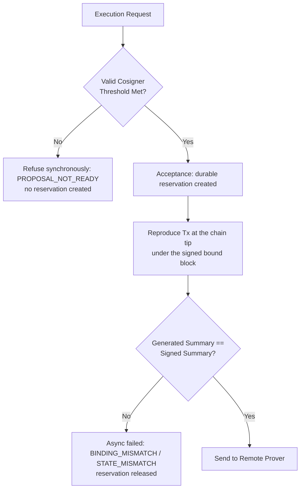
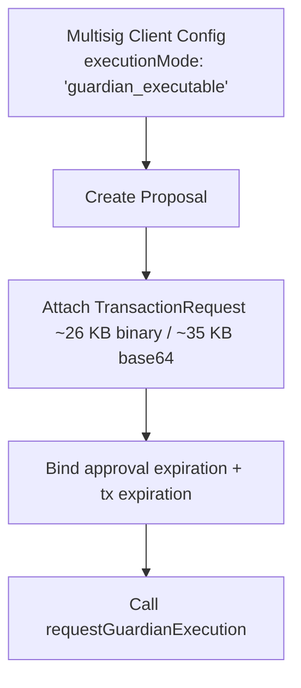
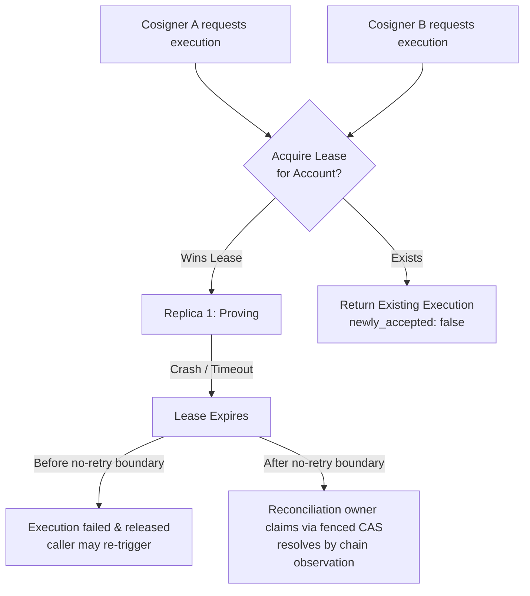
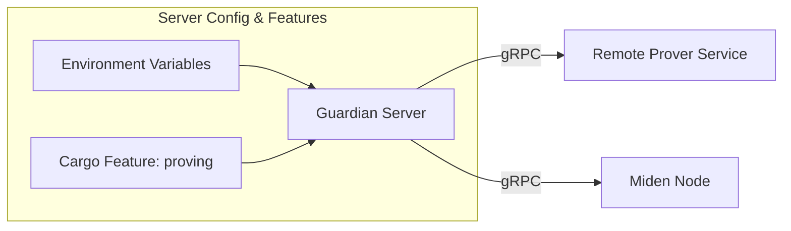
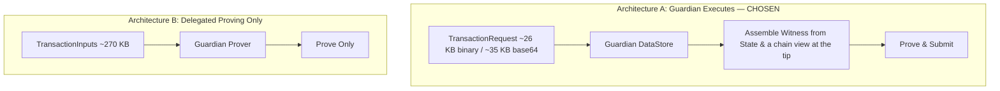

# RFC 0001: Guardian executes, proves and submits transactions

| | |
|---|---|
| **Status** | Implemented on branch `254-execution-impl` ([PR #510](https://github.com/OpenZeppelin/guardian/pull/510)); comments still welcome, no closing date |
| **Feature** | [#254](https://github.com/OpenZeppelin/guardian/issues/254) (parent [#253](https://github.com/OpenZeppelin/guardian/issues/253), "Transaction Orchestration") |
| **Audience** | Integrators, operators, and upstream reviewers (Miden team or anyone reading publicly) |
| **Working artifacts** | [`speckit/features/254-guardian-prove-and-commit/`](../../speckit/features/254-guardian-prove-and-commit/) — see appendix |
| **Revision** | 21 (2026-10-08): GUARDIAN refuses to execute a transaction whose signed summary creates a private output note unless the execute request sets `allow_private_note` (`GUARDIAN_PROPOSAL_EXECUTES_LOCALLY`, `meta.reason` `private_note`; a switch carries `meta.reason` `switch_guardian` and is refused whatever the flag). The flag is part of the signed execute payload, and the gRPC execute payload is domain-separated from a signed status read. Execution failure messages are fixed per cause; raw node, prover and storage errors are log-only. Finished execution records are deleted after `GUARDIAN_EXECUTION_RECORD_RETENTION_DAYS` (default 30, `0` keeps them) unless they are the newest attempt of a proposal that still exists; a status read for a pruned proposal returns `GUARDIAN_EXECUTION_NOT_FOUND`. Earlier revisions follow as history |
| **Revision 20** | 2026-10-07: GUARDIAN refuses to execute a `switch_guardian` proposal with `GUARDIAN_PROPOSAL_EXECUTES_LOCALLY`, because only the client can finish the GUARDIAN handoff (register the account at the new GUARDIAN and switch its endpoint). A `guardian_executable` client still executes a switch locally, and executes a private-note P2ID locally unless the caller opts in with `allow_private_note`; the private-note P2ID gets no server rule. Earlier revisions follow as history |
| **Revision 19** | 2026-10-07: a planned stop (SIGTERM) releases accounts of executions short of the no-retry boundary at once instead of after their lease; an execution is refused while any candidate is queued, at any candidate-queue depth (#486); the execution bound defaults to 64 per process and the prover bound is optional |
| **Revision 18** | 2026-10-06: implemented on `254-execution-impl`. Pins moved to stable Miden 0.17.0 (protocol / standards / tx / client / node-proto 0.17.0, web SDK 0.17.0). Live devnet qualification passed on both SDKs on 2026-10-06 against node 0.17.0 || **Revision 17** | 2026-09-30: re-verified against the Miden 0.17 release-candidate pins on `main` (protocol 0.17.0-rc.7, client 0.17.0-rc.4). The signed summary binds a proposer-chosen bound block rather than the reference block, so Guardian reproduces at the chain tip and revision 16's anchored reproduction is withdrawn (Appendix A.3). Foreign public accounts, the approval expiration, and sealed submission inputs enter the design. Gate 0 spike code stays on the `254-execution-spike` branch; this document and its working artifacts are the only content merged to `main` |

> **Implementation status:** this design is **implemented** on the `254-execution-impl` branch ([PR #510](https://github.com/OpenZeppelin/guardian/pull/510)). The implementation comprises the three endpoints (execute: `POST /delta/proposal/execution`; status: `GET /delta/proposal/execution`; current: `GET /delta/execution/current`) on HTTP and on gRPC (`ExecuteDeltaProposal`, `GetDeltaProposalExecution`, `GetCurrentExecution`), the execution reservation tables (`execution_reservations`, `execution_submissions`, `execution_outcomes`), the `guardian_executable` execution mode in both multisig SDKs, and the server execution module `crates/server/src/network/miden/execution/`. The [`254-execution-spike`](https://github.com/OpenZeppelin/guardian/tree/254-execution-spike) branch (commit `769e2a90`) is historical: it holds the Gate 0 witness-assembly spike that earlier revisions cite. The linked working artifacts are the implementation plan, and numeric defaults given here are proposals unless the linked contract marks them normative.
>
> **Miden version:** the implementation pins stable Miden 0.17.0 (protocol / standards / tx / `miden-client` / `miden-node-proto-build` 0.17.0, web SDK 0.17.0). The file:line citations in the body were read on the release candidates (protocol / standards / tx 0.17.0-rc.7, `miden-client` 0.17.0-rc.4) and are kept as dated evidence; they are not re-pinned to 0.17.0.

---

## Executive Summary & What Changes

Today, the **client** must build the transaction, execute it against account state, collect cosigner signatures, obtain Guardian's acknowledgment, generate the ZK proof, and submit it to the Miden node. This forces every client or triggering caller to maintain full Miden execution and proving capabilities.

**After this work**, three roles separate. A **Miden-capable party builds the proposal** once, attaching the serialized `TransactionRequest`. **Cosigners sign it to threshold** through Guardian — signing a summary commitment needs keys, not a Miden stack. Then **any authenticated cosigner triggers execution and polls the outcome with no Miden capabilities at all**: Guardian carries the proposal the rest of the way — verifies signatures, reproduces the exact transaction against account state, proves via remote prover, submits to the Miden node, and tracks confirmation. What becomes thin is the signing and triggering side; building the proposal remains a Miden-capable step.


```mermaid
flowchart TB
  subgraph Today [Today: Client-Side Execution & Proving]
    direction LR
    C1[Thin / Heavy Client] --> Build[Build Tx]
    Build --> Exec[Execute Tx]
    Exec --> Sig[Collect Sigs + Ack]
    Sig --> Prove[Generate ZK Proof]
    Prove --> Node1[Submit to Miden Node]
  end

  subgraph After [After #254: Server-Side Delegation]
    direction LR
    Builder[Miden-capable Proposal Builder] -->|Create proposal + TransactionRequest| G[Guardian Server]
    Caller[Thin Cosigner / Triggerer] -->|Sign & Trigger| G
    G -->|Reproduce & Verify| Store[(Guardian DataStore)]
    G -->|Remote Proving| RP[Remote Prover]
    G -->|Submit & Track| Node2[Miden Node]
  end
```

**What stays the same:**
- **Zero forgery power**: Guardian cannot alter transaction outputs or forge updates. The executed transaction must reproduce, bit for bit, the summary commitment signed by cosigners.
- **Self-execution is preserved**: Local self-execution remains fully supported and is the default behavior in SDKs. Server-side execution is an opt-in capability.

---

## 1. How It Looks (End-State Design & Experience)

### 1.1 High-Level Sequence Flow


```mermaid
sequenceDiagram
  autonumber
  participant Builder as Miden-capable Proposal Builder
  participant Thin as Thin Cosigner / Triggerer
  participant Guardian as Guardian Server
  participant Prover as Remote Prover
  participant Node as Miden Node

  Note over Builder,Guardian: 1. Proposal Phase
  Builder->>Guardian: Create Proposal (carries TransactionRequest)
  Thin->>Guardian: Sign until threshold is met (keys only, no Miden stack)

  Note over Thin,Guardian: 2. Execution Delegation
  Thin->>Guardian: POST /delta/proposal/execution
  Guardian-->>Thin: 202 Accepted (state: pending, newly_accepted: true)

  Note over Guardian,Node: 3. Server Proving & Submission Workflow
  Guardian->>Guardian: Verify signatures & binding against account state
  Guardian->>Guardian: Sign acknowledgment (satisfies the on-chain guardian gate)
  Guardian->>Prover: Send witness & request ZK proof
  Prover-->>Guardian: Return proof
  Guardian->>Node: Submit transaction to Miden Node

  Note over Thin,Guardian: 4. Outcome Polling
  loop Poll Status
    Thin->>Guardian: GET /delta/proposal/execution
    Guardian-->>Thin: state: proving → submitted → committed
  end
```

#### Proposal admission and explicit execution

For v1, the client builds the transaction request, derives the summary locally, and
submits the summary with its signatures and metadata. Opting into delegated execution
also attaches the serialized request. Client-side preparation and execution remain the
default.

Proposal creation does not execute the request. The existing Miden validation parses
the supplied summary and verifies that the stored account state matches its recorded
commitment. Guardian records that commitment as the proposal's base. On protocol 0.17 the
signed summary also binds a **bound block**: the block the proposer chose, whose number and
commitment the summary carries and whose number the request declares in `block_numbers()`. It
fixes what the cosigners signed against; it is not where the transaction must execute. Both SDKs
on `main` verify, sign and execute at the chain tip under that bound block. The proposal still
ships a serialized `ChainAnchor` (wire field `chain_anchor`,
`crates/miden-multisig-client/src/payload.rs:82-88`), which now only names the bound block for
SDK compatibility; the server never reads it and Guardian execution does not need it. Creation
does not establish that the request produces the supplied summary. Guardian reproduces the
request and checks the signed-summary binding after delegated execution is accepted,
before acknowledgment or remote proving.

The wallet makes two calls: create the proposal, then request execution. If the
proposal already contains enough valid signatures, the calls can run consecutively
without another signature-collection round. An SDK convenience operation could compose
these calls, but v1 does not automatically execute when the final signature arrives.
Creating or signing a proposal does not acquire an execution reservation.

The effective cosigner threshold is checked before Guardian adds its separate
acknowledgment. The acknowledgment does not fill a missing cosigner signature. The
mapping to a wallet described as 2-of-3 with Guardian as one signer requires agreement
with the wallet team; see the upstream signer-model question below.

#### Competing proposals and admission limits

Multiple proposals can coexist without reserving the account. V1 records each proposal's
base commitment and treats it as stale once the canonical state advances. Only one
proposal can hold the execution reservation. A conflicting execution request is refused;
creating further proposals is also refused while an active candidate exists.

V1 adds a viable-proposal quota per account and authenticated proposer alongside the existing
account-wide count cap and the request-byte limits. A signer must not consume the count
capacity allocated to another signer. Admission must check limits and insert atomically
on both storage backends. Two viable proposals per proposer is a proposed default;
final configuration and the allocation of account-wide capacity must be specified before
implementation. Byte limits remain separate resource limits, so this is not a guarantee
against every denial of service by an authorized signer.

### 1.2 End-to-End Execution Lifecycle & State Machine

Every delegated execution progresses through an explicit five-state lifecycle.
`committed` is the terminal execution status for on-chain success and candidate
canonicalization. Committing submission evidence to storage only produces `submitted`;
it does not establish on-chain success. Existing delta statuses and error codes are unchanged.


```mermaid
stateDiagram-v2
  [*] --> pending: POST /delta/proposal/execution accepted
  pending --> proving: Lease acquired & witness assembled
  pending --> failed: Pre-boundary failure (binding / state / codec)
  
  proving --> proving: Transient prover failure (retried with backoff)
  proving --> submitted: No-retry boundary committed (candidate + evidence durable)
  proving --> failed: Permanent prover error / expiration unmeetable
  
  submitted --> committed: Committed on-chain, candidate promoted to canonical
  submitted --> failed: Rejected by node / superseded / expired
  
  committed --> [*]
  failed --> [*]
```

| State | Terminal | Meaning & Caller Action |
|---|---|---|
| `pending` | No | Accepted; the durable reservation already exists — waiting for a worker to pick it up. **Action: Poll.** |
| `proving` | No | Witness assembled, remote proving in progress (6–20s per attempt; transient prover failures are retried server-side). **Action: Poll.** |
| `submitted` | No | No-retry boundary crossed; the candidate delta and submission evidence are durable. The network send may be pending, attempted, or of unknown outcome. **Action: Poll, DO NOT retry.** |
| `committed` | **Yes** | Transaction committed on-chain; Guardian's candidate delta promoted to canonical. **Action: Success complete.** |
| `failed` | **Yes** | Execution stopped or rejected. **Action: Retry ONLY IF `proposal_exists == true`.** |

#### Core Execution Rules:
1. **`submitted` is an irreversible boundary**: The state changes to `submitted` when the boundary evidence *commits*, which is before the first byte of the network send — so `submitted` never implies the transaction reached the node, only that retry is forbidden. From that commit on, a definite application-level rejection may settle the execution immediately; every absent or ambiguous send outcome is resolved by chain observation. Nothing is ever re-submitted. The caller MUST NOT retry a `submitted` execution.
2. **`proposal_exists` controls retry**: Post-boundary failures may delete the proposal. Retry is valid only when `state == "failed"` AND `proposal_exists == true`.
3. **Synchronous refusals never create an execution**: conditions determinable at request time (proposal not Guardian-executable (no stored `TransactionRequest`), signature set below the effective threshold (invalid, duplicate, or non-cosigner signature entries are ignored and counted, not fatal), caller not a cosigner, account paused or released, a `switch_guardian` proposal (`GUARDIAN_PROPOSAL_EXECUTES_LOCALLY`, `meta.reason` `switch_guardian`, even when it stores a request and whatever `allow_private_note` says), a transaction whose signed summary creates a private output note without `allow_private_note` on the request (`GUARDIAN_PROPOSAL_EXECUTES_LOCALLY`, `meta.reason` `private_note`), a pending candidate (at any candidate-queue depth), conflicting reservation, or proving capability unavailable) are refused synchronously and queue nothing. Binding and state mismatches are **not** synchronous: they are detected while reproducing the transaction after acceptance and settle as asynchronous `failed` outcomes (the `pending → failed` edge above).
4. **Transient proving failures are retried server-side**: A prover failure at the transport level — connection error, i/o timeout, deadline exceeded — does not fail the execution. Guardian retries proving with capped backoff under the same held reservation, without leaving `proving` and without caller involvement. The execution settles `failed` only on a permanent prover error, or once the transaction's own expiration can no longer be met. The finite expiration chosen at build time (see the Expiration Guard in US3) **is** the retry budget; there is deliberately no separate retry-count or retry-window configuration.

#### How `submitted` Terminates

Before sending the first byte of a submission, Guardian durably records the evidence it will reconcile against: the transaction id, the base account commitment, the expected resulting account commitment, the reference block, and the expiration block taken from the proven transaction itself. A `submitted` execution then terminates in one of four ways:

- **Rejected** — the node returns a definite application-level rejection. The execution owner discards the candidate and settles `failed` immediately; no chain watch is needed.
- **Committed** — the expected account commitment (or the transaction's inclusion) is observed on chain. The candidate delta is promoted to canonical through the normal canonicalization lifecycle, and the execution settles `committed`.
- **Superseded** — the account is observed at a commitment that is neither the base nor the expected result. The transaction can no longer land; the execution settles `failed`.
- **Expired** — the chain height passes the recorded expiration block while the account still sits at its base commitment. The transaction can never land; the execution settles `failed`.

The finite-expiration requirement gives the last outcome a finite **chain-height** bound rather than a wall-clock deadline. Once Guardian can obtain trustworthy chain observations beyond that block, the watch terminates even if the send never started or the node silently dropped the transaction. During a node outage Guardian keeps the execution `submitted`, retains the reservation, retries observation with capped backoff, and alerts operators; restoring or failing over RPC is the only safe operator recovery. Elapsed time alone never permits release or re-submission. This is also why boundary-crossed executions need no re-submission machinery: Guardian knows exactly what it prepared and the chain height after which it cannot land.

Settled records are not kept forever. A daily, idempotent sweep on every replica deletes an attempt's reservation, evidence and outcome once the attempt has been settled for longer than `GUARDIAN_EXECUTION_RECORD_RETENTION_DAYS` (default 30 days; `0` disables it; any other value below 2 is refused so records outlive the roughly one-day approval window), provided its proposal is gone or a newer attempt of the same proposal exists. An unsettled attempt and the newest attempt of a proposal that still exists are never deleted. A status read for a proposal whose records were deleted returns `GUARDIAN_EXECUTION_NOT_FOUND`, as for one never executed.

### 1.3 Wire API Surface

The feature adds three unified operations available on both HTTP and gRPC:

| Endpoint (HTTP) | gRPC Method | Auth Domain | Purpose |
|---|---|---|---|
| `POST /delta/proposal/execution` | `ExecuteDeltaProposal` | Cosigner (`x-pubkey`, `x-signature`, `x-timestamp`) | Trigger delegated execution, proving, and submission. Carries `allow_private_note` (default `false`) in the signed payload |
| `GET /delta/proposal/execution` | `GetDeltaProposalExecution` | Cosigner (`x-pubkey`, `x-signature`, `x-timestamp`) | Fetch current status of a specific proposal execution |
| `GET /delta/execution/current` | `GetCurrentExecution` | Cosigner (`x-pubkey`, `x-signature`, `x-timestamp`) | Fetch the active in-flight execution for an account |

The two per-proposal operations return the execution envelope directly — `state`, `newly_accepted`, `proposal_exists`, `delta_nonce`, and `error` (when failed). `GET /delta/execution/current` wraps it as `{"execution": <envelope> | null}`: it asks a question about the *account*, and "nothing in flight" is a successful answer (`200`, never `404`), whereas the per-proposal read treats a never-executed proposal as a missing resource. The pair `(account_id, proposal_id)` is the canonical handle.

> **API style note.** Guardian's HTTP surface is deliberately RPC-over-HTTP rather than resource-oriented REST, and these endpoints follow it. Every endpoint must exist with equivalent semantics on gRPC, which is method-oriented; keeping the HTTP shape flat keeps the two surfaces isomorphic — one request message, one handler, one contract. Identifiers (`account_id`, `proposal_id`) travel in the signed payload, never in the URL path, because the authentication signature covers the canonical JSON of the body (or query object), not the path — a path-templated identifier would sit outside the signed bytes. This also preserves the idempotent handle: executions are addressed by `(account_id, proposal_id)` with no separate execution-resource identity, so a repeated trigger returns the same execution rather than creating a new resource.

---

## 2. Per User Story & Persona Configuration


```mermaid
flowchart TB
  subgraph Personas [User Personas & Stories]
    US1[US1: Thin Client / Cosigner<br/>Trigger execution without Miden]
    US2[US2: Security & Binding<br/>Verify signatures & state match]
    US3[US3: SDK Integrator<br/>Configure client & proposals]
    US4[US4: Server Reliability<br/>Concurrency, leases & idempotency]
    US5[US5: Operator<br/>Prover config & feature control]
  end
```

---

### US1 — Thin Client / Cosigner: Trigger Execution Without Miden

A cosigner or light client monitors proposal signature collection. Once threshold is reached, it requests Guardian execution. The triggering client needs **no Miden client SDK or WASM executor**.


```mermaid
flowchart LR
  ThinApp[Thin Client / Bot] -->|POST /delta/proposal/execution| Guardian[Guardian Server]
  Guardian -->|Poll status| ThinApp
  ThinApp -.->|No Miden Node required| Node[Miden Node]
```

#### Base HTTP Client Invocation (no Miden dependencies required):
```ts
// Proposed API — not yet implemented; see contracts/sdk-api.md
import { GuardianHttpClient } from "@openzeppelin/guardian-client";

const client = new GuardianHttpClient("https://guardian.example.com");
client.setSigner(signer); // cosigner credentials sign every request

// Request Guardian to prove and submit a threshold-met proposal
const res = await client.executeDeltaProposal("0x1234...", "0x5678...");

console.log("Execution state:", res.state); // "pending"
```

---

### US2 — Security & Binding: Verifying Signed State Commitments

Before initiating remote proving or writing to chain, Guardian reproduces the transaction at the chain tip against current account state and verifies that the generated summary commitment matches what cosigners signed. On protocol 0.17 the summary binds the proposer's bound block, not the reference block, so any reference block at or after the bound block reproduces it, and the bound block's commitment is proven by an MMR path under the tip header.


```mermaid
flowchart TD
  Req[Execution Request] --> ThreshCheck{Valid Cosigner<br/>Threshold Met?}
  ThreshCheck -->|No| Refuse1[Refuse synchronously: PROPOSAL_NOT_READY<br/>no reservation created]
  ThreshCheck -->|Yes| Reserve[Acceptance: durable reservation created]
  Reserve --> Reproduce[Reproduce Tx at the chain tip<br/>under the signed bound block]
  Reproduce --> SummaryCheck{Generated Summary ==<br/>Signed Summary?}
  SummaryCheck -->|No| Fail[Async failed: BINDING_MISMATCH / STATE_MISMATCH<br/>reservation released]
  SummaryCheck -->|Yes| RemoteProve[Send to Remote Prover]
```

**Guarantees:**
- Mismatched state (e.g. account nonce advanced elsewhere) halts execution **before** remote proving starts.
- Pre-boundary failures leave proposal unlocked and available for re-execution or fallback local execution.

---

### US3 — SDK Integrator: Configuring Client & Proposal Execution Mode

SDK integrators choose the execution mode at client creation. Default mode remains local self-execution (`self_executed`). Opting into `guardian_executable` embeds the serialized `TransactionRequest` on proposal creation and applies the two finite expiration bounds.


```mermaid
flowchart TD
  Config["Multisig Client Config<br/>executionMode: 'guardian_executable'"] --> CreateProp[Create Proposal]
  CreateProp --> AttachReq[Attach TransactionRequest ~26 KB binary / ~35 KB base64]
  AttachReq --> RequireExp[Bind approval expiration + tx expiration]
  RequireExp --> TriggerExec[Call requestGuardianExecution]
```

#### TypeScript SDK (`@openzeppelin/miden-multisig-client`)
```ts
// Proposed API — not yet implemented; see contracts/sdk-api.md
import { MultisigClient } from "@openzeppelin/miden-multisig-client";

// 1. Configure server-execution support at construction (defaults to "self_executed")
const client = new MultisigClient(midenClient, {
  /* …existing configuration… */
  executionMode: "guardian_executable",
});

// 2. Obtain the account's Multisig and create the proposal through a typed,
//    request-building method exactly as today — the configured mode attaches the
//    serialized TransactionRequest and, for built-in proposal families, adds
//    the shared approval expiration and transaction expiration internally
const multisig = /* …load the account's Multisig as today… */;
const proposal = await multisig.createP2idProposal(/* …unchanged… */);

// 3. Request Guardian execution once threshold is met
await multisig.requestGuardianExecution(proposal.id);

// 4. Track status
const status = await multisig.executionStatus(proposal.id);
console.log(`Current state: ${status.state}`);
```

#### Rust SDK (`miden-multisig-client`)
```rust
// Proposed API — not yet implemented; see contracts/sdk-api.md
use miden_multisig_client::{MultisigClientBuilder, ProposalExecutionMode};

// 1. Initialize client with server-execution support
let client = MultisigClientBuilder::new()
    /* …existing required configuration: Miden endpoint, Guardian endpoint,
       account directory, key manager… */
    .execution_mode(ProposalExecutionMode::GuardianExecutable)
    .build()
    .await?;

// 2. Request execution & track state
client.request_guardian_execution(&proposal_id).await?;
let status = client.execution_status(&proposal_id).await?;
println!("Execution state: {:?}", status.state);
```

| Config Rule | Detail |
|---|---|
| **Opt-in** | Omitting `executionMode` uses `self_executed`. Existing behavior is unchanged. |
| **Locally executed types** | GUARDIAN refuses to execute a `switch_guardian` proposal (`GUARDIAN_PROPOSAL_EXECUTES_LOCALLY`, `meta.reason` `switch_guardian`, `meta.proposal_type`): when GUARDIAN executes a switch, no client registers the account at the new GUARDIAN or switches its endpoint, so the account is stuck. A `guardian_executable` client therefore still executes a switch locally. GUARDIAN also refuses a transaction that creates a private output note (`meta.reason` `private_note`) unless the execute request sets `allow_private_note`: only the executing party learns a private note's details, so the caller must opt in. Privacy is read from the output notes of the signed `TransactionSummary`, never from the metadata label, and the flag is part of the signed execute payload, which over gRPC is tagged `guardian.ExecuteDeltaProposal` so a signed status read (whose body encodes identically) never authenticates an execute. |
| **Payload Attachment** | `guardian_executable` attaches a serialized `TransactionRequest` (~26 KB binary; ~35 KB after base64 in JSON). |
| **Expiration Guard** | Two signed bounds. The **approval expiration** (absolute, bound in the auth arg, default 28,800 blocks, about 24 h on devnet, overridable 1 to 65,535) is the signing window: the auth procedure aborts once the reference block reaches it. The **transaction expiration** (relative, 256 blocks for built-in families) bounds how long an unknown-outcome submission can hold the account; the summary signs it relative to the executing block, so it reproduces at any tip. The proven expiration is `R + min(256, approval_expiration - R)`. Both bounds are in the signed summary, so the same effects produce a different proposal id under `guardian_executable` than under `self_executed`, and nobody can change them after cosigners sign. A custom producer binds the approval expiration through the SDK's auth-args helper and scripts any transaction expiration itself. Guardian refuses a proven transaction whose expiration is further than its horizon from the reference block, before the boundary. |

---

### US4 — Server Reliability: Concurrency, Lease Reservation & Idempotency

When multiple cosigners trigger execution simultaneously or a server replica crashes mid-proof, Guardian guarantees, across all replicas: **at most one lease-authorized proving attempt at a time, and at most one on-chain submission** — enforced by durable storage-backed reservations with renewable leases and monotonic fence tokens. On the Postgres backend the fencing is transactional and holds across replicas; the filesystem backend is single-process and validates the active reservation's holder and fence under the existing account-scoped write lock. It deliberately does **not** claim at most one *active* attempt: the remote prover is an external service Guardian cannot cancel, so an expired owner's proof request may still be running while a new owner starts another. Stale owners are fenced out of every write. Wasted prover cost is accepted; a second submission is not.


```mermaid
flowchart TD
  CosignerA[Cosigner A requests execution] --> DB{Acquire Lease<br/>for Account?}
  CosignerB[Cosigner B requests execution] --> DB
  
  DB -->|Wins Lease| Replica1[Replica 1: Proving]
  DB -->|Exists| ReturnActive[Return Existing Execution<br/>newly_accepted: false]
  
  Replica1 -->|Crash / Timeout| LeaseExpire[Lease Expires]
  LeaseExpire -->|Before no-retry boundary| FailRelease[Execution failed & released<br/>caller may re-trigger]
  LeaseExpire -->|After no-retry boundary| Reconcile[Reconciliation owner claims via fenced CAS<br/>resolves by chain observation]
```

**Reliability Contracts:**
- **Idempotent Requests**: Re-posting `/delta/proposal/execution` for an active proposal returns the existing execution record (`newly_accepted: false`).
- **Lease Timeout**: A stalled worker's lease expires. **Before the no-retry boundary** the execution is failed and released — never silently resumed, so the caller decides whether to re-trigger. **After the boundary** a reconciliation owner takes over the live reservation by fenced compare-and-set and resolves the outcome by chain observation; nothing is ever re-submitted.
- **Planned Stop**: On SIGTERM a process refuses new executions as busy, fails its attempts short of the no-retry boundary as `GUARDIAN_EXECUTION_ABANDONED` and releases their accounts at once, and gives attempts past the boundary a short grace to send. A stop without the signal, or an attempt whose local execution outlasts the grace, falls back to the lease timeout above.

---

### US5 — Operator Configuration & Infrastructure Setup

Operators control whether server-side proving is enabled by specifying a remote prover endpoint and timeouts. Guardian **never proves in-process**: "local" proving is an operator running a prover next to Guardian (e.g. a sidecar) and pointing `GUARDIAN_TX_PROVER_URL` at it, not an alternate code path in the server.


```mermaid
flowchart LR
  subgraph OperatorConfig [Server Config & Features]
    Env[Environment Variables] --> Server[Guardian Server]
    Feature["Cargo Feature: proving"] --> Server
  end

  Server -->|gRPC| RemoteProver[Remote Prover Service]
  Server -->|gRPC| Node[Miden Node]
```

#### Operator Configuration Parameters

Defaults below are **proposed by this RFC**; the normative contract ([`contracts/execution-api.md`](../../speckit/features/254-guardian-prove-and-commit/contracts/execution-api.md) § Configuration) fixes the variable set and one constraint — the prover timeout must default well above the upstream client library's 10 s.

| Parameter | Required | Proposed Default | Description |
|---|---|---|---|
| `GUARDIAN_TX_PROVER_URL` | **Yes** (to enable) | None | Remote transaction prover endpoint URL. Unset disables the capability (no fallback). |
| `GUARDIAN_TX_PROVER_TIMEOUT_SECS` | No | `300` | Remote prover RPC timeout per attempt (observed proving on 0.15/0.16: 6–20 s, to be re-measured on 0.17; the upstream client default of 10 s, `miden-client-0.17.0-rc.4/src/remote_prover/tx_prover.rs:43`, is too low). |
| `GUARDIAN_PROVING_ENABLED` | No | `true` | Kill-switch to disable proving without unsetting prover URL. |
| `GUARDIAN_MAX_PROPOSAL_REQUEST_BYTES` | No | TBD | Size cap on a stored `TransactionRequest`; an oversized proposal is refused at creation, not at execution. |
| `GUARDIAN_MAX_ACCOUNT_REQUEST_BYTES` | No | TBD | Aggregate cap on stored requests per account. |
| `GUARDIAN_EXECUTION_LEASE_SECS` | No | `120` | Duration of the reservation lease before a stalled worker times out. |
| `GUARDIAN_EXECUTION_RECONCILE_INTERVAL_SECS` | No | `30` | How often reconciliation re-checks unresolved submissions against the chain. |
| `GUARDIAN_EXECUTION_MAX_CONCURRENT` | No | `64` | Safety bound on memory: executions one process holds at once, from acceptance until the worker finishes. A request arriving at the bound is refused with `GUARDIAN_EXECUTION_BUSY` (retryable) and nothing is reserved. |
| `GUARDIAN_TX_PROVER_MAX_CONCURRENT` | No | Unset | Optional limit on proofs one process has at the prover at once, for a shared or small prover. The slot covers the prover call alone; executions beyond it wait instead of reaching the prover. Unset, proofs are bounded only by `GUARDIAN_EXECUTION_MAX_CONCURRENT`. |
| `GUARDIAN_EXECUTION_EXPIRATION_HORIZON_BLOCKS` | No | `512` (at least 256) | Maximum allowed distance from the attempt's reference block to the proven expiration; exceeding it refuses the execution before the no-retry boundary (never a wait). This is a chain-height bound; resolution still requires eventual trustworthy chain observation. |

#### Example `.env` Configuration
```bash
# Feature enablement
GUARDIAN_TX_PROVER_URL=https://tx-prover.testnet.miden.io
GUARDIAN_TX_PROVER_TIMEOUT_SECS=300
GUARDIAN_PROVING_ENABLED=true

# Execution & Lease Controls
GUARDIAN_EXECUTION_LEASE_SECS=120
GUARDIAN_EXECUTION_RECONCILE_INTERVAL_SECS=30
GUARDIAN_EXECUTION_MAX_CONCURRENT=64
# Set for a shared or small prover:
# GUARDIAN_TX_PROVER_MAX_CONCURRENT=8
```

> **Warning for Operators:** The upstream prover client's own default timeout (10 seconds) is below real testnet proving times (6–20 s), which is why the proposed Guardian default is far higher. If you override `GUARDIAN_TX_PROVER_TIMEOUT_SECS`, keep it well above observed proving times for your prover.
>
> **Canonicalization mode is required.** Guardian execution depends on the candidate → canonical delta lifecycle to establish whether a submitted transaction committed. A server running in optimistic delta-commit mode refuses execution requests with the capability-unavailable error class, and the misconfiguration is reported at startup rather than discovered by the first caller.

**Prover capacity is the principal throughput constraint to size.** Each observed proof took 6–20 seconds, and executions across all accounts use the configured prover endpoint. Exploratory load runs against the public testnet prover produced transport-level i/o timeouts under concurrency rather than well-formed errors (Appendix A.4, finding 4) — which is why the server-side retry policy above classifies transport failures as transient. These runs are not presented as a reproducible capacity benchmark because their raw report is not committed. A deployment expecting sustained execution throughput should provision its own prover (or prover pool) and size it against the expected number of concurrent executions.

---

## 3. Architecture Decision Matrix

Two architectural options were evaluated for server-side transaction execution:


```mermaid
flowchart TB
  subgraph ArchA [Architecture A: Guardian Executes — CHOSEN]
    ReqA[TransactionRequest ~26 KB binary / ~35 KB base64] --> StoreA[Guardian DataStore]
    StoreA --> WitnessA[Assemble Witness from State & a chain view at the tip]
    WitnessA --> ProveA[Prove & Submit]
  end

  subgraph ArchB [Architecture B: Delegated Proving Only]
    InputsB[TransactionInputs ~270 KB] --> DirectB[Guardian Prover]
    DirectB --> ProveB[Prove Only]
  end
```

| Dimension | Architecture A (Chosen) | Architecture B (Delegated Proving) |
|---|---|---|
| **Client Sends** | Serialized `TransactionRequest` (~26 KB binary; ~35 KB base64) | Serialized `TransactionInputs` (~270 KB binary) |
| **Witness Built By** | **Guardian** (server-side `miden-tx::DataStore` over stored state plus a chain view and foreign public accounts read at the tip) | A Miden-capable party outside Guardian, per transaction |
| **Triggering Caller Needs Miden SDK** | **NO** (thin cosigners trigger and poll) | No for the literal trigger — but some external party must execute locally to build each witness |
| **Eliminates Per-Execution Miden Requirement** | **YES** (only proposal *creation* stays Miden-capable) | No |

**Decision**: **Architecture A is chosen** because it achieves the primary project goal: allowing thin, non-Miden clients (such as web frontends or light cosigners) to delegate execution and proving completely to Guardian.

### 3.1 Chain View & Witness Assembly — the Inner Flow

The **account and reference-chain snapshot is required for every transaction**. On protocol 0.17 the chain snapshot has to cover two more blocks than the reference block alone: the summary's **bound block**, and the creation block of every authenticated input note.

**Why the tip, not the anchor.** `TransactionSummary` now carries a `block_number` and binds that block's commitment, "the block the summary binds" (`miden-protocol-0.17.0-rc.7/src/transaction/tx_summary.rs:23-39`) **[READ]**. The guarded-multisig auth procedure creates the summary through `create_tx_summary_with_block(bound_block, …)`, whose bound block "must not exceed the transaction reference block number" (`miden-standards-0.17.0-rc.7/asm/standards/auth/mod.masm:48-49,67-99`) **[READ]**. The kernel resolves an older block through the partial blockchain's MMR (`get_block_commitment`, `miden-protocol-0.17.0-rc.7/asm/kernels/transaction-core/src/tx.masm:98-130`) **[READ]**. So any reference block at or after the bound block reproduces the signed summary. Executing at the proposal's anchor is no longer required, and it is no longer workable either. Every fee payment loads the fee faucet as a foreign account at the reference block (devnet's faucet sets the asset-callback flag, `callbacks.masm:102-123`) **[READ]**, and devnet stops serving account state about 50 blocks after a block (#462). That is why both SDKs on `main` moved to tip execution in #498, and a 2-of-2 multisig executed on devnet more than 70 blocks past its bound block that way (`docs/MIDEN_COMPATIBILITY.md`, open upstream items).

**Assembly.** Guardian picks one reference block `R` per attempt: its node's committed tip. It then builds:

- **Tip peaks.** A genesis-seeded `SyncChainMmr` to `R` supplies them. This is the spike's construction, which is normative again. The delta is logarithmic in chain length, and a cold start took about 0.6 s on 0.16 testnet **[RAN]**.
- **Tracked-block paths.** One `GetBlockHeaderByNumber(n, include_mmr_proof)` per tracked block (`miden-node-proto-build-0.17.0-rc.3/proto/rpc.proto:270-295`) **[READ]**. A path returned at a later chain length is adjusted to forest `R`.
- **The tracked set must be supplied by Guardian.** The executor asks the data store only for note blocks plus `R`. It never asks for the bound block (`miden-tx-0.17.0-rc.7/src/executor/mod.rs:280-281`), and lazy block-witness loading is a TODO (`src/host/tx_event.rs:491-494`) **[READ]**. So Guardian's `DataStore` adds the request's declared `block_numbers()` itself, as `ClientDataStore` does (`miden-client-0.17.0-rc.4/src/store/data_store/mod.rs:335-342`) **[READ]**.
- **The `ProtocolConfig`.** The data store now returns the configuration the reference header commits to (`miden-tx-0.17.0-rc.7/src/executor/data_store.rs:29-44`) **[READ]**. The fee asset left the header for it. Guardian fetches it with `include_protocol_config` and checks it against the header's commitment.

This gives a stronger binding check than 0.16's. The bound block's commitment is proven by an MMR path under the tip header's chain commitment, instead of being compared against a second header read from the same node. The trust question narrows to whether `R`'s header is canonical (question 2).

**Consumption mode is still the request's job.** The mode each input note is consumed in, authenticated or unauthenticated, enters the summary. `miden-client` classifies notes from the executing client's own store unless the request pins them with `TransactionRequestBuilder::explicit_input_notes` (`miden-client-0.17.0-rc.4/src/transaction/request/builder.rs:178-190`) **[READ]**. Guardian has no store. The SDKs' consume-notes path still classifies from the local store and imports proofs (`crates/miden-multisig-client/src/transaction/consume.rs:108-193` on `main`), and neither SDK uses `explicit_input_notes` yet. So a Guardian-executable consume-notes request has to carry its notes pinned, or a storeless executor reproduces a different summary and fails the binding check on the honest path. This is the consume-notes residue Gate 0 named, restated for 0.17; see question 3.

The chain view remains ephemeral: it is built for one worker attempt and discarded afterward. There is no long-lived per-account sync loop, and the proposal's `chain_anchor` field is not read.

**Future optimization:** if production measurements show that per-attempt chain assembly is material, Guardian may keep a rebuildable cache of validated headers and peaks. This is not a v1 requirement. Node data remains authoritative and correctness must not depend on the cache.

Four further 0.17 inputs are the executor's responsibility, because Guardian drives `TransactionExecutor` directly rather than through the `miden-client` façade:

- **Fee info travels in the request.** The auth arg commits to `[bound_block, approval_expiration, 0, 0] || SALT || CONVERSION_INFO`. The procedure pipes and hash-checks that three-word preimage from the advice map, pays the fee from the account's vault, and only then builds the summary, so the fee note is signed (`miden-standards-0.17.0-rc.7/asm/standards/auth/multisig.masm:827-854,995-1053`, `.../components/auth/guarded_multisig/guarded_multisig.masm:48-115`) **[READ]**. Both SDKs set the auth arg and preimage on every request (`crates/miden-multisig-client/src/transaction/auth_args.rs:145-160`).
  - `miden-client`'s own fee path would commit the two-word 0.16 shape, which this procedure rejects (`miden-client-0.17.0-rc.4/src/transaction/request/mod.rs:291-300`) **[READ]**.
  - The client leaves a request that already carries an auth arg alone (`transaction/mod.rs:1535-1540`) **[READ]**.
  - So Guardian passes the auth arg through unchanged and commits nothing. A request without one is refused. See question 8.
- **Foreign accounts.** The executor loads them lazily through `DataStore::get_foreign_account_inputs(id, ref_block)` (`miden-tx-0.17.0-rc.7/src/executor/exec_host.rs:183`) **[READ]**. They include the fee faucet's asset callback and the pricing of fee-sponsored network notes (`miden-standards-0.17.0-rc.7/asm/standards/fee/mod.masm:349-352`) **[READ]**. Guardian reads public foreign accounts from the node at `R` and refuses private ones.
- **Expiration.** The approval expiration aborts the VM once `R` reaches it, then lowers the transaction's expiration to at most that block (`multisig.masm:884-914,931-942`) **[READ]**. Built-in families also carry a 256-block relative delta. The summary signs it relative to the executing block (`tx.masm:177-189`, host check `miden-tx-0.17.0-rc.7/src/host/tx_event.rs:787-795`) **[READ]**, so it reproduces at any tip. The tip moves while proving is retried, so Guardian re-reads the chain height before each retry and stops once either expiration is reached (working artifacts FR-058). Separately, the horizon rule refuses an expiration too far ahead of `R` (FR-046).
- **Sealed submission inputs.** A 0.17 submission carries the proven transaction together with its `TransactionInputs`, sealed to the validator set's encryption key, which the node publishes with attestations (`miden-node-proto-build-0.17.0-rc.3/proto/types/submission.proto:8-28,51-97`) **[READ]**. The inputs cannot be recovered from the proven transaction. So Guardian keeps them in memory, and it fetches the key, validates the attestations and seals the inputs **before** the no-retry boundary (FR-059). A failure after the boundary would strand the account until expiration for a transaction that was never sent.

```mermaid
sequenceDiagram
  participant GS as Guardian Storage
  participant W as Execution Worker
  participant Node as Miden Node RPC
  participant Prover as Remote Prover

  W->>GS: Load account, TransactionRequest, signatures
  W->>W: Structural checks: bound block declared, auth arg + preimage, approval expiration, pinned notes
  W->>Node: Chain tip; refuse if approval expiration reached
  W->>Node: SyncChainMmr to tip R, header + ProtocolConfig, MMR paths for bound + note blocks (Q2)
  W->>W: Build ephemeral DataStore over stored state + chain view at R (Q5)
  W->>W: Reproduce unsigned, verify signed-summary binding
  W->>W: Add signatures and Guardian acknowledgment, execute, verify again
  W->>Node: Foreign public accounts at R, loaded lazily during execution
  W->>Node: Read chain height; refuse if an expiration is already reached
  W->>Prover: Self-contained TransactionInputs witness
  Prover-->>W: ZK proof
  W->>Node: Transaction encryption key + attestations; seal inputs
  W->>W: Re-check, fence, and atomically cross no-retry boundary
  W->>Node: Submit proven transaction + sealed inputs
  W->>W: Resolve by chain observation (Q7)
```

Reading guide for the upstream questions:

- **Q1** anchors at the expiration bounds: both are signed on 0.17, and the approval expiration reaches custom producers through the auth args.
- **Q2** anchors at the tip header: the bound block is proven under it, so the header is what Guardian has to trust.
- **Q3** anchors at input-note preparation: the note-block paths come from RPC, but the consumption mode is pinned by the request.
- **Q4** anchors at `SyncChainMmr`, which is back on the execution path.
- **Q5** anchors at the `DataStore` note, the seam Guardian implements directly.
- **Q7** anchors at outcome observation.
- **Q8** anchors at the auth arg Guardian passes through.
- **Q9** anchors at the fee note, which can make an honest reproduction at a later tip differ.
- **Q10** anchors at sealing.

---

## Future extensions (outside v1)

- **Optional server preparation.** An authenticated `prepare` operation could accept a
  transaction request and its execution context, derive the summary, and create an
  unsigned proposal. It would return the proposal ID and summary for review and signing
  through the existing signing endpoint. The existing create operation would continue
  to accept client-prepared summaries. Preparation would neither reserve the account nor
  authorize execution. Resource limits and preparation failures need their own contract.
- **Opt-in automatic execution.** A future account policy could queue eligible proposals
  when enough distinct, valid cosigner signatures exist. Explicit execution remains the
  default. The policy must be discoverable by signers, preserve the normal authorization,
  state and conflict checks, and define retry or queue behavior when another execution
  blocks the account. Policy configuration is additional API work, not assumed here.
- **Dependent transaction chains.** Pipelining `A -> B -> C` could reduce the wait between
  transactions. It requires dependencies, speculative states, ordered submission, and
  recovery when a parent fails. V1 waits for canonicalization before advancing the base.
- **Independent proposal ordering.** V1's base-commitment restriction is Guardian policy,
  not a claim that every summary binds to an exact starting account state. A future
  executor could revalidate independent proposals after another transaction commits and
  retain signatures only if execution still reproduces the signed summary. Compatibility
  also depends on the pinned Miden version and signed execution context.
- **Batching.** Compatible transactions could share a network batch. The design must
  preserve each transaction's authorization and define how failures affect the batch.
  This is distinct from both dependency chaining and independent proposal revalidation.

## 4. Protocol Questions for Upstream (Miden Team)

Each question below states what Guardian does, what we observed, and the specific confirmation or guidance we are asking for. Verification tags follow Appendix A.1, and §3.1 diagrams the witness-assembly flow the questions anchor to. Citations are to the 0.17 release candidates `main` pins.

1. **Finite expiration, its binding, and custom scripts.**
   - **What Guardian needs.** Guardian resolves an absent or ambiguous send only by chain observation, so a transaction's expiration block is the finite chain height at which that watch can end. A transaction with neither bound is non-expiring: the prologue stores the `u32::MAX` sentinel (`miden-protocol-0.17.0-rc.7/asm/kernels/transaction-core/src/prologue.masm:30,1395`) **[READ]**.
   - **What 0.17 provides.** Two signed bounds.
     - The multisig **approval expiration** is absolute and bound in the auth arg. It aborts the VM once the reference block reaches it, then lowers the transaction's expiration to at most that block (`miden-standards-0.17.0-rc.7/asm/standards/auth/multisig.masm:884-914,931-942`) **[READ]**.
     - The **transaction expiration delta** is signed relative to the executing reference block (`tx_summary.rs:276-282`, `tx.masm:177-189`) **[READ]**. So a fixed delta reproduces at any tip.
   - **Guardian's rule.** It requires a non-zero approval expiration on every delegated proposal. Built-in families also carry a 256-block delta. The horizon is applied to the proven expiration.
   - **What stays unsolved.** A custom producer can set an approval expiration through the auth args. It still cannot get a transaction delta from the request builder together with a custom script (`miden-client-0.17.0-rc.4/src/transaction/request/builder.rs:682-687`) **[READ]**, and `TransactionRequest` exposes no mutator.
   - **Questions.**
     - (a) Is a multisig approval expiration the intended bound for a third-party executor, given that its lowering of the transaction expiration happens after the summary is built and is therefore not reflected in the summary's own delta?
     - (b) Is `tx::update_expiration_block_delta` inside the producer's script still the supported way to add a transaction delta to a custom-script request, or would upstream consider a builder path that allows both?

   Outcome observation is question 7.

2. **Reference block authentication and trust root.**
   - **What Guardian does.** It executes at its node's committed tip `R`. It proves the bound block under `R`'s chain commitment by an MMR path, and the kernel and host enforce the bound block's commitment during execution (`miden-tx-0.17.0-rc.7/src/host/mod.rs:504-516`) **[READ]**. So everything reduces to whether `R`'s header is canonical.
   - **What the node offers.**
     - `SyncChainMmrResponse` carries `repeated primitives.Signature block_signatures` and a requested `FinalityLevel` (`COMMITTED` or `PROVEN`) (`miden-node-proto-build-0.17.0-rc.3/proto/rpc.proto:673-713`) **[READ]**.
     - `GetBlockHeaderByNumber` returns no signatures (`rpc.proto:270-295`) **[READ]**.
     - Guardian validates neither today.
   - **Questions.**
     - (a) What validator key set or other trust root should a server use to validate `block_signatures`, including rotation?
     - (b) Which finality level should a server executor choose for `R`?
     - (c) Which finality level should mark a submitted transaction as landed in Guardian's `committed` state?

3. **Authenticated note-block paths and consumption mode for a stateless executor.**
   - **What Guardian does.** It adds every authenticated note's creation block to the partial blockchain at `R`, fetching paths with `GetBlockHeaderByNumber(include_mmr_proof)` and adjusting them to forest `R`.
   - **The consumption mode.** It enters the summary and is classified from the executing client's store unless the request pins it with `explicit_input_notes` (`miden-client-0.17.0-rc.4/src/transaction/request/builder.rs:178-190`) **[READ]**. Neither Guardian SDK does that yet (`crates/miden-multisig-client/src/transaction/consume.rs:108-193` classifies from the local store and imports proofs). A storeless executor needs the notes pinned.
   - **Prior spike evidence.** The bounded `SyncNotes` assembly remains validated on 0.16 **[RAN]** (Appendix A). `SyncNotes` paths are valid at forest `block_to + 1`, and a diagnostic full-range query for tag `0` returned 91,465 blocks in 59.9 s.
   - **Questions.**
     - (a) Is `explicit_input_notes` the recommended way to make a consume-notes summary reproducible by a stateless executor?
     - (b) Would upstream consider an exact-note or exact-block MMR-proof query against an explicit target forest, so executors need not adjust paths returned at a later chain length?

4. **`SyncChainMmr` load.**
   - Guardian makes one genesis-seeded `SyncChainMmr` call per attempt for the tip peaks.
   - The spike's finding stands: the payload is logarithmic in chain length, peaks plus merge siblings **[READ]**, and a cold start against a 1,002,185-block chain completed in about 0.6 s on 0.16 **[RAN]**, to be re-measured on 0.17.
   - **Question.** Would upstream consider a direct peaks accessor (a peaks field on the block header response, or a `GetChainMmrPeaks` RPC)? Nothing blocks on it.

5. **Architecture A alignment and the `DataStore` seam.**
   - **What Guardian implements.** The five `miden_tx::DataStore` methods plus the `MastForestStore` supertrait (`miden-tx-0.17.0-rc.7/src/executor/data_store.rs:19-96`) **[READ]**, directly over its stored account state and a per-attempt chain view. On 0.17 the only change to the trait is the `ProtocolConfig` in `get_transaction_inputs`.
   - **Why not `ClientDataStore`.** Its module is still `pub(crate)`, apart from a `testing`-feature re-export (`miden-client-0.17.0-rc.4/src/store/mod.rs:65-71`, `src/lib.rs:345-358`) **[READ]**. It is also built over a `Store` trait of 61 methods, 45 required (`store/mod.rs:191-839`) **[READ]**.
   - **The client helper that would help.** The client already has the tip-anchor assembly Guardian needs, but `chain_anchor_at_tip` is private (`transaction/mod.rs:398-427`) **[READ]**.
   - **Test status.** Spike tests on the 0.16 release candidates validated unsigned reproduction, signature-advice injection, the on-chain Guardian authorization gate, authorized execution, and proving, and a live testnet witness proved through the public remote prover **[RAN]**. They predate the 0.17 bound block, fee payment, foreign loading and sealing, and must be re-run after the port.
   - **Questions.**
     - (a) Is direct third-party implementation of `miden_tx::DataStore` an intended, supported seam?
     - (b) Would upstream make a tip-anchor helper public (`chain_anchor_at_tip(tracked_blocks)` or an equivalent over an RPC client), so server-side executors and the web SDK use one assembly?

6. **Prover concurrency expectations.**
   - Exploratory load runs against the public testnet prover produced transport-level i/o timeouts under concurrency rather than well-formed prover errors (Appendix A.4, finding 4) **[RAN]**. The raw report is not committed, so we treat this as a qualitative observation, not a capacity measurement.
   - Guardian retries transient prover failures server-side (§1.2, rule 4), but retries do not add capacity.
   - **Question.** What concurrency should a single prover endpoint be expected to sustain, and is running a dedicated prover (or pool) the intended pattern for server-side executors like Guardian?

7. **Outcome observation and inclusion lookup.**
   - **What Guardian does.** It resolves a submission by observing the account commitment on chain, and uses the recorded expiration block as the terminal backstop.
   - **What 0.17 offers.** `SyncTransactions(block_range, account_ids)` returns each included transaction's header and block (`rpc.proto:90,798-841`) **[READ]**, and Guardian's RPC client already calls it, which gives a faster committed path. `BlockSubscription` and `ProofSubscription` streams exist (`rpc.proto:122,128`) **[READ]**.
   - **Question.** Is a by-id status lookup planned that distinguishes "not yet included" from "will never be included"? Expiration remains the backstop unless such an API provides definitive absence.

8. **Auth args for a non-`Client` executor.**
   - **What happens today.** `miden-client` 0.17.0-rc.4 commits a two-word `[SALT, CONVERSION_INFO]` preimage when a request declares `fee_conversion_salt` (`request/mod.rs:291-300`) **[READ]**. The 0.17 guarded multisig pipes three words (`multisig.masm:827-854`) **[READ]**. So both Guardian SDKs set the auth arg and preimage themselves, and Guardian passes them through.
   - **Questions.**
     - (a) Will `miden-client` build `MultisigAuthArgs` itself, so producers and executors share one construction?
     - (b) Is the 1/1 native conversion rate the long-term contract, or should an executor expect requests committing other assets and rates?

9. **Fee reproducibility across reference blocks.**
   - **Why an honest reproduction can differ.** The fee is `(ilog2(clk + extra) + 1) × verification_base_fee`, with the base fee from the reference block header (`miden-protocol-0.17.0-rc.7/asm/kernels/transaction-core/src/tx.masm:309-339`) **[READ]**, and the fee note enters the signed output-notes commitment. A reproduction at a later tip can differ from the proposer's execution in two ways:
     - the base fee changed;
     - the cycle count crossed a power of two. Execution with an older bound block adds an MMR lookup that the proposer's run, where the bound block was the reference block, did not do.
   - **Consequence.** The binding check fails even though nobody tampered with anything. The SDK cosigners carry the same risk today (#498 follow-ups).
   - **Question.** Would upstream consider making the fee a function of the bound block's parameters, or of a declared cycle budget, so a summary reproduces at any tip at or after its bound block?

10. **Sealed submission inputs for a server executor.**
    - **What Guardian must do.** 0.17 submissions carry `TransactionInputs` sealed to the validator set's encryption key, published through `GetTransactionEncryptionKey` with attestations (`miden-node-proto-build-0.17.0-rc.3/proto/types/submission.proto:8-28,51-97`) **[READ]**. Guardian seals with the public client helper (`miden-client-0.17.0-rc.4/src/rpc/encryption.rs:445-460`) **[READ]** before its no-retry boundary.
    - **Questions.**
      - (a) What should a server validate the key attestations against (genesis, validator configuration), and how does it learn of rotation?
      - (b) Is the key stable enough to cache per process, or should it be fetched per submission?

---

## Appendix A: Evidence & Spike Research

This appendix contains the reviewable technical evidence and spike findings gathered during prototyping against public Miden testnet.

### A.1 Claim Verification Tags
Technical assertions carry verification tags:
- **[RAN]**: Verified by executing automated tests or live testnet scripts.
- **[READ]**: Verified against dependency source code in `Cargo.lock`.
- **[INFERRED]**: Reasoned from protocol specifications.

### A.2 Dependency versions used for the original spike

The table below records the historical 0.15 validation environment. The spike itself is
kept on the [`254-execution-spike`](https://github.com/OpenZeppelin/guardian/tree/254-execution-spike) branch (commit `769e2a90`), where it was last built against the
workspace's Miden 0.16 rc pins, converting locally generated RPC types and implementing the
0.16 data-store interfaces. `main` has since moved through the stable 0.16 release to the 0.17
release candidates (table below); the spike has not been rebuilt against either, and porting
it (the 0.17 `DataStore` returns a `ProtocolConfig`, the proto types changed) is the first
implementation step.
The remote-prover live test uses `miden_client::remote_prover::RemoteTransactionProver`
under `e2e`; `proving` alone enables `miden-tx` and does not depend on `miden-client`.
Historical live results do not establish compatibility with the current public prover.


| Crate | Version | Crate | Version |
|---|---|---|---|
| `miden-protocol` | 0.15.3 | `miden-processor` | 0.23.3 |
| `miden-client` | 0.15.0 | `miden-node-proto` | 0.15.0 |
| `miden-tx` | 0.15.3 | `miden-remote-prover-client` | 0.15.0 |
| `miden-crypto` | 0.25.1 | `miden-testing` | 0.15.3 |

Revision 16's **[READ]** citations were verified against the stable 0.16 pins (2026-09-15).
`miden-remote-prover-client` is no longer a separate dependency; the remote prover lives in
`miden-client::remote_prover`.

| Crate | Version | Crate | Version |
|---|---|---|---|
| `miden-protocol` | 0.16.1 | `miden-processor` | 0.29.4 |
| `miden-client` | 0.16.0 | `miden-node-proto-build` | 0.16.0 |
| `miden-tx` | 0.16.1 | `miden-standards` | 0.16.1 |
| `miden-crypto` | 0.29.4 | `miden-testing` | 0.16.1 |

Revision 17's **[READ]** citations were re-verified against the release-candidate pins `main`
carries today (`Cargo.toml` / `Cargo.lock`, 2026-09-30). Nothing on 0.17 is **[RAN]** by this
work yet; the devnet observations cited from `docs/MIDEN_COMPATIBILITY.md` come from the SDK
port, not from Guardian execution.

| Crate | Version | Crate | Version |
|---|---|---|---|
| `miden-protocol` | 0.17.0-rc.7 | `miden-processor` | 0.33.0 |
| `miden-client` | 0.17.0-rc.4 | `miden-node-proto-build` | 0.17.0-rc.3 |
| `miden-tx` | 0.17.0-rc.7 | `miden-standards` | 0.17.0-rc.7 |
| `miden-crypto` | 0.33.0 | `@miden-sdk/miden-sdk` | 0.17.0-rc.4 |

### A.3 Historical Corrections Record
- **Revision 1 Claim (Withdrawn)**: Initially claimed that fetching chain MMR peaks via `SyncChainMmr` was linear in chain length and blocked server execution.
- **Correction (Revision 2)**: Source code inspection of `miden-crypto` (`.../mmr/tests.rs:1241`) proved that `SyncChainMmr` delta size is **logarithmic in chain length** (returning peaks and merge siblings). Cold start against public testnet at block 1,002,185 took **0.6 seconds** **[RAN]**.
- **Earlier Expiration Claim (Withdrawn)**: Earlier design text said adding an expiration after
  signing would change the signed transaction summary and proposal id.
- **Correction (Revision 13)**: On the pinned Miden line, `TransactionSummary` contains the
  account delta, input notes, output notes, and salt, but not expiration. Expiration is therefore
  an unsigned liveness constraint. Built-in SDK builders apply the shared finite policy; opaque
  custom producers encode it in their scripts; Guardian verifies the executed/proven result and
  preserves the stored request bytes for reproducibility.
- **Revision 13 Correction (Withdrawn, Revision 16)**: that correction was true of `miden-protocol`
  0.15.3 and is false on the 0.16 line the workspace now pins. `TransactionSummary` 0.16.1 commits
  to the account delta, input notes, output notes, the reference block commitment, the expiration
  delta, and seven user parameters (`miden-protocol-0.16.1/src/transaction/tx_summary.rs:29-36,
  110-121`). Expiration is signed; the original design text was right for 0.16. The v1 rule that
  Guardian never rewrites the request stands, now as a protocol constraint as well as an ownership
  choice, and the sdk contract no longer promises an unchanged proposal id across execution modes.
- **Chain-view assembly superseded (Revision 16)**: the genesis-seeded `SyncChainMmr` and bounded
  `SyncNotes` assembly validated by the spike (questions 2 to 4) is no longer the execution path.
  Since 0.16 proposals carry a `ChainAnchor` whose block commitment the signed summary binds, so
  Guardian reproduces at that anchor and authenticates its header against the node instead of
  assembling a chain view at the tip. The spike evidence is historical and non-normative for v1.
- **Fee conversion (Revision 16)**: earlier revisions did not mention transaction fees. On 0.16
  the auth component pays them inside the signed summary and the executor must supply the fee
  conversion advice; question 8 records the gap (question 7 keeps its outcome-observation
  meaning from earlier revisions' reading guide).
- **Anchored reproduction (Withdrawn, Revision 17)**: revision 16 reproduced at the proposal's
  `ChainAnchor` because the 0.16 summary bound the reference block. The 0.17 summary binds a
  proposer-chosen bound block instead (`miden-protocol-0.17.0-rc.7/src/transaction/tx_summary.rs:23-39`),
  and anchored execution fails in practice once the node prunes account state at the anchor
  block, since fee payment loads the fee faucet there (#462). Guardian now reproduces at the
  tip under the bound block and never reads `chain_anchor`. The anchor admission checks, the
  header comparison at the anchored height, and `GUARDIAN_EXECUTION_ANCHOR_EXPIRED` are
  withdrawn. The genesis-seeded `SyncChainMmr` assembly the spike validated, which revision 16
  demoted to historical evidence, is the execution path again.
- **Fee conversion (Revision 17)**: revision 16 had Guardian copy `miden-client`'s fee-conversion
  decision. On 0.17 that path commits a two-word preimage the guarded multisig rejects, so both
  SDKs set the three-word auth arg themselves and Guardian passes it through, committing
  nothing. Question 8 is restated.
- **Foreign accounts (Revision 17)**: earlier revisions excluded foreign-account inputs from v1.
  On 0.17 the fee faucet's asset callback and fee-sponsored network notes load foreign accounts
  on the ordinary path, so the exclusion would refuse every fee-paying transaction on devnet.
  Public foreign accounts are read at the reference block; private ones are refused.
- **Expiration (Revision 17)**: revision 16 relied on a shared 256-block transaction expiration
  that neither SDK implemented, and could not bound opaque custom requests. 0.17 adds a signed
  approval expiration that custom producers bind through the auth args. V1 requires it and
  keeps the 256-block delta for built-in families; question 1 is restated and question 9 (fee
  reproducibility) is new.
- **Sealed submission (Revision 17)**: new. 0.17 submissions carry encrypted transaction inputs,
  sealed before the boundary; question 10.

### A.4 Testnet Benchmark Findings
1. **Payload Overhead**: `TransactionRequest` is ~26 KB binary (~35 KB after base64 in JSON), while the full binary `TransactionInputs` witness is ~270 KB (~10× larger) **[RAN]**.
2. **Proving Latency**: Measured remote proving times on public testnet (`https://tx-prover.testnet.miden.io`): **6.2s, 13.8s, and 20.1s** **[RAN]**.
3. **Default Timeout Hazard**: Default 10s timeout in `miden-remote-prover-client` caused an observed failure. With a 300s timeout, three consecutive runs passed **[RAN]**. This establishes the default-timeout hazard, not an endpoint reliability rate.
4. **Provisional Prover-Concurrency Observation** (2026-07-29 exploratory load runs): concurrent writers against the public testnet prover produced predominantly transport-level `connection error: i/o timeout` failures rather than well-formed prover error responses — an error family a naive transient-failure classifier can miss **[RAN]**. Methodology: the repository's distributed benchmark client harness (`benchmarks/prod-server/`), with each writer independently executing and proving its own transactions. The raw report is not committed, so this RFC deliberately makes no quantitative success-rate or endpoint-capacity claim from those runs.
5. **Miden 0.17 baseline, Guardian executing** (2026-10-01, devnet, `https://tx-prover.devnet.miden.io`): six Guardian executions from a live qualification run (consume-notes and P2ID executed 60 blocks after their bound blocks, and an add-signer change, each from both SDKs), all committed with no prover retries. Proving took **12.2 s in total, about 2.0 s per execution, every one under 5 s** (four under 2.5 s). Building the chain view at the tip took **0.97 s in total, about 0.16 s per execution, every one between 0.1 and 0.25 s**. Store seeding is in-memory and folded into the chain view, so it is negligible beside proving, as the spike found. Read from the server's `guardian_execution_proving_duration_seconds` and `guardian_execution_chain_view_duration_seconds` histograms, which the qualification stack now saves with every run **[RAN]**.

---

## Appendix B: Working Artifacts Index

Detailed implementation spec artifacts live in [`speckit/features/254-guardian-prove-and-commit/`](../../speckit/features/254-guardian-prove-and-commit/):

| File | Content |
|---|---|
| [`spec.md`](../../speckit/features/254-guardian-prove-and-commit/spec.md) | Requirements, scenarios, and success criteria |
| [`plan.md`](../../speckit/features/254-guardian-prove-and-commit/plan.md) | Architecture plan and workstream breakdown |
| [`data-model.md`](../../speckit/features/254-guardian-prove-and-commit/data-model.md) | DB schema, leases, and state transition atomic units |
| [`contracts/execution-api.md`](../../speckit/features/254-guardian-prove-and-commit/contracts/execution-api.md) | Complete OpenAPI/gRPC wire specification |
| [`contracts/sdk-api.md`](../../speckit/features/254-guardian-prove-and-commit/contracts/sdk-api.md) | TypeScript & Rust SDK interfaces |
| [`quickstart.md`](../../speckit/features/254-guardian-prove-and-commit/quickstart.md) | Integrator & operator step-by-step walkthrough |
