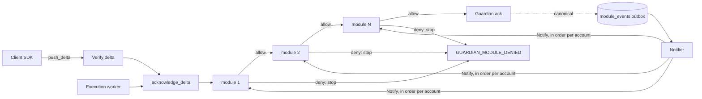

# RFC 0002: Guardian modules, a hook pipeline for pluggable policy

| | |
|---|---|
| **Status** | Draft |
| **Feature** | [#251](https://github.com/OpenZeppelin/guardian/issues/251) ("Modularization: middleware architecture and pluggable modules"); first consumer [#182](https://github.com/OpenZeppelin/guardian/issues/182) (policy evaluation). [#252](https://github.com/OpenZeppelin/guardian/issues/252) (x402 facilitator) is a later consumer: its payment-policy half (caps, allowlists, replay) fits `before_transaction_approved` and `after_transaction_committed`, its facilitator half (`/verify`, `/settle`, a flow that starts and waits) does not fit allow/deny and is future work (section 7) |
| **Audience** | Operators, module authors, integrators, and anyone reviewing the Guardian trust model |
| **Working artifacts** | `speckit/features/251-guardian-modules/` (created after this RFC is accepted) |
| **Revision** | 16 (2026-10-09): sixth review round: `notify_gap` trait method (default no-op) and `POST /v1/notify-gap`; transport byte mapping stated; budget enforcement restated with startup over-budget report; notify delivery on the coordination leadership lease with fenced cursor writes; catalog removal of an instance with unacknowledged events sets `resync_required`; `resync_required` row in the failure table; resync in invariant 4; citations re-pinned (`sweep.rs:667`, `worker.rs:389` at `29c722b4`); `reserved "version"`; `validate_params` on unresolved params; `GET` under `dashboard:read` |
| **Revision 15** | 2026-10-09: fifth review round: resync machinery added to M2 scope; resync listed under `policies:write` and in the operator capability table; `NotifyGap` failures non-fatal within protocol version 1; `Gap.dropped_before` defined as the restart position; in-process `HookRequest.params` carry unresolved secret references; orphaned entry in the `GET` example |
| **Revision 14** | 2026-10-09: fourth review round: retention drop puts the module into `resync_required` with an operator resync and a `NotifyGap` call; budget counts disabled instances; orphaned assignments defined; `$secret` reserved at any depth; `GUARDIAN_MODULE_TIMEOUT_MAX_MS` and `require_fresh_state_ms` named; JCS params; `protocol_version` covers projections and `TxProjection.version` removed; registration projection cost; `module_catalog_hash` column; `all`-first masking note; requirement status column (R5 partly met) |
| **Revision 13** | 2026-10-09: third review round: re-onboarding preserves stored assignments; budget checked at startup on `all` + `default` and per account on assignment; `network` in `CommitEvent`; protocol encodings; `pending` ordering; delivery starts at the latest event; outbox retention; `validate_params` at startup; operator API bodies; operator client in M2 scope. `event_id` kept as the commitment, with its cross-account uniqueness cited |
| **Revision 12** | 2026-10-09: second review round: `pending` and the backlog cap limited to modules subscribed to `after_transaction_committed`; `account_params` catalog field applied by the Guardian replaces the `account_overrides` convention, so remote modules see only the evaluated account's params; `$secret` form in the section 2.5 example; `enabled` seed rule; candidate-mode scope of the single-winner argument and the execution worker's `pending`; budget check described as a union |
| **Revision 11** | 2026-10-09: open questions resolved: `meta.module` is the operator-chosen instance id (section 4.1); evaluation budget (section 4.3); foreign account reads deferred (section 7); x402 facilitator example (section 2.6). No open questions remain |
| **Revision 10** | 2026-10-09: D4 resolved: catalog hot reload removed (revision 5's `SIGHUP` and reload endpoint withdrawn); `enabled` instance field with runtime enable always allowed; catalog hash exported per replica and recorded per signed delta; database-backed catalog as future work |
| **Revision 9** | 2026-10-09: D3 resolved with `pending` in every `evaluate` request (section 3.4), backlog cap, stored projections, no counting in `evaluate`; notify events also written on the optimistic commit path |
| **Revision 8** | 2026-10-09: D2 resolved, params of `all` modules cannot be changed per account through the operator API; per-account variation goes into catalog params (`account_overrides`) |
| **Revision 7** | 2026-10-09: D1 resolved, all module writes under `policies:write` with reason and audit |
| **Revision 6** | 2026-10-09: review round. **Correction:** revisions 1 to 5 exempted a "release sweep ack" that does not exist in production code; the exit guarantee rests on `SwitchGuardian` executing without a Guardian ack (Appendix B). Operator routes moved to `/dashboard/*`; params defined as JSON with secret-reference rules; "copied, not referenced" made precise; notify ordered per account; `reason_code` required only on deny; proto completed; pipeline placed in the single ack function with the pause check first; filesystem outbox; catalog loaded in `build()`; four decisions recorded as pending (section 9) |
| **Revision 5** | 2026-10-09: runtime changes without restart (section 2.2): validated catalog reload, and runtime disable limited to instances with `operator_can_disable`, audited; invariant 4 updated; open question 4 resolved |
| **Revision 4** | 2026-10-09: rebuild matrix and official-image path for third-party crates (section 2.5); `ServerBuilder::from_env()`, `GUARDIAN_MODULES_CONFIG` and the `custom-guardian` template with release lockfile; operator API capability table, no dashboard page; runtime enable and disable as open question 4 |
| **Revision 3** | 2026-10-08: module kinds and instances replace endpoint-based catalog entries; `guardian-module-sdk` crate; operator-registered kinds through `ServerBuilder` (section 2.5), following oif-aggregator's adapter pattern; invariant 1 limited to remote modules |
| **Revision 2** | 2026-10-08: adds `scope = default`, copied into an account's assignment at registration, removable per account, not retroactive |
| **Revision 1** | 2026-10-08: first draft |
| **Code baseline** | `main` at `c892795a`; execution-path citations read on `254-execution-impl` at `29c722b4` (PR #510). Miden pins: protocol 0.17.0 |

---

## Executive summary

Today every rule about whether the Guardian co-signs a transaction is compiled into the server: signature checks, candidate-chain rules, the account pause flag. Operators who need compliance screening, spending caps or risk scoring have nowhere to put that logic.

**After this work**, the Guardian runs a **hook pipeline** at fixed points in its lifecycle. At each hook it calls an ordered list of **modules**, and each module answers allow or deny. Every module is an instance of a **module kind**: either a remote kind (`grpc`, `http`) that calls a service the operator deploys, or an in-process kind compiled into the Guardian. First-party kinds ship in the official image; operators can register their own kinds from a crate through `ServerBuilder` and run their own build (section 2.5). Modules are declared in server configuration, assigned to accounts by operators, and opt-in: a Guardian with no modules configured behaves exactly as it does today.



**What stays the same:**

- **A remote module can only withhold a Guardian signature, never produce one.** With any set of remote modules, the Guardian signs a subset of what it would sign without them. A compromised remote module can deny service; it cannot authorize anything. In-process kinds are trusted code with the Guardian's full privileges (section 5.1).
- **Users can always leave.** `SwitchGuardian` executes on chain without a Guardian acknowledgement, so no module can block an account from switching away (section 2.3, Appendix B).
- **No modules, no cost.** An account with an empty module set skips the pipeline entirely.

---

## 1. Requirements

Collected from #251, its linked issues and the policy discussion on #238.

| # | Requirement | Source | Status |
|---|---|---|---|
| R1 | Transactions pass through an ordered pipeline of modules before the Guardian signs; each returns success or failure | #251 | Covered |
| R2 | Hooks at least before transaction approval and before account registration; the hook set is designed, not ad hoc | #251 | Covered |
| R3 | Modules are external, pluggable, registered by URL, independently deployable; the core stays lean and modules are opt-in | #251 | Covered (`grpc` and `http` kinds) |
| R4 | A Guardian may register several modules; each account has its own module selection and configuration | #251 comment 2026-08-12 | Covered |
| R5 | When the Guardian runs in a TEE, modules may need to run in the same trusted environment with defined access to private state; the RFC defines configuration, execution, isolation and trust for both cases | #251 comment 2026-08-12, #69 | Partly: design only (section 6); attestation fields in the catalog deferred to #69 |
| R6 | Policies evaluate the decoded transaction, never the proposer-asserted `proposal_type` | #238 (Q3) | Covered |
| R7 | Transaction-type filtering belongs in a module, not a core allowlist | #266 | Covered |
| R8 | Stateful policies (daily volume, velocity, cooldowns) must be implementable | #238 policy list | Covered in candidate mode (section 3.4) |

---

## 2. Design

### 2.1 Module kinds and instances

Two concepts are kept apart:

- A **module kind** is code: an implementation of the `Module` trait, registered under a kind name when the server is built.
- A **module instance** is configuration: a catalog entry (section 2.2) that names a kind and supplies its settings and parameters. One kind can back several instances, for example the same sanctions kind configured once per list.

```rust
#[async_trait]
pub trait Module: Send + Sync {
    async fn describe(&self) -> Result<ModuleInfo, ModuleError>;
    async fn validate_params(&self, params: &[u8]) -> Result<ParamsVerdict, ModuleError>;
    async fn evaluate(&self, request: &HookRequest) -> Result<Decision, ModuleError>;
    async fn notify(&self, event: &CommitEvent) -> Result<(), ModuleError>;
    async fn notify_gap(&self, gap: &Gap) -> Result<(), ModuleError> {
        Ok(())
    }
}

pub trait ModuleFactory: Send + Sync {
    fn create(&self, instance: &ModuleInstanceConfig) -> Result<Arc<dyn Module>, ModuleError>;
}
```

The trait, the factory and all protocol types live in a separately published crate, `guardian-module-sdk`, so a kind can be written without depending on the server (section 2.5). `notify_gap` has a default no-op so stateless kinds need not implement it; stateful kinds override it to reset or re-seed state after a gap (section 3.3). The `GrpcModule` and `HttpModule` implementations call the `NotifyGap` RPC, and the `serve` harness routes `NotifyGap` to `notify_gap`, so in-process and remote modules see gaps the same way.

First-party kinds, registered by `ServerBuilder::from_env()` and present in the official image:

| Kind | Runs | Settings | Notes |
|---|---|---|---|
| `grpc` | Remote | `endpoint = "grpc://host:port"` (TLS), `auth` | Calls a service implementing `guardian.module.v1.GuardianModule` |
| `http` | Remote | `endpoint = "https://host[:port]"`, `auth` | Same messages in the proto3 JSON mapping at `GET /v1/describe`, `POST /v1/validate-params`, `POST /v1/evaluate`, `POST /v1/notify`, `POST /v1/notify-gap`. HTTP 404 or 501 from `/v1/notify-gap` is treated like gRPC `UNIMPLEMENTED` (section 3.3) |
| `basic-policy` | In process | none | Reference policy: recipient and asset allowlist, per-transaction amount cap. Stateless: subscribes to `before_transaction_approved` only |

Operator-registered kinds run in process (section 2.5). The proto file is the single source of truth for both remote kinds, so there is one schema to version. A conformance suite in `guardian-module-sdk` runs the same cases against in-process, gRPC and HTTP modules and asserts identical decisions.

`evaluate` must be free of side effects: clients retry `push_delta`, and an evaluation is not a commitment. State a module keeps (volume counters, recipient first-seen times) is updated from `notify`, which reports only what actually became canonical. Transactions the Guardian has signed but the module has not yet acknowledged through `notify` arrive with every `evaluate` request in `pending` (section 3.4), so a stateful module decides on its counters plus `pending` plus the transaction at hand, and never counts anything in `evaluate`.

### 2.2 Registration, assignment and order

**The module catalog is server configuration**: a TOML file whose path is given by `GUARDIAN_MODULES_CONFIG`, loaded at startup and documented in `docs/CONFIGURATION.md`. Like every other Guardian setting, a change to the file applies on restart or rolling deploy; the file is not reloaded at runtime (section 2.2, runtime changes). Adding a module that can veto signing is an infrastructure change and gets deploy-level review; an operator dashboard session cannot point the approval path at a new URL.

For most operators, using modules is therefore configuration only: the official image ships first-party kinds, the operator declares instances of them (or of `grpc` and `http` for remote modules) in the catalog file, and day-to-day per-account changes go through the operator API. No build step is involved.

Each catalog entry:

| Field | Meaning |
|---|---|
| `id` | Stable instance identifier, used in errors, metrics and the operator API |
| `kind` | Registered module kind (section 2.1). An unregistered kind stops startup |
| `endpoint` | Remote kinds only: `grpc://…` or `https://…` |
| `scope` | `all`, `default` or `assigned` (see scopes below) |
| `hooks` | Subset of the hooks in section 2.3 |
| `timeout_ms` | Required; at most `GUARDIAN_MODULE_TIMEOUT_MAX_MS` (default 1000) |
| `on_error` | `deny` (default) or `allow` (section 4) |
| `auth` | Remote kinds only, mandatory in the prod stage: secret reference for the bearer token; optional mTLS client certificate (section 5.2) |
| `params` | Default parameters as a JSON object (TOML tables in the catalog are converted to JSON). Modules receive params as UTF-8 JSON bytes in RFC 8785 canonical form (JCS). The decoded bytes are identical on every transport: in process and over gRPC they arrive as raw bytes, while over `http` the proto3 JSON mapping carries them as a base64 string that decodes to the same bytes (likewise `int64` fields arrive as decimal strings and `Timestamp` fields as RFC 3339 strings, per the standard mapping). See "Parameters and secrets" below |
| `require_fresh_state_ms` | Optional maximum notify lag in milliseconds (section 3.3) |
| `enabled` | Default `true`. A one-time seed, read only the first time an instance id is seen; afterwards the runtime flag in the metadata store governs and later edits of this field have no effect (see runtime changes below) |
| `account_params` | `scope = all` instances only (other scopes take per-account params through the operator API). Optional map from account id to a JSON object. For that account the Guardian sends `params` with the account's entry merged over it (top-level keys replaced). Each request carries only the effective params of the account being evaluated |
| `operator_can_disable` | Default `false`. When `true`, the operator API may disable this instance at runtime. Enabling is always allowed (see runtime changes below) |

```toml
[[module]]
id = "spend-cap"
kind = "basic-policy"
scope = "default"
hooks = ["before_transaction_approved"]
timeout_ms = 50
on_error = "deny"
params = { max_amount_per_tx = 1_000_000 }

[[module]]
id = "risk-vendor"
kind = "grpc"
endpoint = "grpc://risk:7443"
scope = "assigned"
hooks = ["before_transaction_approved", "after_transaction_committed"]
timeout_ms = 300
on_error = "allow"
auth = { token_secret = "guardian/modules/risk-vendor-token" }
```

**Parameters and secrets.** Params are a JSON object. A value of the form `{"$secret": "<name>"}` is a secret reference, resolved by the Guardian through its secrets backend. `$secret` is a reserved key at any depth: the Guardian scans params recursively, so a reference nested inside another object is found and treated exactly like a top-level one, and no module param may use `$secret` as an ordinary key. Secret references are allowed only in catalog entries of in-process kinds, and are resolved when the instance is created. They are rejected in catalog entries of remote kinds (a remote module holds its own credentials) and in per-account params written through the operator API (otherwise a session could read arbitrary secrets through a module). Resolved secret values are never placed in a `HookRequest`, so they never reach a remote module. An in-process instance whose catalog params contain references receives, in its own `HookRequest.params`, the unresolved form with the references intact; it holds the resolved values from its factory, which received them when the instance was created. The `serve` harness and the conformance suite follow the same rule and never substitute.

The catalog is loaded in `ServerBuilder::build()`, after every `with_module_kind` call, so custom kinds are registered before any instance names them. `build()` creates every instance through its kind's factory, calls `describe` on it and checks that it supports the hooks it is configured for and speaks a supported `protocol_version`, then calls `validate_params` on the instance's `params` and on each entry of `account_params` (merged over `params`), in the same unresolved form the module later receives in `HookRequest.params` (secret references intact), so a mistyped value in the catalog fails at startup rather than on the first transaction. In the prod stage a mismatch or an unreachable enabled module stops startup, mirroring `reject_filesystem_in_prod`; a disabled instance that fails these checks is logged and stays disabled, and enabling it runs the same checks first.

**Scopes** decide which accounts a module applies to without the operator visiting every account:

| Scope | Applies to | Removable per account | Effect of a later catalog change |
|---|---|---|---|
| `all` | Every account, evaluated live from the catalog | No; params fixed by the catalog entry | Applies to every account immediately |
| `default` | Copied into the account's assignment when `configure_account` succeeds, in the same storage write that creates the account | Yes; parameters editable | None on existing accounts |
| `assigned` | Only accounts an operator assigns | Yes | None on existing accounts |

`all` is for policy every account must have, such as compliance. `default` is for policy most accounts should start with but individual accounts may drop or tune.

Two rules keep `default` predictable:

- **Not retroactive.** Adding a `default` module to the catalog does not touch existing accounts; otherwise a config deploy would silently rewrite stored per-account policy. An operator who needs a module on every existing account uses `all`. Bulk assignment for backfilling is future work (section 7).
- **Params copied, behaviour referenced.** The account stores `{ module_id, params }` and the order. The params are a snapshot: changing catalog default params later does not shift limits on existing accounts. Every other field (kind, endpoint, hooks, timeout, auth, `on_error`, `require_fresh_state_ms`, `operator_can_disable`, `account_params`) follows the catalog entry the replica started with, so a catalog change to those fields applies, after the next deploy, to every account that names the instance. The policy that applies to an account is therefore its stored assignment and params, plus the `all` modules, both evaluated with the current catalog's settings for each instance.

**Assignment is dynamic and per account** (R4), stored next to account metadata and written only through the operator API. The operator API is the `/dashboard/*` surface with session-cookie authentication (`crates/server/src/builder/handle.rs:446`) **[READ]**; account pause, for example, is `POST /dashboard/accounts/{account_id}/pause` with a required reason (`builder/handle.rs:358`, `services/pause_account.rs:31`) **[READ]**:

- `PUT /dashboard/accounts/{account_id}/modules` replaces the account's stored assignment (`default` and `assigned` instances) with an ordered list, and requires a reason:

  ```json
  {
    "modules": [
      { "module_id": "spend-cap", "params": { "max_amount_per_tx": 500000 } }
    ],
    "reason": "Raise treasury cap, ticket OP-42"
  }
  ```

  An entry naming an `all` instance is rejected with 400. So is an assignment whose effective module set for the account (every `all` instance plus the listed ones, for each hook, enabled or not) has timeouts adding up to more than `GUARDIAN_MODULE_EVALUATION_BUDGET_MS` (section 4.3).
- `GET /dashboard/accounts/{account_id}/modules` (permission `dashboard:read`) returns the effective module set in evaluation order, so an operator can see which entries are fixed:

  ```json
  {
    "modules": [
      { "module_id": "compliance-caps", "scope": "all", "enabled": true, "effective_params": { "max_amount_per_tx": 10000 }, "can_override": false },
      { "module_id": "spend-cap", "scope": "default", "enabled": true, "effective_params": { "max_amount_per_tx": 500000 }, "can_override": true },
      { "module_id": "legacy-risk", "scope": "assigned", "orphaned": true, "effective_params": { "threshold": 70 }, "can_override": true }
    ]
  }
  ```

  Secret references in `effective_params` are shown as references, never resolved.
- `POST /dashboard/modules/{module_id}/enable` and `/disable` take `{ "reason": "<text>" }`.
- `POST /dashboard/modules/{module_id}/resync` takes `{ "reason": "<text>", "account_ids": ["0x..."] }` (omit `account_ids` for every affected account) and clears `resync_required` (section 3.3).
- **Orphaned assignments.** A stored assignment that names an instance id no longer in the catalog is kept, skipped in evaluation, listed by `GET` with `"orphaned": true`, and counted in `guardian_module_orphaned_assignments`. It becomes active again if the id returns to the catalog.
- Permissions come from the operator vocabulary in `crates/server/src/dashboard/permissions.rs`, which today holds `dashboard:read`, `accounts:pause`, `policies:write` (reserved, no handler yet) and `stats:refresh` **[READ]**. Every module write uses the reserved `policies:write`: assignment, per-account params, runtime enable and disable, and resync (section 3.3). Each write requires a reason and is recorded in the audit log with the operator identity, as pause does. A single permission is enough because the safety boundaries sit in the catalog, not in permission granularity: `all` instances cannot be removed, and only instances marked `operator_can_disable` can be disabled. A separate permission for emergency disable can be split out later if operators need to grant it without assignment rights.
- `PUT` calls `validate_params` on each listed module before storing, so a mistyped limit fails when it is set rather than when a transaction is evaluated.
- `scope = all` instances cannot be removed and their params cannot be changed per account. A `PUT` entry naming an `all` instance is rejected; `GET` lists the account's `all` instances read-only.

**Per-account variation of mandatory policy lives in the catalog.** A param change is as strong as removal: for `basic-policy`, a huge `max_amount_per_tx` or an empty allowlist switches the control off, so letting a session change `all` params would make "cannot be removed" protect nothing. The Guardian also cannot judge whether a change is tighter, because params are opaque JSON, and an audit record only detects a loosening after the account has been signed for without the control. When an account needs different mandatory settings, the exception goes into the instance's catalog entry as `account_params`, where it is deploy-reviewed and visible in history:

```toml
[[module]]
id = "compliance-caps"
kind = "basic-policy"
scope = "all"
hooks = ["before_transaction_approved"]
timeout_ms = 20
on_error = "deny"
params = { max_amount_per_tx = 10_000 }
account_params = { "0x7bfb...a1" = { max_amount_per_tx = 1_000_000 } }
```

The Guardian applies `account_params` itself rather than leaving it to a module convention. If the exceptions were part of `params`, every request would carry every account's exception, and a remote module (including `basic-policy` served through the `serve` harness) would learn the limits of every listed account. With `account_params`, a module receives only the effective params of the account it is evaluating, and needs no code to support per-account exceptions. Merging is shallow: a key in the account's entry replaces the same top-level key in `params`. Secret references are not allowed in `account_params`, at any depth.

| Operator API can | Operator API cannot |
|---|---|
| Assign an `assigned` module to an account, or remove it | Add a module instance (catalog file and deploy only) |
| Remove or re-tune a `default` module on one account | Remove an `all` module from an account |
| Override params of a `default` or `assigned` module for one account | Change params of an `all` module, for any account |
| | Change a module's kind, endpoint, auth, timeout or `on_error` |
| Reorder an account's assigned modules | Disable an instance whose catalog entry does not set `operator_can_disable` |
| Enable any declared instance; disable instances that allow it | |
| Resync a module for accounts in `resync_required` (accepting the dropped history) | |

This revision specifies the operator API only; no operator dashboard page is planned.

**Runtime changes without a restart.** The catalog file is read only at startup. Hot reload was considered and rejected (section 8): on ECS, the production target, configuration reaches tasks through the task definition and image, so there is no file to change without a deploy; file watching is unreliable across network and container mounts; and with several replicas a reload reaches one process, so for a newly added `all` module the other replicas keep signing without it. The needs behind a reload are met by state in the metadata store instead, which every replica reads, so a change applies to all replicas at once:

- **Per-account assignment and params** (above).
- **Seed rule for `enabled`.** The catalog's `enabled` value is written to the metadata store only the first time an instance id is seen. After that the stored flag is the only switch: a redeploy that changes `enabled` in the file changes nothing, and the server logs a warning at startup when the file and the stored flag differ. Removing an instance from the catalog stops it but keeps its stored flag; adding the same id back resumes with that stored flag, not the file's value. The file is therefore not the switch for an existing instance; the operator API is.
- **Runtime enable and disable of declared instances.** `POST /dashboard/modules/{module_id}/enable` and `/disable` (permission `policies:write`, reason required, audit record) switch evaluation on or off for every account. The two directions carry different risk. Enabling only tightens policy and is always allowed, so an operator can declare an instance with `enabled = false` and switch it on later without a restart. Disabling loosens policy: an API that could disable any module would let a stolen operator session switch off sanctions screening for every account, which undoes invariant 4. It is therefore allowed only for instances with `operator_can_disable = true`. An instance declared with `enabled = false` and `operator_can_disable = false` is deliberately one-way: a staged rollout that an operator can switch on once and cannot switch off from a session; compliance instances leave the flag off, while advisory modules such as a fail-open risk scorer can turn it on as an emergency stop for a faulty module. `guardian_module_disabled{module}` is exported for alarms. A disabled instance is skipped by `evaluate` but keeps receiving `notify`, so its state is current when it is enabled.

Only adding an instance, removing one, or changing its kind, endpoint, auth, hooks, timeout or `on_error` needs a deploy, and deploy review is the bar wanted for those changes. A rolling deploy still leaves replicas on different catalogs for its duration, so each replica exports the hash of the catalog it loaded (`guardian_module_catalog_info{hash}` and in `/dashboard/info`), and the hash is recorded with every delta the Guardian signs, in a new `module_catalog_hash` column on the delta row, shown in the dashboard delta detail and not exposed through the client API. That answers "which module configuration approved this transaction" exactly.

**Order:** `scope = all` modules in catalog order, then the account's stored assignment in its stored order. Copied `default` modules are stored first, in catalog order, and the operator may reorder them afterwards. Evaluation stops at the first deny. `all` modules always run before the account's own modules, so when an `all` module denies, `meta.module` names it and any account-level module that would also have denied is never called. Operators debugging per-account policy should check the `all` modules first.

Account self-service configuration is out of scope for this revision (section 7). Account requests are authenticated by a single cosigner key, so letting an account remove its own spending cap would let one compromised key disable the policy that limits a compromised key.

### 2.3 Hooks

| Hook | Kind | Attachment point |
|---|---|---|
| `before_transaction_approved` | Gate | Inside the single function that produces the Guardian ack. On `main` the only production ack is `push_delta` before `state.ack.ack_delta` (`crates/server/src/services/push_delta.rs:182`) **[READ]**. PR #510 (`254-execution-impl`) adds a second caller, the execution worker, and routes both through `ack_delta_internal::acknowledge_delta` (`push_delta.rs:145`, `execute_proposal/worker.rs:389`) **[READ]**; the pipeline runs inside that shared function, so no caller can ack around it. The pause and release check runs earlier (`push_delta.rs:35`, before the ack at `:182`) **[READ]**, so a paused or released account is refused before any module sees its transaction. A denial on the execution path does not reach a `push_delta` caller; it ends the execution with a typed abort the multisig SDKs read (section 4.1) |
| `before_account_registered` | Gate | `configure_account` (`crates/server/src/services/configure_account.rs:32`) after the existing credential, canonical signer set and Guardian commitment checks **[READ]**. `configure_account` also serves existing accounts, including re-onboarding after a release (`existing.is_some()`, `configure_account.rs:158,256`) **[READ]**, and the two cases differ. **New account** (`existing.is_none()`): there is no assignment yet, so `scope = all` and `scope = default` modules run (the latter because they are about to apply to the account), each only if it declares this hook; on success the `default` modules are copied into the new assignment. Because `default` instances run here with catalog params, a down fail-closed `default` instance blocks new registrations. **Existing account**: the stored assignment is preserved and never replaced by catalog defaults, and the hook runs `scope = all` modules plus the stored assignment. Otherwise any cosigner, who can call `/configure` with their own key, could wipe a tighter policy an operator assigned |
| `after_transaction_committed` | Notify | Outbox row written in the same storage write that makes the delta committed. In candidate mode that is `promote_candidate` on both storage backends (`crates/server/src/storage/postgres.rs:1786`, `crates/server/src/storage/filesystem.rs:944`) **[READ]**. With canonicalization disabled the delta commits at push time (`DeltaCommitStrategy::Optimistic`, `crates/server/src/services/delta_commit.rs:18-31`) **[READ]**, and the row is written in that commit |

**Deliberately not hooked:**

- **Leaving the Guardian.** `SwitchGuardian` is the one transaction type that executes on chain without a Guardian acknowledgement (`docs/QUALIFICATION.md:657`) **[READ]**, so the pipeline cannot block an account from switching away. The SDK's best-effort push of the switch delta to the old Guardian does pass through `push_delta` and can be denied by a module; the release sweep then detects the switch from chain instead (`services/release_on_switch.rs:21-31`) **[READ]**. The release sweep itself never acks: in production code it only checks whether a delta carries the current key (`jobs/release_sweep/sweep.rs:667`, `ack.acked_with_current_key`) **[READ]**. Revisions 1 to 5 said otherwise (Appendix B).
- **Proposal create and sign.** The Guardian signs nothing there, so a gate would not be binding. An advisory "would this pass?" hook is future work.
- **EVM proposals.** Feature-gated (`evm`), out of scope; the same pipeline can be attached to the EVM ack path later.

### 2.4 Request flow

1. A delta reaches the ack choke point after all existing verification.
2. The pipeline resolves the account's ordered module set for the hook. If it is empty, the delta is acked with no further work.
3. The pipeline builds one `HookRequest` (section 3) and calls each module in order under its timeout.
4. All allow: ack and continue as today. Any deny: no ack, no candidate stored, typed error to the caller (section 4.1).
5. When the delta becomes committed (promotion in candidate mode, the push itself in optimistic mode), a `module_events` row is written in the same storage write. The notifier delivers it to every module that subscribes to `after_transaction_committed`.

### 2.5 Extending the Guardian with custom kinds

Rust code cannot be loaded into a running binary safely, so whether a module needs a Guardian rebuild depends on who wrote it and where it runs:

| Module | Official image | Guardian rebuild |
|---|---|---|
| First-party in-process kinds (`basic-policy` and later first-party kinds) | Included | No; declare instances in the catalog |
| Remote modules, any author and language (kinds `grpc`, `http`) | Supported | No; run the module as its own service |
| Third-party or operator-written in-process kinds | Not included | Yes; custom build through `ServerBuilder` |

Configuration changes (instances, parameters, scopes, order, per-account assignment) never need a rebuild.

There are two ways to use a module someone else wrote, for example a crate published to crates.io.

**As a remote module on the official image (recommended for third-party code).** The crate implements `Module` against `guardian-module-sdk`; a few lines wrap it with the SDK's `serve` harness, which exposes any `Module` over gRPC and HTTP and checks the bearer token:

```rust
#[tokio::main]
async fn main() -> anyhow::Result<()> {
    guardian_module_sdk::serve(acme_sanctions::AcmeSanctions::from_env()?)
        .grpc("0.0.0.0:7443")
        .token_from_file("/run/secrets/module_token")
        .run()
        .await
}
```

The wrapper is built into its own container image and runs next to the official Guardian image, which reaches it through an instance of kind `grpc` or `http`:

```yaml
services:
  guardian:
    image: ghcr.io/openzeppelin/guardian:<tag>
    volumes:
      - ./config/modules.toml:/etc/guardian/modules.toml:ro
    environment:
      GUARDIAN_MODULES_CONFIG: /etc/guardian/modules.toml
  acme-sanctions:
    image: acme/guardian-sanctions:0.3
```

The module runs in its own process and sees only what the protocol sends it. It does not depend on the Guardian's Miden pins, because it reads `TxProjection` rather than Miden types. Module authors are encouraged to publish both the crate and a ready-made image built with `serve`.

**As an in-process kind (for code the operator wrote or audited).** `guardian-server` already exposes `ServerBuilder` (`crates/server/src/main.rs:4`) **[READ]**, but the official `main.rs` wires about 60 lines of environment configuration (storage, ack registry, CORS, network, canonicalization, release sweep, limits, ports) before calling it (`crates/server/src/main.rs:14-78`) **[READ]**. That wiring moves into the library as `ServerBuilder::from_env()`, so the official binary and every custom one share it. A custom binary then registers its kinds and starts the server:

```rust
#[tokio::main]
async fn main() -> anyhow::Result<()> {
    ServerBuilder::from_env()
        .await?
        .with_module_kind("acme-sanctions", acme_sanctions::Factory)
        .with_module_kind("treasury-rules", treasury_rules::Factory)
        .build()
        .await?
        .run()
        .await;
    Ok(())
}
```

The operator depends on `guardian-server` at a release tag and builds with `--locked` against the `Cargo.lock` from that tag. The Guardian relies on exact Miden and Plonky3 versions, and a freshly resolved lockfile can select different transitive versions that build cleanly but break transaction execution. Each release therefore ships a `custom-guardian` template (manifest, `main.rs`, `Dockerfile` mirroring the official one, and the release `Cargo.lock`), to which the operator adds only their own crates.

```toml
[[module]]
id = "sanctions-eu"
kind = "acme-sanctions"
scope = "all"
hooks = ["before_transaction_approved"]
timeout_ms = 200
on_error = "deny"
params = { list = "eu-consolidated", api_key = { "$secret" = "guardian/modules/acme-key" } }

[[module]]
id = "sanctions-ofac"
kind = "acme-sanctions"
scope = "default"
hooks = ["before_transaction_approved"]
timeout_ms = 200
on_error = "deny"
params = { list = "ofac-sdn", api_key = { "$secret" = "guardian/modules/acme-key" } }
```

An in-process kind can also be an adapter: it translates `HookRequest` into a vendor's existing API (for example a compliance REST service), so the vendor never implements `guardian.module.v1`.

Consequences of the in-process path, stated plainly:

- **Full trust.** An in-process kind shares the process with the ack signing keys, storage credentials and every account's state. It can do anything the Guardian can, including signing. Registering a crate this way trusts its author and every transitive dependency as much as the Guardian itself. Invariant 1 (section 5.1) does not hold for in-process kinds.
- **Own build.** The operator leaves the official image and rebuilds, signs and redeploys their binary on every Guardian release. The official image's provenance attestation does not cover a custom build; the operator publishes their own. In a TEE the kind becomes part of the enclave measurement, so the attestation differs from the official build.
- **Public API commitment.** `ServerBuilder::with_module_kind`, `ModuleFactory` and `guardian-module-sdk` become semver-governed public API, and `guardian-server` must be consumable as a library from a published crate or a release tag.

Loading kinds at runtime is not supported. Native dynamic libraries are rejected (no stable Rust ABI, `unsafe` loading, the same full-trust problem without compile-time checks). WebAssembly kinds, sandboxed and pinned by hash, are future work.

**Prior art.** This follows the adapter pattern of [oif-aggregator](https://github.com/openintentsframework/oif-aggregator) (`docs/custom-adapters.md`, `examples/builder_demo.rs`): a small types crate holds the `SolverAdapter` trait, `AggregatorBuilder::default()` registers first-party adapters, `.with_adapter(..)` adds custom ones, and configuration entries reference an adapter by id with free-form `adapter_metadata`. The difference that matters here is privilege: a compromised aggregator adapter can corrupt quotes, while a compromised Guardian kind can sign.

### 2.6 Example: an x402 facilitator

x402 uses HTTP `402 Payment Required` for machine payments: a resource server answers a request with payment terms, the client retries with a signed payment authorization, and the resource server asks a **facilitator** to `/verify` the payment and `/settle` it on chain. For a Guardian-protected account the payment authorization is a Miden transaction that needs the Guardian's signature, so #252 has two halves.

**Payment policy fits the hooks in this RFC.** At `before_transaction_approved` a module checks the payment transaction against the intent it recorded during `/verify`: pay-to address, amount within the account's budget (counters plus `pending`, section 3.4), resource on the allowlist, not expired, not already used. It reads `TxProjection` (vault changes, `p2id_target`), never the proposer's label. At `after_transaction_committed` it learns the payment is final, updates its budget counters, and can give the resource server a receipt bound to the commitment.

**The facilitator itself is a separate service, which is why it is an external module.** Its `/verify` and `/settle` API is called by resource servers on the internet, not by the Guardian, and sits outside `guardian.module.v1`. Inside the Guardian process it would put an internet-facing payment API next to the ack signing keys; as a remote module it runs in its own process, where invariant 1 holds (it can refuse payments, never cause a signature). It may also hold its own keys or funds for settlement, depend on other chains' clients, be run by a different party than the Guardian operator, and follow a spec that is still moving, none of which belongs in the Guardian's release cycle.

**What this RFC does not cover.** A facilitator drives a flow: it receives a payment request, starts settlement and waits for it. Allow/deny hooks cannot express "Guardian, execute this pre-authorized payment now". That needs a hook in the other direction, possibly through the Guardian execution path of RFC 0001, and is future work (section 7).

---

## 3. Module protocol (`guardian.module.v1`)

```proto
syntax = "proto3";
package guardian.module.v1;

import "google/protobuf/timestamp.proto";

service GuardianModule {
  rpc Describe(DescribeRequest) returns (ModuleInfo);
  rpc ValidateParams(ValidateParamsRequest) returns (ParamsVerdict);
  rpc Evaluate(HookRequest) returns (Decision);
  rpc Notify(CommitEvent) returns (NotifyAck);
  rpc NotifyGap(Gap) returns (NotifyAck);
}

enum Hook {
  HOOK_UNSPECIFIED = 0;
  HOOK_BEFORE_TRANSACTION_APPROVED = 1;
  HOOK_BEFORE_ACCOUNT_REGISTERED = 2;
  HOOK_AFTER_TRANSACTION_COMMITTED = 3;
}

message DescribeRequest {}
message ModuleInfo { string name = 1; string version = 2; uint32 protocol_version = 3; repeated Hook hooks = 4; }
message ValidateParamsRequest { bytes params = 1; }      // UTF-8 JSON
message ParamsVerdict { bool ok = 1; string message = 2; }
message NotifyAck {}

message Gap {
  string account_id = 1;
  string network = 2;
  google.protobuf.Timestamp dropped_before = 3;  // restart position: events for the account committed before this and not acknowledged may be missing
}

message HookRequest {
  string request_id = 1;
  Hook hook = 2;
  string network = 3;                 // "miden"
  string account_id = 4;
  bytes params = 5;                   // UTF-8 JSON, effective params for this account and module
  oneof subject {
    TransactionSubject transaction = 10;
    RegistrationSubject registration = 11;
  }
}

message TransactionSubject {
  string prev_commitment = 1;
  string new_commitment = 2;
  TxProjection projection = 3;        // the contract modules should rely on
  bytes raw_tx_summary = 4;           // serialized TransactionSummary; UNSTABLE across Miden protocol bumps
  string unverified_hint = 5;         // proposer-asserted proposal_type; never authoritative
  repeated PendingTransaction pending = 6;  // signed for this account, not yet acknowledged by this module (section 3.4)
}

message PendingTransaction {
  string new_commitment = 1;
  TxProjection projection = 2;
  google.protobuf.Timestamp signed_at = 3;
  PendingState state = 4;
}
enum PendingState {
  PENDING_STATE_UNSPECIFIED = 0;
  PENDING_STATE_CANDIDATE = 1;        // signed, waiting to become committed
  PENDING_STATE_COMMITTED = 2;        // committed, notify not yet acknowledged by this module
}

message RegistrationSubject {
  string auth_scheme = 1;
  repeated string signer_commitments = 2;
  optional uint32 threshold = 3;
  string initial_state_commitment = 4;
  AccountProjection initial_state = 5;  // vault and storage of the account about to be accepted
}

message Decision {
  bool allow = 1;
  string reason_code = 2;             // required when allow = false; ignored when allow = true
  string message = 3;                 // logged, never forwarded to clients
}

message TxProjection {
  reserved 1;                         // was version; protocol_version covers the projection
  reserved "version";                 // the JSON name cannot be reused either (matters for the http kind)
  int64 nonce_delta = 2;
  uint32 expiration_block = 3;
  repeated VaultChange vault_changes = 4;
  repeated OutputNote output_notes = 5;
  repeated InputNote input_notes = 6;
  repeated StorageChange storage_changes = 7;
}

message AccountProjection {
  repeated Asset vault = 1;
  repeated StorageSlot storage = 2;
}

message Asset {
  string faucet_id = 1;
  oneof value { string fungible_amount = 2; string nft_id = 3; }  // amounts as decimal strings
}

message VaultChange { Asset asset = 1; Direction direction = 2; }
enum Direction { DIRECTION_UNSPECIFIED = 0; DIRECTION_IN = 1; DIRECTION_OUT = 2; }

message OutputNote {
  string note_id = 1;
  NoteType note_type = 2;
  bool partial = 3;                   // only the recipient digest is known
  string recipient_digest = 4;
  repeated Asset assets = 5;
  string script_root = 6;
  optional string p2id_target = 7;    // set only for known P2ID / P2IDE scripts
}
enum NoteType { NOTE_TYPE_UNSPECIFIED = 0; NOTE_TYPE_PUBLIC = 1; NOTE_TYPE_PRIVATE = 2; }

message InputNote { string note_id = 1; repeated Asset assets = 2; }

message StorageChange {
  uint32 slot = 1;
  oneof change {
    string value = 2;                 // new slot value
    MapChanges map = 3;
  }
}
message MapChanges { repeated MapEntry entries = 1; }
message MapEntry { string key = 1; string value = 2; }
message StorageSlot { uint32 slot = 1; oneof content { string value = 2; MapChanges map = 3; } }

message CommitEvent {
  string event_id = 1;                // = new_commitment; stable across redelivery
  string account_id = 2;
  string prev_commitment = 3;
  string new_commitment = 4;
  TxProjection projection = 5;
  google.protobuf.Timestamp committed_at = 6;
  string network = 7;                 // "miden", as in HookRequest
}
```

### 3.1 Typed projection

**Encodings.** All string-typed values in the protocol follow one convention, normalized by the Guardian at the boundary (AGENTS.md section 12, Hex/Bytes Boundary Rule):

- Words, digests, commitments and roots (`prev_commitment`, `new_commitment`, `note_id`, `recipient_digest`, `script_root`, `nft_id`, storage values, map keys and values): `0x` followed by 64 lowercase hex characters.
- Amounts and other single field elements (`fungible_amount`): unsigned decimal strings, so values above 2^53 survive JSON.
- Account ids (`account_id`, `faucet_id`, `p2id_target`): the Guardian's canonical `0x` lowercase hex form of the account id.

**Versioning.** `ModuleInfo.protocol_version` versions the whole wire contract, `TxProjection` and `AccountProjection` included; there is no separate projection version. Adding fields stays within a protocol version (proto3 readers ignore unknown fields). A breaking change, including a breaking projection change, increments it. The Guardian supports a range of protocol versions, and a module whose `describe` reports a version outside that range is refused at startup.

**Registration cost.** `RegistrationSubject.initial_state` is built from the account `configure_account` already decodes to read its state head (`crates/server/src/services/configure_account.rs:150-153`) **[READ]**. Building the vault and storage projection from it is new work on the registration path, and the implementation should build it only when a module that declares `before_account_registered` will be called.

`TxProjection` (defined in the proto above) is a flattened view the Guardian decodes once from the `TransactionSummary`. It is the only code that changes on a Miden protocol bump, so modules that read only the projection do not need a Miden decoder pinned to the Guardian's protocol line. `raw_tx_summary` is the exception: its encoding follows the Guardian's Miden pin and can change on any protocol bump, so a module that decodes it is tied to that pin.

`p2id_target` is set only when the note script root is a known P2ID or P2IDE script. Recipient-based policies are enforceable because `TransactionSummary.output_notes` is a collection of `RawOutputNote::Full(Note) | Partial(PartialNote)` (`miden-protocol-0.17.0/src/transaction/tx_summary.rs:31-39`, `outputs/notes.rs:190`) **[READ]**: a full note carries recipient, assets and script even when its type is private. A partial note exposes only the recipient digest, so it is marked `partial = true` and a recipient policy must decide what to do with an unknown recipient.

### 3.2 The unverified hint

The proposer's `proposal_type` label is forwarded as `unverified_hint` only. A proposer can label a vault drain `change_threshold` (#238, Q3), so a module must derive meaning from `projection` and use the hint at most for display or logging. The single-key `push_delta` path has no label and sends an empty hint.

### 3.3 Notify delivery

Delivery is at least once:

- The `module_events` row is written in the same storage write that commits the delta (promotion in candidate mode, the push in optimistic mode), so an event exists if and only if the delta became committed. A rollback, including a `StaleBase` rollback, leaves no event.
- Delivery runs on the replica holding the notifier's leadership lease, through the existing coordination mechanism (`crates/server/src/coordination/leader.rs:7-30`, wired by `.coordination(..)` in `main.rs`) **[READ]**. Cursor advances and the cursor move made by a resync are conditional writes fenced by the lease's fence token, so a delivery in flight on a replica that lost the lease cannot advance the cursor, and a pre-gap redelivery cannot land after the resync's `NotifyGap`.
- Delivery is tracked per (module, account) and is in order per account: the next event for an account is sent only after the previous one is acknowledged, which is what volume counters need. Accounts are independent, so one account whose events keep failing does not hold back notify for any other account. Failures retry with backoff indefinitely.
- `event_id` is the new commitment, so modules deduplicate redelivery. It is unique across accounts, not only within one: a Miden account commitment hashes the account header, and the header includes the account id (`miden-protocol-0.17.0/src/account/header.rs:104-114,120-126`) **[READ]**, so two accounts share a commitment only through a hash collision.
- Optional `require_fresh_state_ms` per module, checked per account: if that module has an undelivered event for this account older than the configured lag, its `evaluate` for this account is treated as an error without being called and `on_error` applies. With `pending` (section 3.4) a lagging module still sees every signed transaction, so this is an age limit for operators who want one, not the main guard.

- **Starting position.** Delivery for a (module, account) pair starts at the latest event when the instance is first seen, or when it is first assigned to the account; earlier events are not replayed. A module added on day 30 therefore starts with empty counters for existing accounts, and a stateful module that needs history must obtain it elsewhere. Without this rule a new module would begin hundreds of events behind and immediately exceed the backlog cap (section 3.4).
- **Retention.** An event row is deleted once every current subscriber of the account's modules has acknowledged it; instances removed from the catalog do not hold rows. Dropping unacknowledged events for any reason other than acknowledgement, a retention lapse or the instance's removal from the catalog, sets `resync_required` for the affected (module, account) pairs; an instance added back after removal therefore stays refused for those accounts until an operator resyncs it. A subscriber more than `GUARDIAN_MODULE_EVENT_RETENTION` behind (default 14 days) has its backlog for the account dropped, with `guardian_module_events_dropped_total{module}` and an alarm. Dropping history must not quietly lower protection: a stateful module resumed with empty counters would allow what its limits were meant to stop. The (module, account) pair therefore enters `resync_required`, and while it is set the module's `evaluate` for that account is treated as an error without being called, so `on_error` applies. An operator clears it with `POST /dashboard/modules/{module_id}/resync` (section 2.2; reason required, audited). Delivery then restarts at the latest event, preceded by a `NotifyGap` call telling the module which account lost history, so it can reset or re-seed its state from its own sources. `Gap.dropped_before` is the restart position, not the moment retention lapsed: every event for the account committed before it that the module had not acknowledged, including events committed between the lapse and the resync, may be missing. Accepting the loss is an explicit operator decision. `NotifyGap` is informational, because the operator has already accepted the loss by resyncing: a failed call, or `UNIMPLEMENTED` from a module written before the RPC existed, is logged and delivery continues. This is how a new RPC stays within protocol version 1, and the conformance suite includes a module without `NotifyGap`.

The filesystem backend writes events under its existing in-process lock; it remains dev-only.

### 3.4 Pending transactions and stateful limits

A stateful limit (daily volume, rolling volume, velocity, new-recipient cooldown, R8) must see every transaction the Guardian has signed for the account. Counters that move only on `notify` miss transactions that are signed but not yet committed, and committed ones whose `notify` the module has not processed yet. Each evaluation would see the same stale total, and the limit could be overshot by as many transactions as fit in that window:

```
10:00  A: 800  evaluate: counters 0, 0 + 800 <= 1000      allow, signed
10:01  B: 800  evaluate: counters 0, 0 + 800 <= 1000      allow, signed   (without pending)
10:01  B: 800  evaluate: counters 0 + pending A 800 + 800  deny            (with pending)
```

`TransactionSubject.pending` therefore lists, for the account and the module being called, every transaction the Guardian has signed that this module has not acknowledged through `notify`. It is built only for modules that subscribe to `after_transaction_committed`. A module that does not subscribe never acknowledges events, so for it `pending` would only grow; such a module is stateless by construction, receives an empty `pending`, and is never subject to the backlog cap below. For a subscribing module the list holds:

- the account's queued candidates (`state = candidate`), and
- committed transactions whose `module_events` row this module has not acknowledged (`state = committed`).

Order is fixed: committed entries first, in commit order, then queued candidates in chain order (ascending nonce). The list is therefore the account's history in the order it happened or will happen.

The module decides on its counters, plus `pending`, plus the transaction being evaluated. Every signed transaction is counted exactly once: it leaves `pending` when the module acknowledges its event, the moment it enters the module's counters. A candidate that is discarded or superseded drops out of `pending`, so no release or expiry hook is needed. `signed_at` places pending entries in time windows.

The list is exact for every delta that gets stored. `push_delta` reads the candidate queue (`crates/server/src/services/push_delta.rs:86`) **[READ]** before the pipeline runs and the delta is signed (`:182`), and the storage gate admits the delta under the account lock only if it extends the queue's tail (`crates/server/src/storage/mod.rs:374-399`) **[READ]**. A candidate admitted after the queue was read moves the tail, so the later delta is refused with a 409 and its signature is never returned. Two concurrent requests can both pass `evaluate`, but at most one is stored.

This argument holds in candidate mode, which the official server binary always configures (`crates/server/src/main.rs:44`, `with_canonicalization(Some(..))`) **[READ]**. With canonicalization disabled (`DeltaCommitStrategy::Optimistic`, `crates/server/src/services/delta_commit.rs:87-201`) **[READ]** there is no candidate queue and no storage gate of this kind: two overlapping pushes on the same base can both be evaluated against the same `pending` and both signatures can be returned. Both spend the same account nonce from the same state, so at most one can execute on chain, but a module may see both as committed. Stateful limits are exact only in candidate mode, and `docs/CONFIGURATION.md` will say so (section 7, docs).

The execution worker (PR #510) builds `pending` from the same queue snapshot it uses for its own admission. It refuses to execute while any candidate is queued for the account (RFC 0001, revision 19), so its `pending` holds only committed entries the module has not acknowledged.

Limits:

- **Backlog cap.** Applies only to modules that subscribe to `after_transaction_committed`. The committed part grows while such a module is unreachable. Above `GUARDIAN_MODULE_PENDING_MAX` entries for an account (default 256), that module's `evaluate` for the account is treated as an error without being called and `on_error` applies. The candidate part is bounded by the candidate queue depth.
- **Projections are stored, not recomputed.** The projection is computed once when the delta is signed and stored with the candidate and with the `module_events` row.
- **No counting in `evaluate`.** Module authors keep state only from `notify`. The conformance suite evaluates the same request twice and checks that the module's state does not change.

---

## 4. Errors and failure handling

### 4.1 Client-visible errors

Both use the `{ code, message, meta }` envelope.

| Code | HTTP | gRPC | Retryable | `meta` |
|---|---|---|---|---|
| `GUARDIAN_MODULE_DENIED` | 403 | `PERMISSION_DENIED` | no | `{ module, reason_code }` |
| `GUARDIAN_MODULE_UNAVAILABLE` | 503 | `UNAVAILABLE` | yes | `{ module }` |

On a deny, `reason_code` must match `[a-z0-9_]{1,64}`; a deny without a conforming code is a protocol error and follows `on_error`. On an allow, `reason_code` is ignored and may be empty, so an allow is never turned into an error by a missing code. The module's free-text `message` is logged but not forwarded to clients: a module may be a third party and should not place arbitrary text in front of end users. `meta.module` is the instance `id` from the catalog, which the operator chooses: an operator who does not want to reveal which vendor screens its traffic names the instance neutrally (for example `compliance-1`), and the vendor's kind name never reaches clients. The Rust and TypeScript SDKs expose both as typed errors with the same retry classification. On the execution path (PR #510) a denial ends the execution with a typed abort reason `module_denied` carrying the same `{ module, reason_code }`, and module unavailability with `module_unavailable`; both multisig SDKs read these from the execution status.

### 4.2 Module failures

| Situation | `on_error = deny` | `on_error = allow` |
|---|---|---|
| Timeout, transport error, malformed decision, unknown protocol version, stale state, pending backlog over the cap | `GUARDIAN_MODULE_UNAVAILABLE` | Continue; WARN log; `guardian_module_fail_open_total{module}` |
| `resync_required` set for the account (section 3.3) | `GUARDIAN_MODULE_UNAVAILABLE` | Continue; WARN log; `guardian_module_fail_open_total{module}` |
| Notify failure | Never affects requests; retried; `guardian_module_notify_lag_seconds{module}` drives an alarm | same |

A fail-closed module is a dependency on the approval path: when it is down, approvals stop for every account it applies to. That is intended for compliance and is why `on_error` is per module.

### 4.3 Evaluation budget

Modules run in sequence, so their timeouts add up, while the execution worker holds its reservation lease (RFC 0001) and a client calling `push_delta` has its own request deadline. A per-request budget bounds the total:

- `GUARDIAN_MODULE_EVALUATION_BUDGET_MS` (default 2000) limits the time spent in module calls for one hook invocation.
- At runtime each module call gets the smaller of its own `timeout_ms` and the time left in the budget. A call cut short by the budget counts as a timeout, and its `on_error` applies.
- At startup in the prod stage, the server refuses to start if, for any hook, the timeouts of the `all` and `default` instances, enabled or not, add up to more than the budget (the set every new account receives; disabled instances are counted because enabling needs no further check), or if the budget is not below the execution reservation lease. `assigned` instances are not summed at startup: a catalog may declare many optional instances that no account uses together.
- Per account, `PUT /dashboard/accounts/{account_id}/modules` rejects an assignment whose effective set (`all` instances plus the listed ones) exceeds the budget on any hook (section 2.2). These static checks cover new accounts and new assignments only. A later deploy that raises a `timeout_ms`, adds an `all` instance, or brings back an orphaned id can push an account that fit at `PUT` time over budget; nothing re-validates stored assignments then. The runtime budget is the enforcement: once it is spent, later modules count as timed out and their `on_error` applies. At startup the server lists every account whose stored assignment exceeds the budget (log and `guardian_module_over_budget_accounts`) without refusing to start, so a routine deploy cannot become an outage, and operators fix those assignments through the operator API.
- SDK request timeouts must exceed the budget; otherwise a slow approval arrives after the client has retried. `docs/CONFIGURATION.md` and both SDK docs state this.

---

## 5. Security and trust model

### 5.1 Invariants

1. **Monotonic restriction for remote modules.** The pipeline runs after all existing checks and can only turn an ack into a refusal. No module input reaches the signed message, so a compromised remote module can deny service but cannot cause a signature. In-process kinds are outside this guarantee: they run with the Guardian's privileges and are trusted code (section 2.5). First-party in-process kinds are reviewed as part of the Guardian; operator-registered ones are the operator's responsibility.
2. **No trusted labels.** Modules receive proposer metadata only as `unverified_hint`.
3. **Exit is never gated.** `SwitchGuardian` executes on chain without a Guardian acknowledgement, so no module can keep an account from leaving. A module may deny the best-effort push of the switch delta to the old Guardian; the release sweep then detects the switch from chain.
4. **Registration is reviewed.** Only the catalog file, applied by a deploy, adds, removes or reconfigures module instances. Operator sessions assign and parameterize `default` and `assigned` modules, cannot remove `scope = all` modules or change their params, may enable any declared instance, can disable only instances the catalog marks `operator_can_disable`, and can resync a module for accounts in `resync_required`, accepting the dropped history; every one of these writes is audited.
5. **Disclosure.** Every external module receives the full transaction details of each account it applies to. This is a change to the trust boundary in `docs/CONCEPTS.md` and operators must treat module vendors as data processors.

### 5.2 Transport authentication

- Remote endpoints must use TLS. Plain text is accepted only for loopback outside the prod stage.
- In the prod stage, `auth` is mandatory for remote kinds; a remote instance without it stops startup.
- The Guardian sends a per-module bearer token (gRPC metadata `authorization`, HTTP `Authorization` header) read from the secrets backend, so the module can reject callers that are not this Guardian. Without it, anyone could probe the module or forge commit events that corrupt its counters.
- The Guardian authenticates the module through TLS server authentication.
- mTLS is an optional per-module setting for operators who already run a CA.
- No Guardian signing key is reused for module authentication.

---

## 6. TEE model

Design only; the enclave deployment itself is #69 (host for TLS redirection, enclave for TLS termination, API and logic, host for encrypted storage).

| Tier | Runs where | Sees | Allowed in enclave mode |
|---|---|---|---|
| In-process kind | Inside the Guardian enclave, covered by its measurement | `HookRequest` plus private state through a read-only `ModuleContext` (account state, delta history) | Yes |
| Attested external | Its own enclave; the Guardian verifies its attestation document against a configured expected measurement before sending anything (vsock or attested TLS) | `HookRequest` only | Yes |
| Unattested external | Anywhere | `HookRequest` only | Only with `allow_unattested_disclosure = true`, documented as breaking the confidentiality claim for that data |

The first enclave step allows in-process kinds only; the attested tier follows once a cross-enclave attestation protocol is specified.

---

## 7. Scope

**First implementation (milestone M2):**

- Hook points from section 2.3, pipeline, catalog and configuration with kinds and instances, and the `grpc` and `http` kinds.
- `guardian-module-sdk` crate: `Module`, `ModuleFactory`, protocol types, the `serve` harness for remote modules, and the conformance suite.
- `ServerBuilder::from_env()` (environment wiring moved out of `main.rs`) and `ServerBuilder::with_module_kind` for operator-registered kinds.
- `GUARDIAN_MODULES_CONFIG` catalog file read at startup; `enabled` and `operator_can_disable` instance fields; runtime enable and disable in the metadata store under `policies:write`; catalog hash metric, in `/dashboard/info`, and recorded with each signed delta.
- `custom-guardian` template shipped with each release (manifest, `main.rs`, `Dockerfile`, release `Cargo.lock`).
- `module_events` outbox (candidate and optimistic commit paths) and notifier with per-account ordering, `require_fresh_state_ms`, and `pending` in every `evaluate` request with the backlog cap.
- Outbox retention (`GUARDIAN_MODULE_EVENT_RETENTION`), the `resync_required` state, `POST /dashboard/modules/{module_id}/resync`, and the `NotifyGap` RPC (section 3.3).
- Operator API on `/dashboard/*` under `policies:write`, every write with a reason and an audit record. No operator dashboard page.
- `GUARDIAN_MODULE_DENIED` and `GUARDIAN_MODULE_UNAVAILABLE` in the server and both SDKs.
- `packages/guardian-operator-client` and its tests updated for the new `/dashboard/*` module endpoints in the same change, as AGENTS.md section 8 requires for dashboard changes.
- Evaluation budget (`GUARDIAN_MODULE_EVALUATION_BUDGET_MS`) with the startup checks in section 4.3.
- Reference module `basic-policy` (recipient and asset allowlist, per-transaction amount cap), shipped as a first-party in-process kind and, through the `serve` harness, as a standalone service in `examples/policy-module/` that serves both transports.
- Example custom build in `examples/custom-guardian/` that registers an extra kind through `ServerBuilder`.
- Docs: configuration, trust boundary in concepts, troubleshooting codes, a module author guide covering both paths in section 2.5.

**Future work:**

- `require_additional_approval` decisions (for example an extra signer above a threshold), which change the proposal lifecycle.
- Bulk assignment through the operator API (for example "assign module X with these params to every account that lacks it"), to backfill a `default` module onto accounts registered before it was added.
- Account self-service module configuration, with removal or loosening gated by a threshold proposal.
- Advisory hook at proposal creation.
- EVM hooks.
- TEE tiers from section 6.
- More first-party kinds in the official image, so fewer operators need remote modules or custom builds. Candidates from #238: rolling volume caps, velocity limits, new-recipient cooldown, emergency mode (withdrawals only to recovery addresses). The stateful ones build on `notify` and are delivered by #182.
- Operator dashboard page for module assignment and parameters.
- Side-effecting modules such as the x402 facilitator (#252), which may need hooks beyond allow/deny.
- WebAssembly kinds: sandboxed, loaded from configuration and pinned by hash, without a custom build.
- Foreign account reads in `TxProjection` (a v2 of the projection). No policy in the #238 list needs them; until then a module that does can decode `raw_tx_summary`, accepting its coupling to the Guardian's Miden pin.
- Adding instances without a deploy, if it becomes a requirement: a versioned catalog stored in the metadata store, written from CI by a CLI (`guardian modules apply modules.toml`) that validates the file, and picked up by every replica. Review stays in git, replicas converge quickly, and a replica can cheaply refuse to sign while behind the latest version.

---

## 8. Alternatives considered

| Alternative | Why not |
|---|---|
| A policy proxy in front of the Guardian | Cannot see Guardian-executed transactions (RFC 0001), must re-implement Miden decoding, and is bypassed by anyone who reaches the Guardian directly |
| On-chain policy in MASM account components | Strongest guarantee, but cannot use off-chain data (sanctions lists, risk scores) and every policy change is an account upgrade. Complementary rather than competing; both can apply to one account |
| Runtime module registration through the operator API | Lets a dashboard session redirect the approval path to an arbitrary URL |
| Hot reload of the catalog file (signal, endpoint or file watch) | No file to change on ECS without a deploy; watchers are unreliable across network and container mounts; a reload reaches one replica, so others keep signing without a newly added `all` module. Making replicas refuse to sign while behind an expected catalog version turns one stale replica into an outage |
| Catalog in a cloud configuration service (AWS AppConfig, SSM Parameter Store) | Ties the Guardian to one provider; it is otherwise provider-neutral |
| Raw summary only, modules decode | Every module needs a Miden decoder on the Guardian's protocol line and breaks on each bump |
| Best-effort notify | A module outage silently undercounts and lets limits be exceeded |
| Always fail closed | Forces operators to choose between availability and running advisory modules at all |
| Loading module kinds as native dynamic libraries | No stable Rust ABI, `unsafe` loading, and full Guardian privileges without compile-time checks |
| Endpoint-only catalog (`builtin:<name>`, URLs) instead of kinds and instances | One implementation could not back several configured instances, and remote and in-process modules would need separate configuration models |

---

## 9. Open questions

None. Questions resolved in earlier revisions are kept below with their answers.

### Questions resolved in revision 11

1. **Should `GUARDIAN_MODULE_DENIED` expose `module` to clients?** Yes. `module` is the operator-chosen instance id, so an operator who does not want to reveal a vendor names the instance neutrally (section 4.1).
2. **Is a global evaluation budget needed?** Yes: `GUARDIAN_MODULE_EVALUATION_BUDGET_MS`, enforced per request and checked at startup against module timeouts and the execution lease (section 4.3).
3. **Should the projection include foreign account reads?** Deferred to a v2 of `TxProjection` (section 7); `raw_tx_summary` covers the interim.

### Decisions from the revision 6 review (all resolved)

- **D1. Permissions.** Resolved in revision 7: all module writes use `policies:write` with a required reason and an audit record (section 2.2).
- **D2. Per-account params for `scope = all` modules.** Resolved in revision 8: forbidden through the operator API; per-account variation of mandatory policy goes into the catalog entry's `account_params`, applied by the Guardian (section 2.2; revision 12 replaced the earlier `account_overrides` module convention).
- **D3. Stateful limits and in-flight acks.** Resolved in revision 9: every `evaluate` request carries `pending`, the transactions signed for the account that the module has not acknowledged through `notify` (section 3.4). Rejected: module-side reservations (every way an allowed transaction fails to happen would need a release event, and a missed one leaks budget permanently) and a documented overshoot (unbounded while a module is down).
- **D4. Catalog convergence across replicas.** Resolved in revision 10: no hot reload. The catalog is read at startup; runtime changes go through metadata-store state every replica reads (assignment, params, enable and disable), with `enabled = false` for instances to be switched on later. The catalog hash is exported per replica and recorded with each signed delta (section 2.2).

---

## Appendix A: claim tags

**[READ]** verified against source at the stated baseline; **[RAN]** verified by executing code; **[INFERRED]** reasoned, not directly verified. No claim in this revision is tagged **[RAN]**.

## Appendix B: corrections

**Revisions 1 to 5: "the release sweep ack is not hooked".** These revisions cited `crates/server/src/jobs/release_sweep/sweep.rs:1543` as a release-sweep ack that the pipeline must exempt, so that no module could hold a switched account hostage. That line is inside the sweep's test module (`#[cfg(test)] mod tests` begins at `sweep.rs:1407`), as is the other `ack_delta` call cited during review (`storage/postgres.rs:2982`). In production code the release sweep never acks; it only checks whether the latest delta carries the current key (`sweep.rs:667`). The citation was taken from a grep of `ack_delta` callers without checking for test modules. The guarantee the exemption was meant to provide holds for a different reason: `SwitchGuardian` executes on chain without a Guardian acknowledgement (`docs/QUALIFICATION.md:657`), so the pipeline is never in the exit path. Invariant 3 and section 2.3 are restated on that basis. Also corrected in revision 6: `crates/server/src/error.rs:1333`, cited as the home of `accounts:pause`, is a test fixture; the permission is defined in `crates/server/src/dashboard/permissions.rs:37`.
