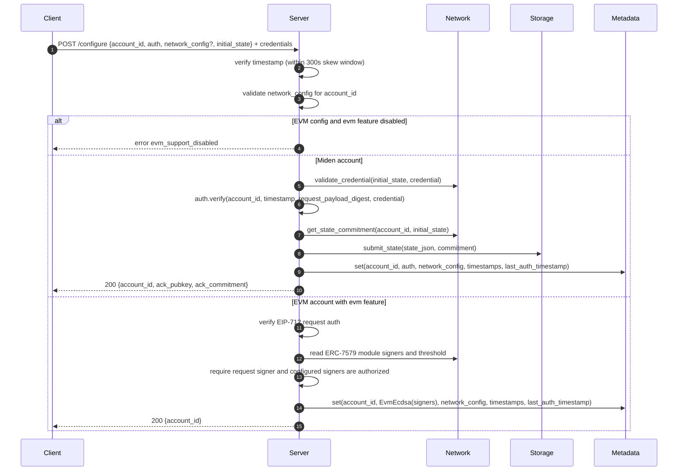
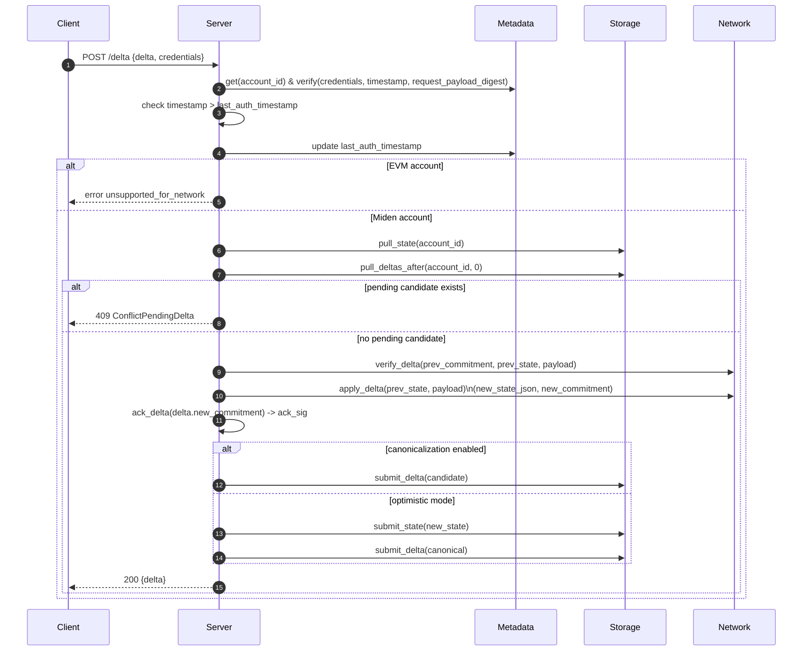
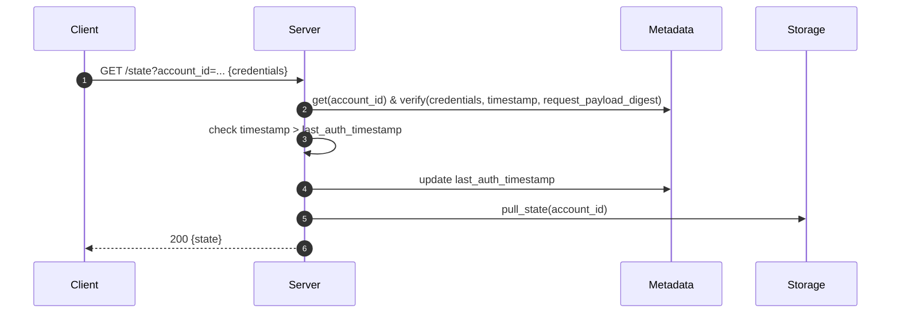
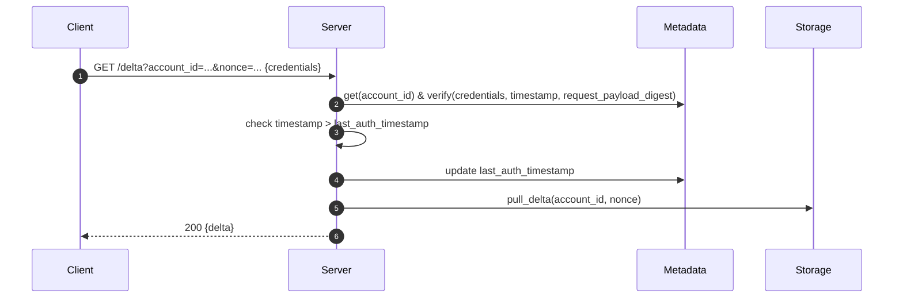
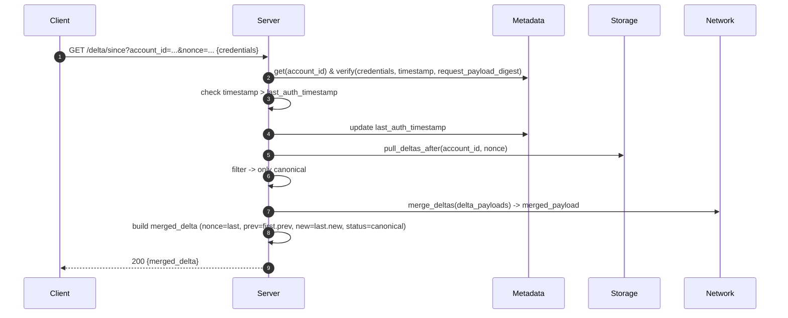
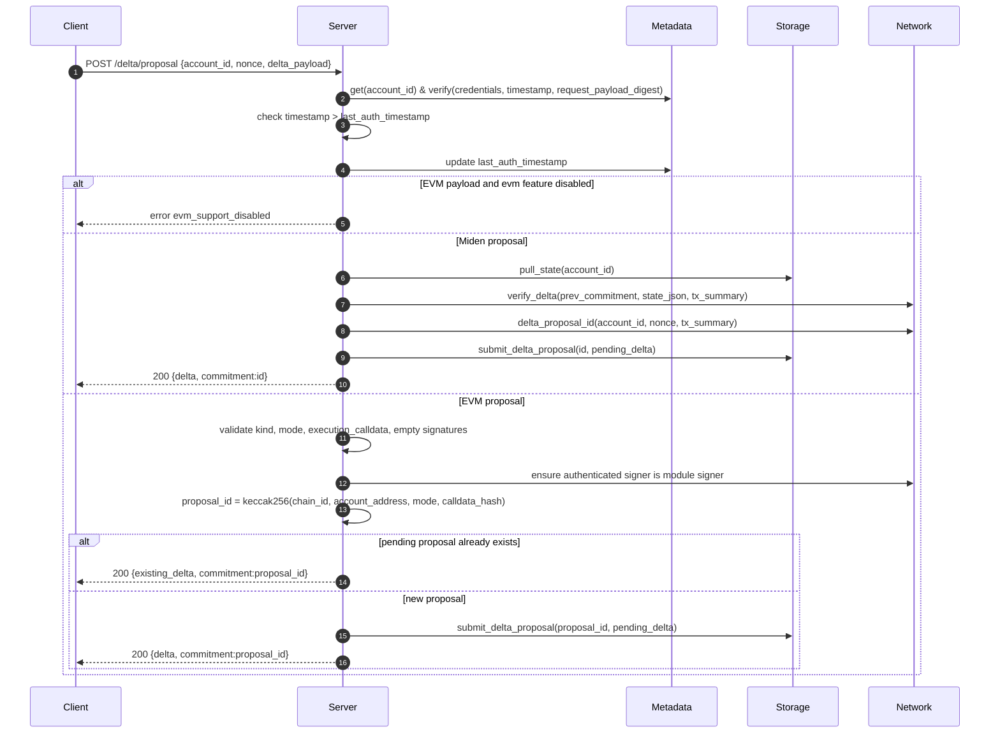
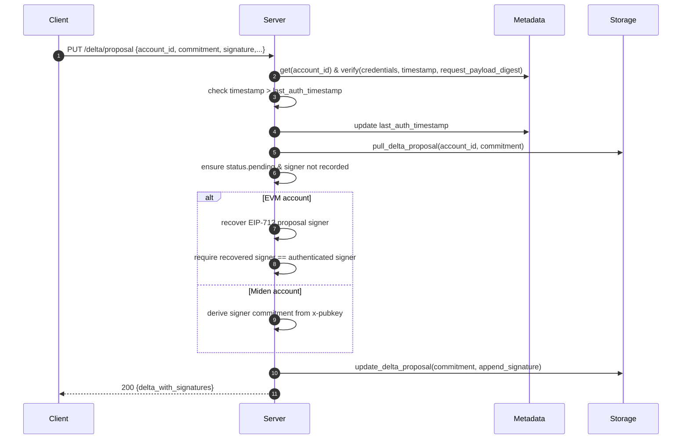
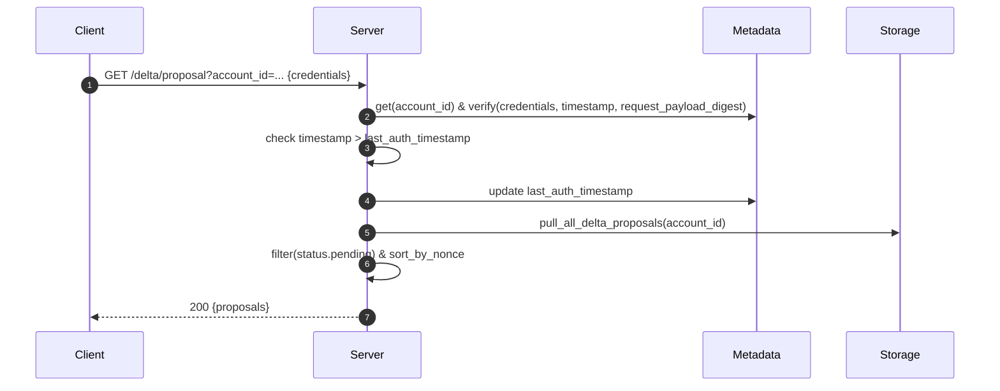
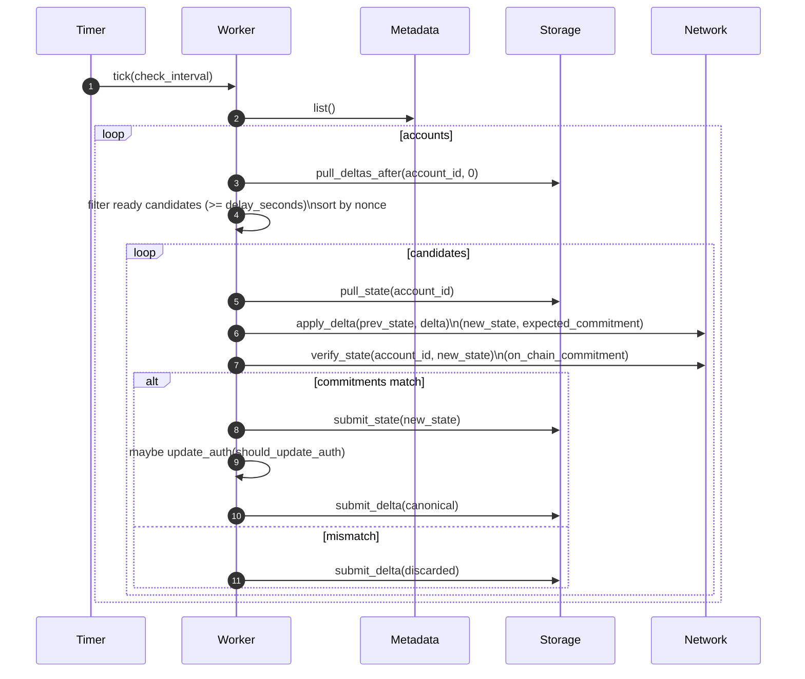

# Processes

## Services overview

- **configure_account**: creates a new account by validating the provided network configuration and auth policy, then storing account metadata. Miden accounts also validate and persist the initial state. EVM accounts are feature-gated, require empty `initial_state`, and store normalized signer/module metadata after ERC-7579-style module checks.
- **push_delta**: verifies a Miden delta against the current state, computes the new commitment, attaches an acknowledgement, and either enqueues it as a candidate (canonicalization enabled) or immediately applies it and marks it canonical (optimistic mode). EVM accounts do not support `push_delta` in v1.
- **get_state**: authenticates and returns the latest persisted account state.
- **get_delta**: authenticates and returns a specific delta by nonce.
- **get_delta_since**: authenticates, fetches deltas after a given nonce (excluding discarded), merges their payloads via the network client, and returns a single merged delta snapshot.
- **push_delta_proposal**: creates a pending proposal. Miden proposals validate `tx_summary` against state and derive IDs through the Miden network client. EVM proposals are feature-gated, validate EVM payload shape, enforce signer authority, and derive IDs from `(chain_id, account_address, mode, keccak256(execution_calldata))`.
- **sign_delta_proposal**: appends one signer signature to a pending proposal. EVM signatures are EIP-712 proposal signatures recovered to signer EOA addresses.

### Diagrams

#### configure_account

#### push_delta

#### get_state

#### get_delta

#### get_delta_since

#### push_delta_proposal

#### sign_delta_proposal

#### get_delta_proposals

## Canonicalization

### Modes
- Candidate mode (enabled): `push_delta` stores deltas as `candidate`; a background worker promotes or discards them after verification.
- Optimistic mode (disabled): `push_delta` marks deltas as `canonical` immediately and updates state.

### Configuration
- Defaults: delay_seconds = 900 (15m), check_interval_seconds = 60 (1m).
- Per deployment configurable.

### Worker Behavior
 - Runs every `check_interval_seconds`.
 - For each account:
  - Pull all deltas and select ready candidates (candidate_at >= delay_seconds); process in nonce order.
  - Apply delta locally to compute expected state and commitment.
  - Verify on-chain commitment. If it matches `new_commitment`:
    - Persist new state (atomic with delta status update when possible).
    - Optionally update auth from chain via `should_update_auth`.
    - Set delta status to `canonical`.
    - Delete matching Miden delta proposal identified via `delta_proposal_id(account_id, nonce, delta_payload)`.
  - Else set delta status to `discarded`.

EVM proposals are not processed by canonicalization in v1. They remain pending records used to collect signatures for on-chain submission, and on-chain execution tracking/reconciliation is out of scope.

#### Canonicalization worker (diagram)

### State Machine
- candidate -> canonical | discarded. Discarded deltas MUST NOT be returned by default APIs.

### Failure Handling
- Transient failures SHOULD be retried with backoff. Malformed candidates SHOULD be quarantined with logs/metrics.

### Concurrency
- Processing SHOULD be per-account sequential; multi-account processing MAY be parallel with bounded concurrency.
