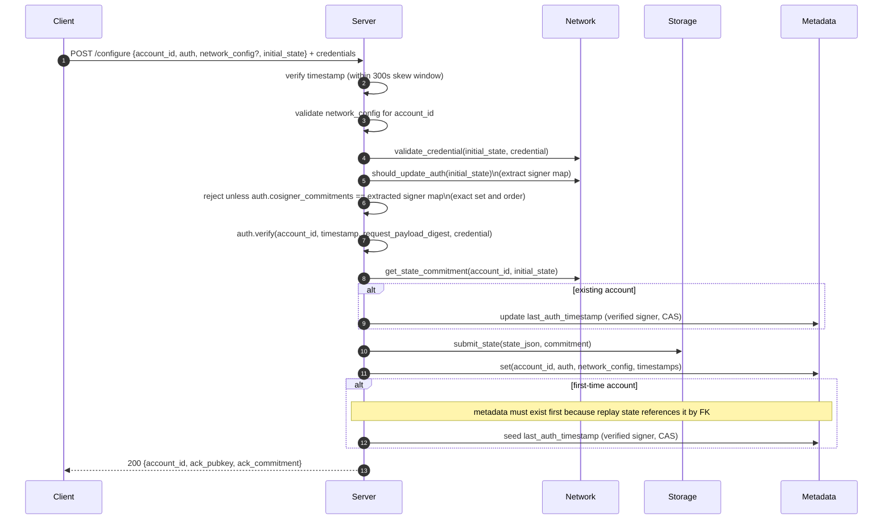
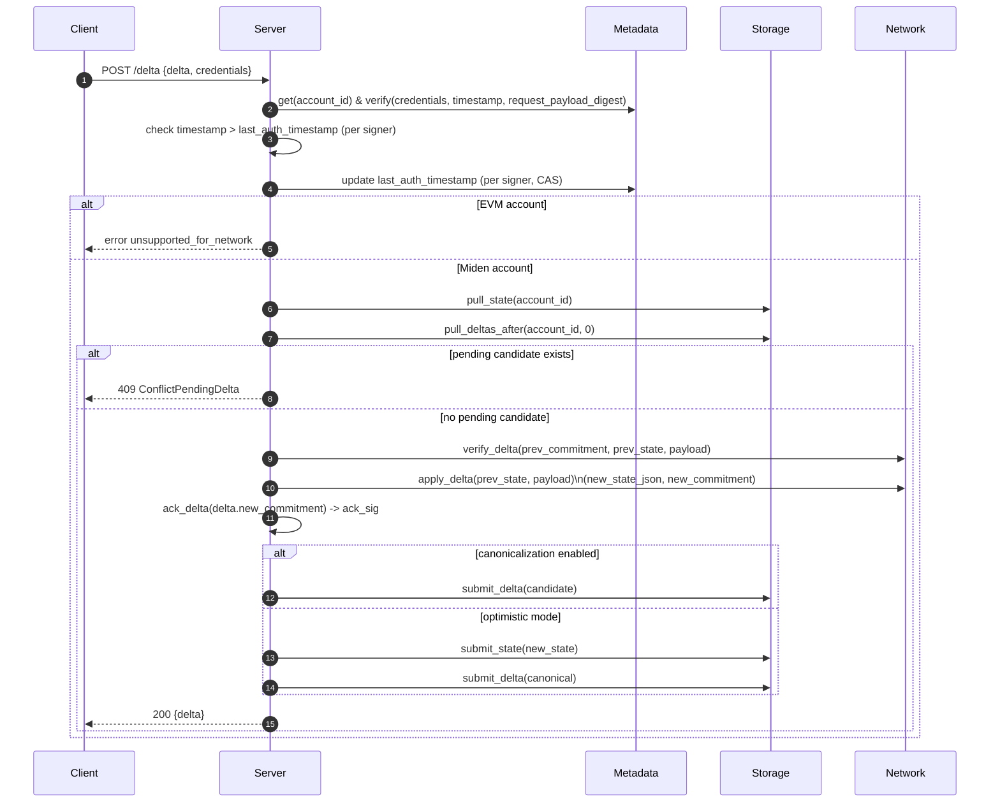
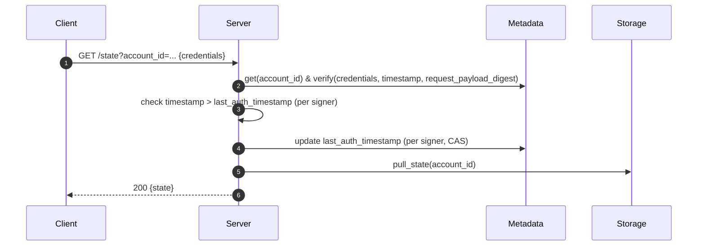
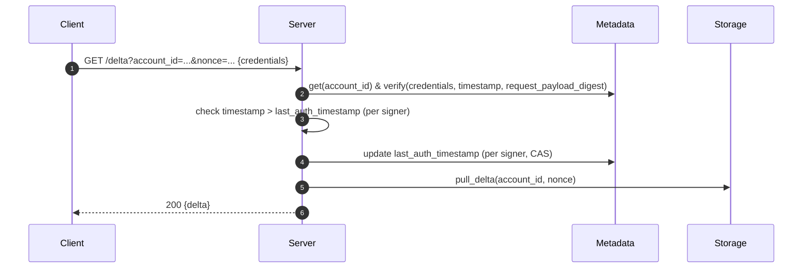
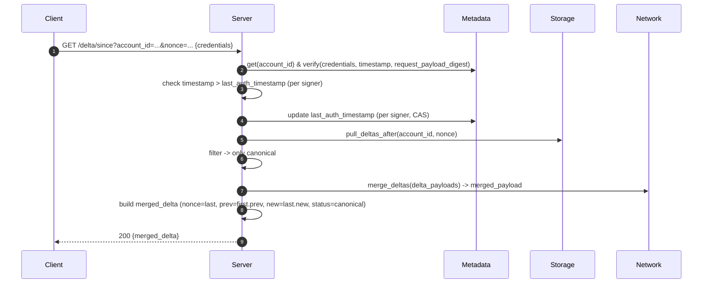
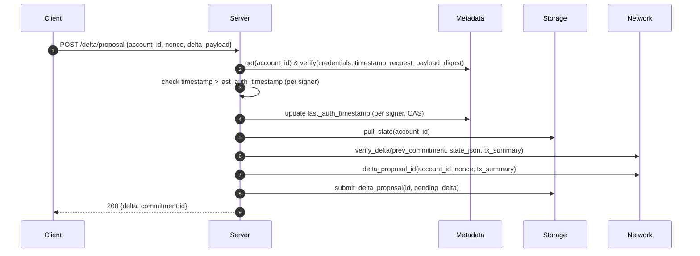
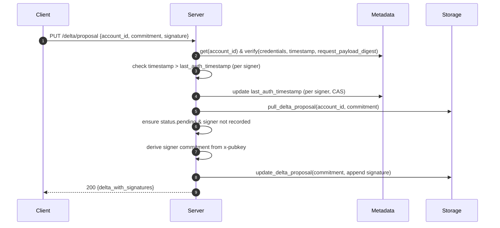
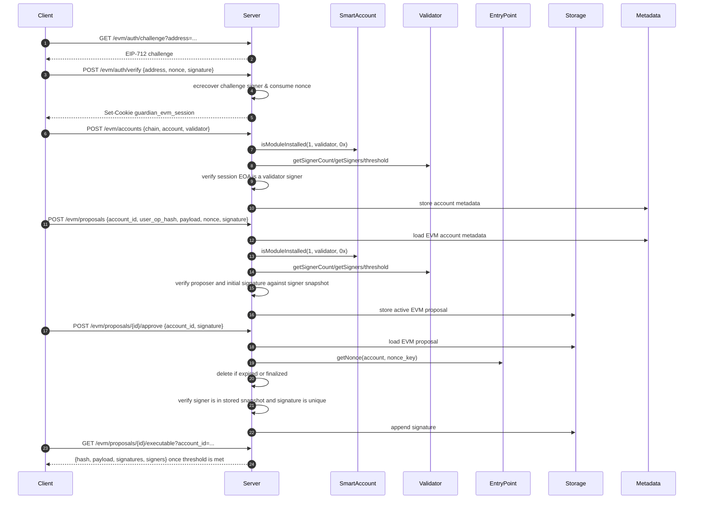
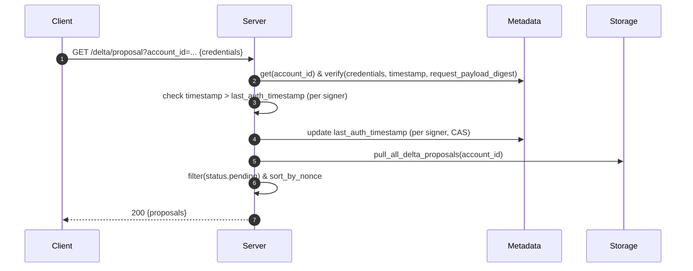
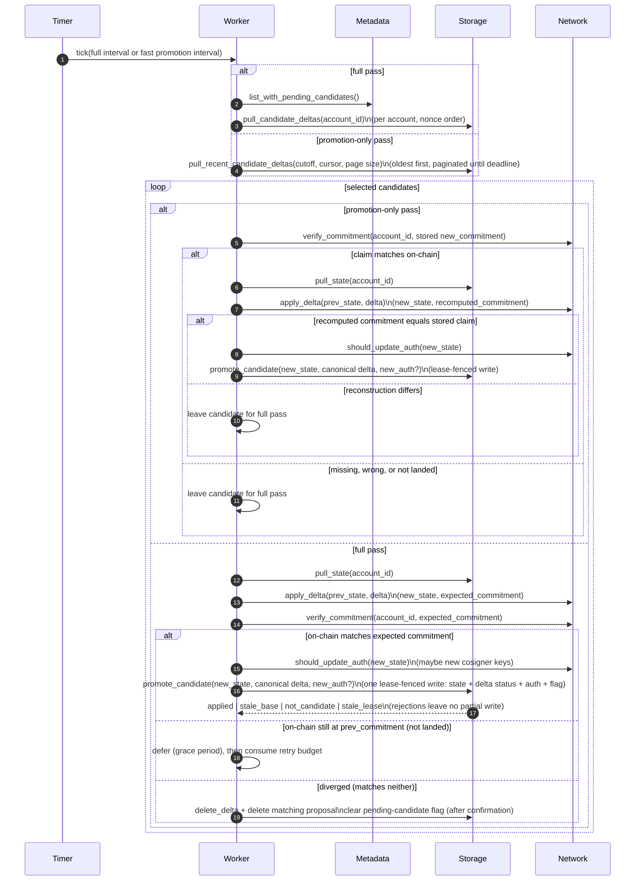

# Processes

## Services overview

- **configure_account**: creates a Miden account by validating the provided network configuration and auth policy, then storing account metadata and initial state. Every entry in `auth.cosigner_commitments` must be a canonical commitment (`0x` plus 64 lowercase hex digits) and the list must be non-empty and duplicate-free. For MultisigGuardian accounts the list must exactly match the signer map extracted from `initial_state`, including the map's canonical (index) order — the stored list is the authorization source of truth for every later request, so any mismatch is rejected as `InvalidInput`. EVM accounts are not configured through this service.
- **push_delta**: verifies a Miden delta against the current state, computes the new commitment, attaches an acknowledgement, and either enqueues it as a candidate (canonicalization enabled) or immediately applies it and marks it canonical (optimistic mode). EVM accounts do not support `push_delta` in v1.
- **get_state**: authenticates and returns the latest persisted account state.
- **get_delta**: authenticates and returns a specific delta by nonce.
- **get_delta_since**: authenticates, fetches deltas after a given nonce (excluding discarded), merges their payloads via the network client, and returns a single merged delta snapshot.
- **push_delta_proposal**: creates a pending Miden proposal by validating `tx_summary` against state and deriving IDs through the Miden network client.
- **sign_delta_proposal**: appends one signer signature to a pending Miden proposal.
- **evm_session**: issues an EIP-712 wallet challenge, recovers the EOA with `ecrecover`, consumes the nonce once, and creates a cookie-backed session.
- **evm_accounts**: registers EVM smart accounts under `/evm/accounts` by validating the cookie session signer, server-owned chain config, ERC-7579 validator installation, and signer snapshot before storing account metadata without state or acknowledgement data.
- **evm_proposals**: creates, lists, approves, fetches executable data for, and cancels EVM proposals with opaque payloads, UserOperation hashes, signer snapshots, TTL, and lazy EntryPoint nonce cleanup.

### Diagrams

#### configure_account

```mermaid
sequenceDiagram
  autonumber
  participant C as Client
  participant S as Server
  participant N as Network
  participant ST as Storage
  participant M as Metadata
  C->>S: POST /configure {account_id, auth, network_config?, initial_state} + credentials
  S->>S: verify timestamp (within 300s skew window)
  S->>S: validate network_config for account_id
  S->>N: validate_credential(initial_state, credential)
  S->>N: should_update_auth(initial_state)\n(extract signer map)
  S->>S: reject unless auth.cosigner_commitments == extracted signer map\n(exact set and order)
  S->>S: auth.verify(account_id, timestamp, request_payload_digest, credential)
  S->>N: get_state_commitment(account_id, initial_state)
  alt existing account
    S->>M: update last_auth_timestamp (verified signer, CAS)
  end
  S->>ST: submit_state(state_json, commitment)
  S->>M: set(account_id, auth, network_config, timestamps)
  alt first-time account
    Note over S,M: metadata must exist first because replay state references it by FK
    S->>M: seed last_auth_timestamp (verified signer, CAS)
  end
  S-->>C: 200 {account_id, ack_pubkey, ack_commitment}
```

#### push_delta

```mermaid
sequenceDiagram
  autonumber
  participant C as Client
  participant S as Server
  participant M as Metadata
  participant ST as Storage
  participant N as Network
  C->>S: POST /delta {delta, credentials}
  S->>M: get(account_id) & verify(credentials, timestamp, request_payload_digest)
  S->>S: check timestamp > last_auth_timestamp (per signer)
  S->>M: update last_auth_timestamp (per signer, CAS)
  alt EVM account
    S-->>C: error unsupported_for_network
  else Miden account
    S->>ST: pull_state(account_id)
    S->>ST: pull_deltas_after(account_id, 0)
    alt pending candidate exists
      S-->>C: 409 ConflictPendingDelta
    else no pending candidate
      S->>N: verify_delta(prev_commitment, prev_state, payload)
      S->>N: apply_delta(prev_state, payload)\n(new_state_json, new_commitment)
      S->>S: ack_delta(delta.new_commitment) -> ack_sig
      alt canonicalization enabled
        S->>ST: submit_delta(candidate)
      else optimistic mode
        S->>ST: submit_state(new_state)
        S->>ST: submit_delta(canonical)
      end
      S-->>C: 200 {delta}
    end
  end
```

#### get_state

```mermaid
sequenceDiagram
  autonumber
  participant C as Client
  participant S as Server
  participant M as Metadata
  participant ST as Storage
  C->>S: GET /state?account_id=... {credentials}
  S->>M: get(account_id) & verify(credentials, timestamp, request_payload_digest)
  S->>S: check timestamp > last_auth_timestamp (per signer)
  S->>M: update last_auth_timestamp (per signer, CAS)
  S->>ST: pull_state(account_id)
  S-->>C: 200 {state}
```

#### get_delta

```mermaid
sequenceDiagram
  autonumber
  participant C as Client
  participant S as Server
  participant M as Metadata
  participant ST as Storage
  C->>S: GET /delta?account_id=...&nonce=... {credentials}
  S->>M: get(account_id) & verify(credentials, timestamp, request_payload_digest)
  S->>S: check timestamp > last_auth_timestamp (per signer)
  S->>M: update last_auth_timestamp (per signer, CAS)
  S->>ST: pull_delta(account_id, nonce)
  S-->>C: 200 {delta}
```

#### get_delta_since

```mermaid
sequenceDiagram
  autonumber
  participant C as Client
  participant S as Server
  participant M as Metadata
  participant ST as Storage
  participant N as Network
  C->>S: GET /delta/since?account_id=...&nonce=... {credentials}
  S->>M: get(account_id) & verify(credentials, timestamp, request_payload_digest)
  S->>S: check timestamp > last_auth_timestamp (per signer)
  S->>M: update last_auth_timestamp (per signer, CAS)
  S->>ST: pull_deltas_after(account_id, nonce)
  S->>S: filter -> only canonical
  S->>N: merge_deltas(delta_payloads) -> merged_payload
  S->>S: build merged_delta (nonce=last, prev=first.prev, new=last.new, status=canonical)
  S-->>C: 200 {merged_delta}
```

#### push_delta_proposal

```mermaid
sequenceDiagram
  autonumber
  participant C as Client
  participant S as Server
  participant M as Metadata
  participant ST as Storage
  participant N as Network
  C->>S: POST /delta/proposal {account_id, nonce, delta_payload}
  S->>M: get(account_id) & verify(credentials, timestamp, request_payload_digest)
  S->>S: check timestamp > last_auth_timestamp (per signer)
  S->>M: update last_auth_timestamp (per signer, CAS)
  S->>ST: pull_state(account_id)
  S->>N: verify_delta(prev_commitment, state_json, tx_summary)
  S->>N: delta_proposal_id(account_id, nonce, tx_summary)
  S->>ST: submit_delta_proposal(id, pending_delta)
  S-->>C: 200 {delta, commitment:id}
```

#### sign_delta_proposal

```mermaid
sequenceDiagram
  autonumber
  participant C as Client
  participant S as Server
  participant M as Metadata
  participant ST as Storage
  C->>S: PUT /delta/proposal {account_id, commitment, signature}
  S->>M: get(account_id) & verify(credentials, timestamp, request_payload_digest)
  S->>S: check timestamp > last_auth_timestamp (per signer)
  S->>M: update last_auth_timestamp (per signer, CAS)
  S->>ST: pull_delta_proposal(account_id, commitment)
  S->>S: ensure status.pending & signer not recorded
  S->>S: derive signer commitment from x-pubkey
  S->>ST: update_delta_proposal(commitment, append signature)
  S-->>C: 200 {delta_with_signatures}
```

#### evm_accounts_and_proposals

```mermaid
sequenceDiagram
  autonumber
  participant C as Client
  participant S as Server
  participant A as SmartAccount
  participant V as Validator
  participant E as EntryPoint
  participant ST as Storage
  participant M as Metadata
  C->>S: GET /evm/auth/challenge?address=...
  S-->>C: EIP-712 challenge
  C->>S: POST /evm/auth/verify {address, nonce, signature}
  S->>S: ecrecover challenge signer & consume nonce
  S-->>C: Set-Cookie guardian_evm_session
  C->>S: POST /evm/accounts {chain, account, validator}
  S->>A: isModuleInstalled(1, validator, 0x)
  S->>V: getSignerCount/getSigners/threshold
  S->>S: verify session EOA is a validator signer
  S->>M: store account metadata
  C->>S: POST /evm/proposals {account_id, user_op_hash, payload, nonce, signature}
  S->>M: load EVM account metadata
  S->>A: isModuleInstalled(1, validator, 0x)
  S->>V: getSignerCount/getSigners/threshold
  S->>S: verify proposer and initial signature against signer snapshot
  S->>ST: store active EVM proposal
  C->>S: POST /evm/proposals/{id}/approve {account_id, signature}
  S->>ST: load EVM proposal
  S->>E: getNonce(account, nonce_key)
  S->>S: delete if expired or finalized
  S->>S: verify signer is in stored snapshot and signature is unique
  S->>ST: append signature
  C->>S: GET /evm/proposals/{id}/executable?account_id=...
  S-->>C: {hash, payload, signatures, signers} once threshold is met
```

#### get_delta_proposals

```mermaid
sequenceDiagram
  autonumber
  participant C as Client
  participant S as Server
  participant M as Metadata
  participant ST as Storage
  C->>S: GET /delta/proposal?account_id=... {credentials}
  S->>M: get(account_id) & verify(credentials, timestamp, request_payload_digest)
  S->>S: check timestamp > last_auth_timestamp (per signer)
  S->>M: update last_auth_timestamp (per signer, CAS)
  S->>ST: pull_all_delta_proposals(account_id)
  S->>S: filter(status.pending) & sort_by_nonce
  S-->>C: 200 {proposals}
```

## Canonicalization

### Modes
- Candidate mode (enabled): `push_delta` stores deltas as `candidate`; a background worker promotes or discards them after verification.
- Optimistic mode (disabled): `push_delta` marks deltas as `canonical` immediately and updates state.

### Configuration
- Shipped server builder configuration: submission_grace_period_seconds = 600
  (10m), check_interval_seconds = 10, fast_promotion_enabled = true,
  fast_promotion_interval_seconds = 3,
  fast_promotion_window_seconds = 30, max_retries = 48,
  divergence_confirmations = 2, max_concurrent_accounts = 10,
  retained_ttl_seconds = 86400 (24h; 0 disables retention and restores
  the historical delete-on-give-up behavior),
  reconcile_interval_seconds = 60, reconcile_page_size = 100,
  release_sweep_enabled = true, release_sweep_interval_seconds = 60,
  release_sweep_page_size = 100, release_sweep_confirmations = 2.
- These values are configured in code, not through server env vars. The
  exceptions are `GUARDIAN_CANONICALIZATION_FAST_PROMOTION_ENABLED=false`,
  which disables the promotion-only pass,
  `GUARDIAN_CANONICALIZATION_MAX_CONCURRENT_ACCOUNTS`, which overrides account
  concurrency at startup, `GUARDIAN_CANONICALIZATION_RETAINED_TTL_SECONDS`,
  which overrides the retained TTL (`0` is the runtime kill switch for
  retention), `GUARDIAN_CANONICALIZATION_RECONCILE_INTERVAL_SECONDS`,
  which overrides the reconcile pass cadence,
  `GUARDIAN_CANONICALIZATION_RELEASE_SWEEP_ENABLED=false`, which disables
  the chain-driven release sweep, and
  `GUARDIAN_CANONICALIZATION_RELEASE_SWEEP_INTERVAL_SECONDS`, which
  overrides the sweep cadence.

### Worker Behavior
- A full pass runs every `check_interval_seconds` and owns all retry,
  divergence, and discard decisions.
- Between full passes, a promotion-only pass runs every
  `fast_promotion_interval_seconds` for candidates younger than
  `fast_promotion_window_seconds`. It scans candidates directly in storage in
  bounded, oldest-first pages, carrying a cursor across passes so bursts are
  visited fairly. The pass stops admitting new work when its next cadence tick
  or the next full-pass tick is due; already-started candidate work finishes.
  It first compares each stored `new_commitment` with the chain and reconstructs
  state only after that cheap probe matches. Promotion still requires the
  reconstructed commitment to equal the claimed commitment before the normal
  auth refresh and fenced write. Missing, incorrect, or not-yet-landed claims
  are left unchanged for the next full pass.
- The fast pass never increments `retry_count` or `divergence_count`, applies
  `submission_grace_period_seconds`, or discards a candidate. Those behaviors
  belong exclusively to full passes. Both pass types use
  `max_concurrent_accounts`; candidates within one account remain sequential.
- For each account with a pending candidate:
  - Pull candidate deltas (`pull_candidate_deltas`, a store-side status
    filter — canonical and discarded history rows never leave the store);
    process in nonce order.
  - Apply delta locally to compute expected state and commitment.
  - Fetch the on-chain commitment and classify:
    - Matches the expected new commitment: canonicalize —
      persist new state (atomic with delta status update when possible),
      optionally update auth from chain via `should_update_auth`, set delta
      status to `canonical`, and delete the matching Miden delta proposal
      identified via `delta_proposal_id(account_id, nonce, delta_payload)`.
      The persisted commitment is the recomputed one the verification
      proved on-chain; a client-supplied `new_commitment` that differs (or
      is absent) is logged and counted but never blocks promotion.
      Promotion is additionally gated on the stored state still sitting at
      the candidate's `prev_commitment` — if a concurrent write moved it,
      the promotion rolls back (`stale_base`) and the next tick
      re-verifies against the new base.
    - Matches the candidate's `prev_commitment` (its transaction has not
      landed yet), or the comparison itself failed (RPC error): defer within
      `submission_grace_period_seconds`, then consume retry budget on each
      full-pass tick. After `max_retries` the candidate is parked as
      `retained` with reason `retry_exhausted` (issue #345) — not deleted —
      the account's pending-candidate flag is cleared, and the matching
      proposal is deleted (the delta row carries everything reconciliation
      needs; a proposal left `pending` would be stranded forever the moment
      a resubmission supersedes the retained row).
    - Matches the candidate's `prev_commitment` AND the candidate carries a
      client abandon intent (`abandon_requested_at`, recorded by
      `POST /delta/candidate/abandon`): count the observation toward the
      abandon quarantine instead — this takes precedence over the grace
      deferral. After `abandon_quarantine_checks` consecutive at-base
      observations (default 2) AND `abandon_quarantine_seconds` since the
      request (default 15, so a late-landing transaction can surface),
      delete the matching proposal, transition the delta to
      `discarded` with reason `client_abandoned` (preserved as history),
      and clear the pending-candidate flag. A divergent observation resets
      the abandon-confirmation streak; a landed transaction always wins
      and canonicalizes normally.
    - Matches neither — the account appears to have advanced past the
      candidate's base state: after `divergence_confirmations` consecutive
      such observations (default 2, to tolerate a single stale RPC read),
      bypass the grace period and park the candidate as `retained` with
      reason `diverged` (issue #345), clearing the account's
      pending-candidate flag so new proposals stop returning
      `409 conflict_pending_delta`. Retention (rather than deletion)
      matters because a diverged verdict is an observation, not proof —
      a lagging RPC node can produce one for a transaction that landed.
      With `retained_ttl_seconds = 0` the historical behavior applies:
      delete the delta and its matching proposal.
- Recoverable deltas — `retained` rows, plus
  `discarded { client_abandoned }` rows no older than
  `retained_ttl_seconds` (the abandon quarantine cannot fully rule out a
  late-landing transaction; one that lands after the abandon finalizes
  leaves stored state behind chain, and the preserved row holds
  everything needed to recover) — are swept by a dedicated reconcile
  pass, never by the full pass. It runs every
  `reconcile_interval_seconds` (default 60), visits at most
  `reconcile_page_size` accounts per pass under a rotation cursor
  (a backlog larger than one page drains breadth-first across passes),
  and stops admitting work at the next full-pass tick, so
  reconciliation can never delay ordinary candidate processing. Per
  visited account, in order:
  - Skip the account entirely while it has an in-flight candidate
    (reconciliation never runs under a pending candidate — promoting
    would move the stored base out from under a signed proposal).
  - Drop any retained delta older than `retained_ttl_seconds` before
    any network work. Expired client-abandoned rows are merely dropped
    from the scan — they are preserved history, never deleted.
  - Back off aged rows: for its first 15 minutes a recoverable row is
    reconsidered on every reconcile tick; after that the spacing doubles
    per 15 minutes of age, capped at 10 minutes. The schedule is derived
    purely from the row's age (no persisted cursor), so it survives
    restarts and lease failover and every replica computes the same
    answer.
  - Retry proposal cleanup for retained rows whose matching proposal
    could not be deleted at retain time.
  - Probe the chain once against the stored state commitment. A match
    (or an absent on-chain account) means nothing recoverable can have
    landed — the pass stops there, with no state reconstruction at all.
  - Only when the chain moved past the stored base: select the
    recoverable row whose submission-computed `new_commitment` equals
    the observed on-chain commitment (rows without a stored hint fall
    back to reconstruct-and-compare), reconstruct that path from the
    stored base — reconstruction remains mandatory, the hint alone never
    promotes — and require the recomputed commitment to equal the
    observed one before the same fenced promotion the candidate pass
    uses (auto-recovering an account whose stored state fell behind the
    chain). Anything else waits for a later tick — the TTL is the only
    bound.
  - A new candidate submission at a retained or client-abandoned delta's
    nonce supersedes (deletes) that row inside the submission
    transaction — without the abandoned-row supersede, the resubmission
    the abandon endpoint exists to enable would be refused forever at
    the nonce's unique constraint. Deltas are unique per
    `(account_id, nonce)` and admission requires chaining from the
    current canonical head, so same-nonce supersede is the only
    replacement path; a retained row orphaned by an out-of-band base
    move (e.g. `configure`) can never promote — the base gate rules it
    out — and ages out through the TTL.

- Release on guardian switch has two detectors. The push path (issue
  #305): when a delta commits (optimistic mode) or canonicalizes
  (candidate mode) and the resulting state's guardian public key
  commitment differs from this server's ack key, the account is
  released (`released_at` set, `accounts.release` audit row with
  `detected_by: delta`). The release sweep (issue #434): a dedicated
  pass, on its own cadence (`release_sweep_interval_seconds`, default
  60), covers switches that never reach the push path — the offline
  switch path, a failed best-effort push, a client predating the push,
  a switch executed while this server was unreachable. It visits at
  most `release_sweep_page_size` unreleased Miden accounts with no
  candidate in flight per pass (the push path owns busy accounts; the
  store filters both so every page slot is useful) under a rotation
  cursor over `account_id` (a fleet larger than one page is covered
  breadth-first across passes; an exact multiple of the page size wraps
  without an idle pass), and stops admitting work at the next full-pass
  tick (a pass already past its deadline leaves the cursor untouched). Per visited account, cheapest
  first:
  - Probe the chain once against the stored state commitment. A match
    (or an absent on-chain account) means the stored state *is* the
    on-chain state, so its guardian key — this server's, as
    `/configure` validated — is the on-chain one too: nothing to do.
  - Only when the chain moved past the stored base: read the guardian
    public key map from the account's **published** on-chain storage
    (`GetAccount` with storage-map details). Private accounts publish
    no storage; for them the chain holds a bare commitment and the
    sweep records that it cannot tell (`storage_opaque`) rather than
    guessing. A key equal to this server's means the stored state
    merely lags the chain (issue #345 territory), not a switch.
  - A foreign guardian key must be observed on
    `release_sweep_confirmations` consecutive visits (accounts with an
    open streak are re-probed on the very next pass, not the next
    rotation), and the stored base is re-read right before the write
    (a `/configure` re-onboarding meanwhile voids the evidence). The
    release then goes through the same path as the push hook:
    `released_at` set, `accounts.release` audit row with
    `detected_by: chain_sweep` and the `on_chain_commitment` /
    `stored_commitment` pair. The stored state is left as is; reads keep
    serving the last state this server verified.
  - The sweep ignores `paused_at` like the other passes: pause gates
    client mutations, the sweep records chain truth.

EVM proposals are not processed by Miden canonicalization. They are stored in the EVM proposal store and deleted lazily when expired or when the configured EntryPoint nonce indicates finality.

#### Canonicalization worker (diagram)

```mermaid
sequenceDiagram
  autonumber
  participant T as Timer
  participant W as Worker
  participant M as Metadata
  participant ST as Storage
  participant N as Network
  T->>W: tick(full interval or fast promotion interval)
  alt full pass
    W->>M: list_with_pending_candidates()
    W->>ST: pull_candidate_deltas(account_id)\n(per account, nonce order)
  else promotion-only pass
    W->>ST: pull_recent_candidate_deltas(cutoff, cursor, page size)\n(oldest first, paginated until deadline)
  end
  loop selected candidates
    alt promotion-only pass
      W->>N: verify_commitment(account_id, stored new_commitment)
      alt claim matches on-chain
        W->>ST: pull_state(account_id)
        W->>N: apply_delta(prev_state, delta)\n(new_state, recomputed_commitment)
        alt recomputed commitment equals stored claim
          W->>N: should_update_auth(new_state)
          W->>ST: promote_candidate(new_state, canonical delta, new_auth?)\n(lease-fenced write)
        else reconstruction differs
          W->>W: leave candidate for full pass
        end
      else missing, wrong, or not landed
        W->>W: leave candidate for full pass
      end
    else full pass
      W->>ST: pull_state(account_id)
      W->>N: apply_delta(prev_state, delta)\n(new_state, expected_commitment)
      W->>N: verify_commitment(account_id, expected_commitment)
      alt on-chain matches expected commitment
        W->>N: should_update_auth(new_state)\n(maybe new cosigner keys)
        W->>ST: promote_candidate(new_state, canonical delta, new_auth?)\n(one lease-fenced write: state + delta status + auth + flag)
        ST-->>W: applied | stale_base | not_candidate | stale_lease\n(rejections leave no partial write)
      else on-chain still at prev_commitment (not landed)
        W->>W: defer (grace period), then consume retry budget
      else diverged (matches neither)
        W->>ST: delete_delta + delete matching proposal\nclear pending-candidate flag (after confirmation)
      end
    end
  end
```

### State Machine
- candidate -> canonical | retained | discarded; retained -> canonical
  (reconciled) | superseded (deleted by a new submission at its nonce) |
  dropped (TTL expiry); discarded{client_abandoned} -> canonical
  (late-landing reconcile, within the TTL) | superseded (new submission
  at its nonce). Discarded deltas MUST NOT be returned by default APIs.

### Failure Handling
- Transient failures SHOULD be retried with backoff. Malformed candidates SHOULD be quarantined with logs/metrics.

### Concurrency
- Processing SHOULD be per-account sequential; multi-account processing MAY be parallel with bounded concurrency.
- The server processes accounts with bounded concurrency
  (`max_concurrent_accounts`, default 10); candidates within one account
  remain strictly sequential in nonce order, and every custody write is
  individually lease-fenced, so correctness does not depend on the bound.
