# Processes

## Services overview

- **configure_account**: creates a Miden account by validating the provided network configuration and auth policy, then storing account metadata and the initial state with its commitment and account nonce. Every entry in `auth.cosigner_commitments` must be a canonical commitment (`0x` plus 64 lowercase hex digits) and the list must be non-empty and duplicate-free. For MultisigGuardian accounts the list must exactly match the signer map extracted from `initial_state`, including the map's canonical (index) order — the stored list is the authorization source of truth for every later request, so any mismatch is rejected as `InvalidInput`. EVM accounts are not configured through this service.
- **push_delta**: verifies a Miden delta against the current state, computes the new state's commitment and account nonce, attaches an acknowledgement, and either enqueues it as a candidate (canonicalization enabled) or immediately applies it and marks it canonical (optimistic mode). EVM accounts do not support `push_delta` in v1.
- **get_state**: authenticates and returns the latest persisted account state.
- **get_canonical_nonce**: authenticates and returns the account nonce and commitment stored with the latest persisted account state, without loading the state blob, so a client can skip `get_state` when that nonce is below its local nonce, or equal to it at the same commitment (issue #191). A state stored before nonces were kept is decoded once, and its nonce is backfilled onto the row only while the row still holds that state.
- **get_delta**: authenticates and returns a specific delta by nonce.
- **get_delta_since**: authenticates, fetches deltas after a given nonce (excluding discarded), merges their payloads via the network client, and returns a single merged delta snapshot.
- **push_delta_proposal**: creates a pending Miden proposal by validating `tx_summary` against state and deriving IDs through the Miden network client.
- **sign_delta_proposal**: appends one signer signature to a pending Miden proposal.
- **evm_session**: issues an EIP-712 wallet challenge, recovers the EOA with `ecrecover`, consumes the nonce once, and creates a cookie-backed session.
- **evm_accounts**: registers EVM smart accounts under `/evm/accounts` by validating the cookie session signer, server-owned chain config, ERC-7579 validator installation, and signer snapshot before storing account metadata without state or acknowledgement data.
- **evm_proposals**: creates, lists, approves, fetches executable data for, and cancels EVM proposals with opaque payloads, UserOperation hashes, signer snapshots, TTL, and lazy EntryPoint nonce cleanup.

### Diagrams

#### configure_account
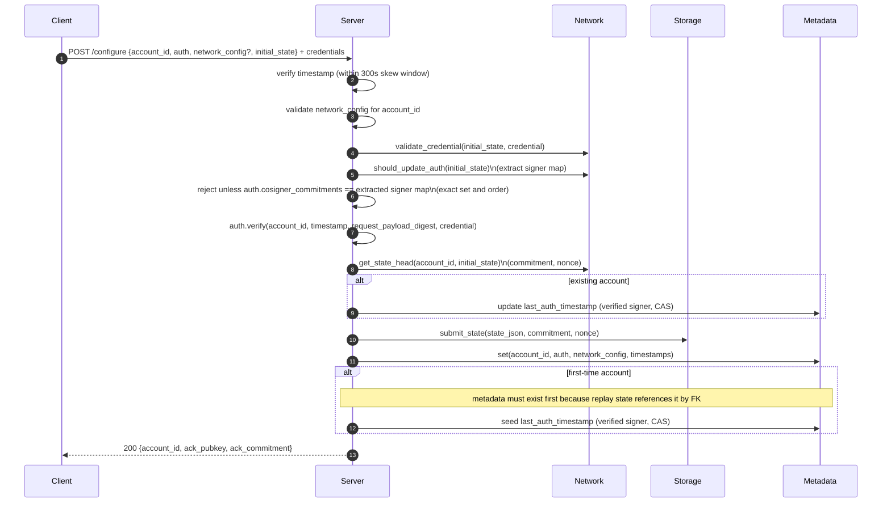
```mermaid
sequenceDiagram
  autonumber
  participant C as Client
  participant S as Server
  participant N as Network
  participant ST as Storage
  participant M as Metadata
  C->>S: POST /configure {account_id, auth, network_config?, initial_state} + credentials
  S->>S: verify timestamp (within 300s skew window)
  S->>S: validate network_config for account_id
  S->>N: validate_credential(initial_state, credential)
  S->>N: should_update_auth(initial_state)\n(extract signer map)
  S->>S: reject unless auth.cosigner_commitments == extracted signer map\n(exact set and order)
  S->>S: auth.verify(account_id, timestamp, request_payload_digest, credential)
  S->>N: get_state_head(account_id, initial_state)\n(commitment, nonce)
  alt existing account
    S->>M: update last_auth_timestamp (verified signer, CAS)
  end
  S->>ST: submit_state(state_json, commitment, nonce)
  S->>M: set(account_id, auth, network_config, timestamps)
  alt first-time account
    Note over S,M: metadata must exist first because replay state references it by FK
    S->>M: seed last_auth_timestamp (verified signer, CAS)
  end
  S-->>C: 200 {account_id, ack_pubkey, ack_commitment}
```

#### push_delta
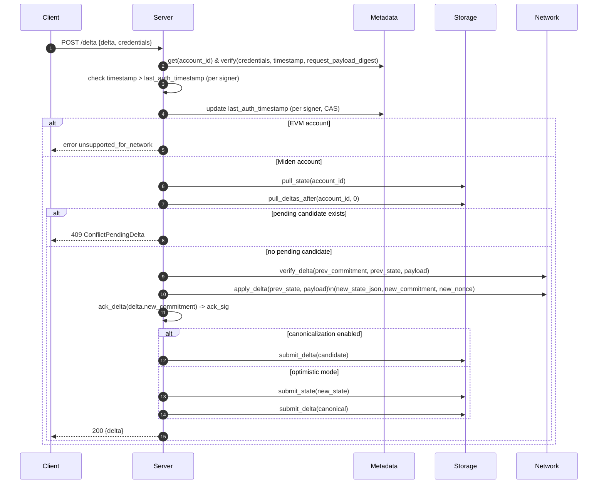
```mermaid
sequenceDiagram
  autonumber
  participant C as Client
  participant S as Server
  participant M as Metadata
  participant ST as Storage
  participant N as Network
  C->>S: POST /delta {delta, credentials}
  S->>M: get(account_id) & verify(credentials, timestamp, request_payload_digest)
  S->>S: check timestamp > last_auth_timestamp (per signer)
  S->>M: update last_auth_timestamp (per signer, CAS)
  alt EVM account
    S-->>C: error unsupported_for_network
  else Miden account
    S->>ST: pull_state(account_id)
    S->>ST: pull_deltas_after(account_id, 0)
    alt pending candidate exists
      S-->>C: 409 ConflictPendingDelta
    else no pending candidate
      S->>N: verify_delta(prev_commitment, prev_state, payload)
      S->>N: apply_delta(prev_state, payload)\n(new_state_json, new_commitment, new_nonce)
      S->>S: ack_delta(delta.new_commitment) -> ack_sig
      alt canonicalization enabled
        S->>ST: submit_delta(candidate)
      else optimistic mode
        S->>ST: submit_state(new_state)
        S->>ST: submit_delta(canonical)
      end
      S-->>C: 200 {delta}
    end
  end
```

#### get_state
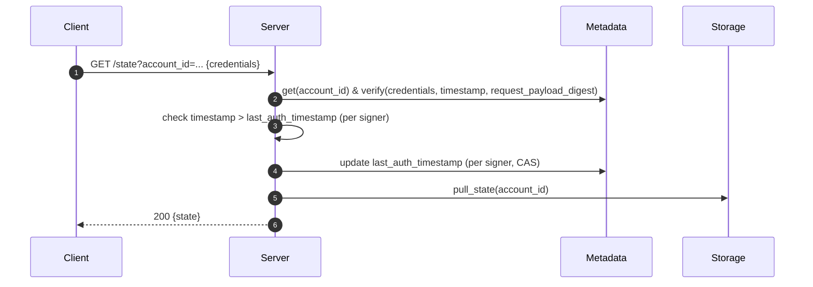
```mermaid
sequenceDiagram
  autonumber
  participant C as Client
  participant S as Server
  participant M as Metadata
  participant ST as Storage
  C->>S: GET /state?account_id=... {credentials}
  S->>M: get(account_id) & verify(credentials, timestamp, request_payload_digest)
  S->>S: check timestamp > last_auth_timestamp (per signer)
  S->>M: update last_auth_timestamp (per signer, CAS)
  S->>ST: pull_state(account_id)
  S-->>C: 200 {state}
```

#### get_canonical_nonce
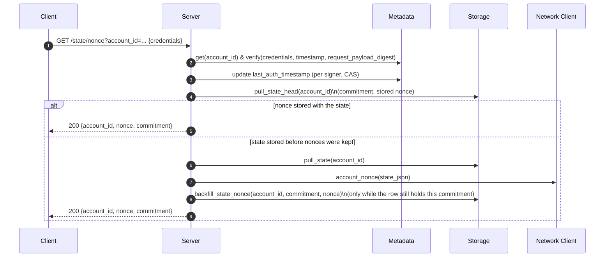
```mermaid
sequenceDiagram
  autonumber
  participant C as Client
  participant S as Server
  participant M as Metadata
  participant ST as Storage
  participant N as Network Client
  C->>S: GET /state/nonce?account_id=... {credentials}
  S->>M: get(account_id) & verify(credentials, timestamp, request_payload_digest)
  S->>M: update last_auth_timestamp (per signer, CAS)
  S->>ST: pull_state_head(account_id)\n(commitment, stored nonce)
  alt nonce stored with the state
    S-->>C: 200 {account_id, nonce, commitment}
  else state stored before nonces were kept
    S->>ST: pull_state(account_id)
    S->>N: account_nonce(state_json)
    S->>ST: backfill_state_nonce(account_id, commitment, nonce)\n(only while the row still holds this commitment)
    S-->>C: 200 {account_id, nonce, commitment}
  end
```

#### get_delta
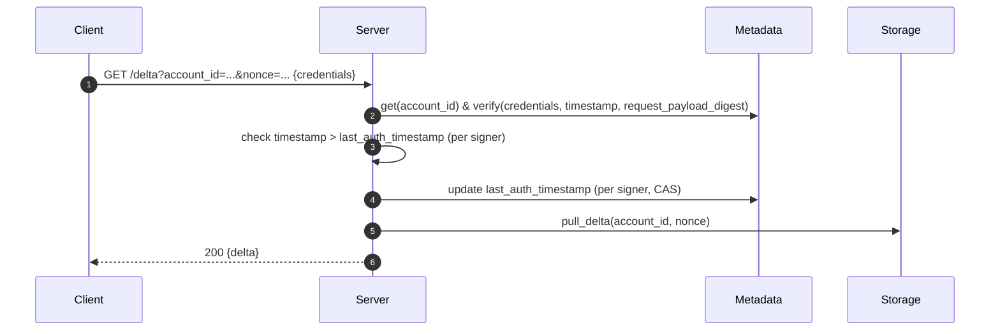
```mermaid
sequenceDiagram
  autonumber
  participant C as Client
  participant S as Server
  participant M as Metadata
  participant ST as Storage
  C->>S: GET /delta?account_id=...&nonce=... {credentials}
  S->>M: get(account_id) & verify(credentials, timestamp, request_payload_digest)
  S->>S: check timestamp > last_auth_timestamp (per signer)
  S->>M: update last_auth_timestamp (per signer, CAS)
  S->>ST: pull_delta(account_id, nonce)
  S-->>C: 200 {delta}
```

#### get_delta_since
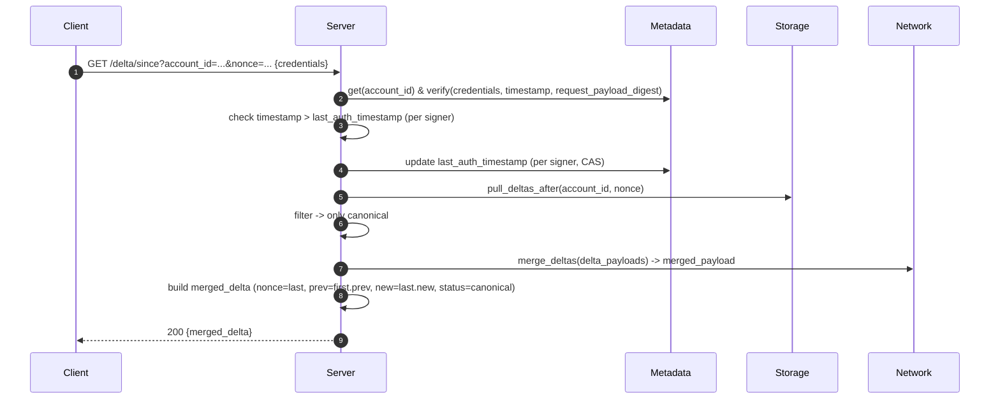
```mermaid
sequenceDiagram
  autonumber
  participant C as Client
  participant S as Server
  participant M as Metadata
  participant ST as Storage
  participant N as Network
  C->>S: GET /delta/since?account_id=...&nonce=... {credentials}
  S->>M: get(account_id) & verify(credentials, timestamp, request_payload_digest)
  S->>S: check timestamp > last_auth_timestamp (per signer)
  S->>M: update last_auth_timestamp (per signer, CAS)
  S->>ST: pull_deltas_after(account_id, nonce)
  S->>S: filter -> only canonical
  S->>N: merge_deltas(delta_payloads) -> merged_payload
  S->>S: build merged_delta (nonce=last, prev=first.prev, new=last.new, status=canonical)
  S-->>C: 200 {merged_delta}
```

#### push_delta_proposal
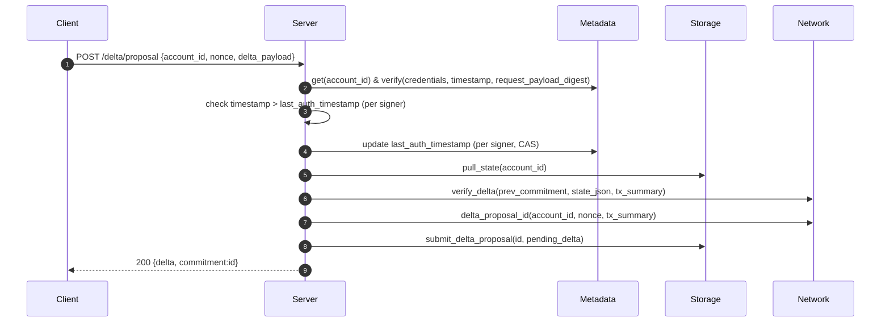
```mermaid
sequenceDiagram
  autonumber
  participant C as Client
  participant S as Server
  participant M as Metadata
  participant ST as Storage
  participant N as Network
  C->>S: POST /delta/proposal {account_id, nonce, delta_payload}
  S->>M: get(account_id) & verify(credentials, timestamp, request_payload_digest)
  S->>S: check timestamp > last_auth_timestamp (per signer)
  S->>M: update last_auth_timestamp (per signer, CAS)
  S->>ST: pull_state(account_id)
  S->>N: verify_delta(prev_commitment, state_json, tx_summary)
  S->>N: delta_proposal_id(account_id, nonce, tx_summary)
  S->>ST: submit_delta_proposal(id, pending_delta)
  S-->>C: 200 {delta, commitment:id}
```

#### sign_delta_proposal
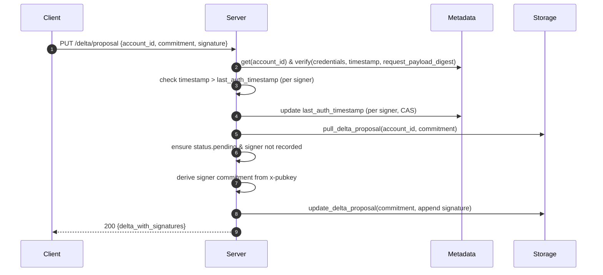
```mermaid
sequenceDiagram
  autonumber
  participant C as Client
  participant S as Server
  participant M as Metadata
  participant ST as Storage
  C->>S: PUT /delta/proposal {account_id, commitment, signature}
  S->>M: get(account_id) & verify(credentials, timestamp, request_payload_digest)
  S->>S: check timestamp > last_auth_timestamp (per signer)
  S->>M: update last_auth_timestamp (per signer, CAS)
  S->>ST: pull_delta_proposal(account_id, commitment)
  S->>S: ensure status.pending & signer not recorded
  S->>S: derive signer commitment from x-pubkey
  S->>ST: update_delta_proposal(commitment, append signature)
  S-->>C: 200 {delta_with_signatures}
```

#### evm_accounts_and_proposals
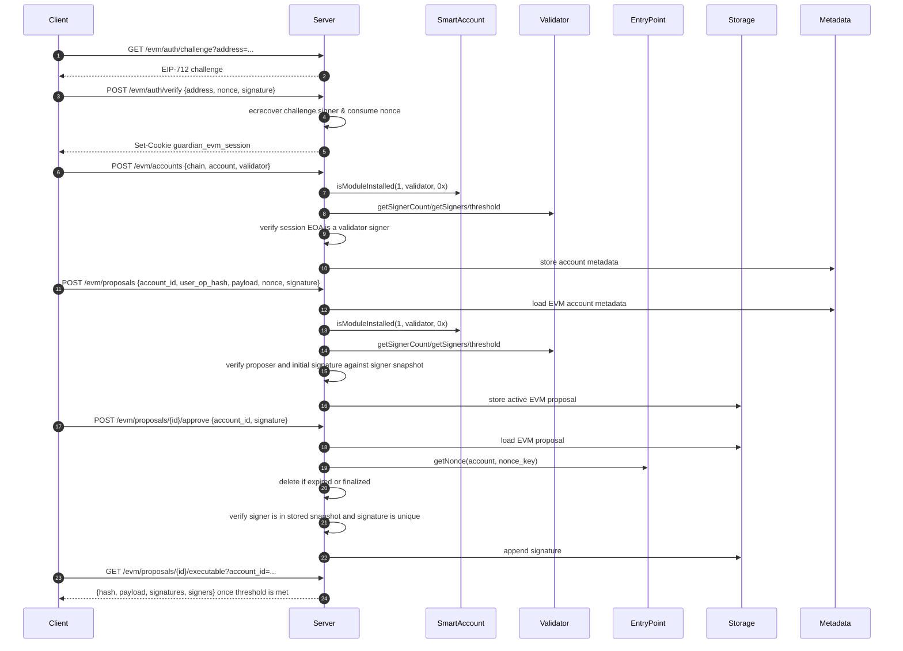
```mermaid
sequenceDiagram
  autonumber
  participant C as Client
  participant S as Server
  participant A as SmartAccount
  participant V as Validator
  participant E as EntryPoint
  participant ST as Storage
  participant M as Metadata
  C->>S: GET /evm/auth/challenge?address=...
  S-->>C: EIP-712 challenge
  C->>S: POST /evm/auth/verify {address, nonce, signature}
  S->>S: ecrecover challenge signer & consume nonce
  S-->>C: Set-Cookie guardian_evm_session
  C->>S: POST /evm/accounts {chain, account, validator}
  S->>A: isModuleInstalled(1, validator, 0x)
  S->>V: getSignerCount/getSigners/threshold
  S->>S: verify session EOA is a validator signer
  S->>M: store account metadata
  C->>S: POST /evm/proposals {account_id, user_op_hash, payload, nonce, signature}
  S->>M: load EVM account metadata
  S->>A: isModuleInstalled(1, validator, 0x)
  S->>V: getSignerCount/getSigners/threshold
  S->>S: verify proposer and initial signature against signer snapshot
  S->>ST: store active EVM proposal
  C->>S: POST /evm/proposals/{id}/approve {account_id, signature}
  S->>ST: load EVM proposal
  S->>E: getNonce(account, nonce_key)
  S->>S: delete if expired or finalized
  S->>S: verify signer is in stored snapshot and signature is unique
  S->>ST: append signature
  C->>S: GET /evm/proposals/{id}/executable?account_id=...
  S-->>C: {hash, payload, signatures, signers} once threshold is met
```

#### get_delta_proposals
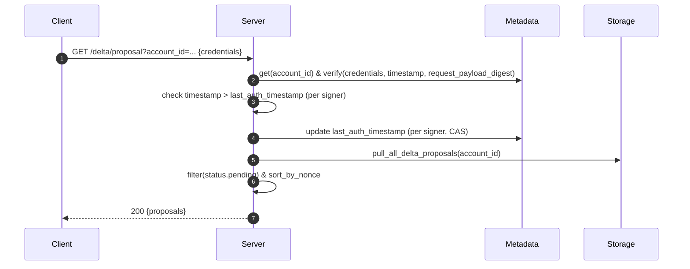
```mermaid
sequenceDiagram
  autonumber
  participant C as Client
  participant S as Server
  participant M as Metadata
  participant ST as Storage
  C->>S: GET /delta/proposal?account_id=... {credentials}
  S->>M: get(account_id) & verify(credentials, timestamp, request_payload_digest)
  S->>S: check timestamp > last_auth_timestamp (per signer)
  S->>M: update last_auth_timestamp (per signer, CAS)
  S->>ST: pull_all_delta_proposals(account_id)
  S->>S: filter(status.pending) & sort_by_nonce
  S-->>C: 200 {proposals}
```

## Canonicalization

### Modes
- Candidate mode (enabled): `push_delta` stores deltas as `candidate`; a background worker promotes or discards them after verification.
- Optimistic mode (disabled): `push_delta` marks deltas as `canonical` immediately and updates state.

### Configuration
- Shipped server builder configuration: submission_grace_period_seconds = 600
  (10m), check_interval_seconds = 10, fast_promotion_enabled = true,
  fast_promotion_interval_seconds = 3,
  fast_promotion_window_seconds = 30, max_retries = 48,
  divergence_confirmations = 2, max_concurrent_accounts = 10,
  retained_ttl_seconds = 86400 (24h; 0 disables retention and restores
  the historical delete-on-give-up behavior),
  reconcile_interval_seconds = 60, reconcile_page_size = 100.
- These values are configured in code, not through server env vars. The
  exceptions are `GUARDIAN_CANONICALIZATION_FAST_PROMOTION_ENABLED=false`,
  which disables the promotion-only pass,
  `GUARDIAN_CANONICALIZATION_MAX_CONCURRENT_ACCOUNTS`, which overrides account
  concurrency at startup, `GUARDIAN_CANONICALIZATION_RETAINED_TTL_SECONDS`,
  which overrides the retained TTL (`0` is the runtime kill switch for
  retention), and `GUARDIAN_CANONICALIZATION_RECONCILE_INTERVAL_SECONDS`,
  which overrides the reconcile pass cadence.

### Worker Behavior
- A full pass runs every `check_interval_seconds` and owns all retry,
  divergence, and discard decisions.
- Between full passes, a promotion-only pass runs every
  `fast_promotion_interval_seconds` for candidates younger than
  `fast_promotion_window_seconds`. It scans candidates directly in storage in
  bounded, oldest-first pages, carrying a cursor across passes so bursts are
  visited fairly. The pass stops admitting new work when its next cadence tick
  or the next full-pass tick is due; already-started candidate work finishes.
  It first compares each stored `new_commitment` with the chain and reconstructs
  state only after that cheap probe matches. Promotion still requires the
  reconstructed commitment to equal the claimed commitment before the normal
  auth refresh and fenced write. Missing, incorrect, or not-yet-landed claims
  are left unchanged for the next full pass.
- The fast pass never increments `retry_count` or `divergence_count`, applies
  `submission_grace_period_seconds`, or discards a candidate. Those behaviors
  belong exclusively to full passes. Both pass types use
  `max_concurrent_accounts`; candidates within one account remain sequential.
- For each account with a pending candidate:
  - Pull candidate deltas (`pull_candidate_deltas`, a store-side status
    filter — canonical and discarded history rows never leave the store);
    process in nonce order.
  - Apply delta locally to compute expected state and commitment.
  - Fetch the on-chain commitment and classify:
    - Matches the expected new commitment: canonicalize —
      persist new state (atomic with delta status update when possible),
      optionally update auth from chain via `should_update_auth`, set delta
      status to `canonical`, and delete the matching Miden delta proposal
      identified via `delta_proposal_id(account_id, nonce, delta_payload)`.
      The persisted commitment is the recomputed one the verification
      proved on-chain; a client-supplied `new_commitment` that differs (or
      is absent) is logged and counted but never blocks promotion.
      Promotion is additionally gated on the stored state still sitting at
      the candidate's `prev_commitment` — if a concurrent write moved it,
      the promotion rolls back (`stale_base`) and the next tick
      re-verifies against the new base.
    - Matches the candidate's `prev_commitment` (its transaction has not
      landed yet), or the comparison itself failed (RPC error): defer within
      `submission_grace_period_seconds`, then consume retry budget on each
      full-pass tick. After `max_retries` the candidate is parked as
      `retained` with reason `retry_exhausted` (issue #345) — not deleted —
      the account's pending-candidate flag is cleared, and the matching
      proposal is deleted (the delta row carries everything reconciliation
      needs; a proposal left `pending` would be stranded forever the moment
      a resubmission supersedes the retained row).
    - Matches the candidate's `prev_commitment` AND the candidate carries a
      client abandon intent (`abandon_requested_at`, recorded by
      `POST /delta/candidate/abandon`): count the observation toward the
      abandon quarantine instead — this takes precedence over the grace
      deferral. After `abandon_quarantine_checks` consecutive at-base
      observations (default 2) AND `abandon_quarantine_seconds` since the
      request (default 15, so a late-landing transaction can surface),
      delete the matching proposal, transition the delta to
      `discarded` with reason `client_abandoned` (preserved as history),
      and clear the pending-candidate flag. A divergent observation resets
      the abandon-confirmation streak; a landed transaction always wins
      and canonicalizes normally.
    - Matches neither — the account appears to have advanced past the
      candidate's base state: after `divergence_confirmations` consecutive
      such observations (default 2, to tolerate a single stale RPC read),
      bypass the grace period and park the candidate as `retained` with
      reason `diverged` (issue #345), clearing the account's
      pending-candidate flag so new proposals stop returning
      `409 conflict_pending_delta`. Retention (rather than deletion)
      matters because a diverged verdict is an observation, not proof —
      a lagging RPC node can produce one for a transaction that landed.
      With `retained_ttl_seconds = 0` the historical behavior applies:
      delete the delta and its matching proposal.
- Recoverable deltas — `retained` rows, plus
  `discarded { client_abandoned }` rows no older than
  `retained_ttl_seconds` (the abandon quarantine cannot fully rule out a
  late-landing transaction; one that lands after the abandon finalizes
  leaves stored state behind chain, and the preserved row holds
  everything needed to recover) — are swept by a dedicated reconcile
  pass, never by the full pass. It runs every
  `reconcile_interval_seconds` (default 60), visits at most
  `reconcile_page_size` accounts per pass under a rotation cursor
  (a backlog larger than one page drains breadth-first across passes),
  and stops admitting work at the next full-pass tick, so
  reconciliation can never delay ordinary candidate processing. Per
  visited account, in order:
  - Skip the account entirely while it has an in-flight candidate
    (reconciliation never runs under a pending candidate — promoting
    would move the stored base out from under a signed proposal).
  - Drop any retained delta older than `retained_ttl_seconds` before
    any network work. Expired client-abandoned rows are merely dropped
    from the scan — they are preserved history, never deleted.
  - Back off aged rows: for its first 15 minutes a recoverable row is
    reconsidered on every reconcile tick; after that the spacing doubles
    per 15 minutes of age, capped at 10 minutes. The schedule is derived
    purely from the row's age (no persisted cursor), so it survives
    restarts and lease failover and every replica computes the same
    answer.
  - Retry proposal cleanup for retained rows whose matching proposal
    could not be deleted at retain time.
  - Probe the chain once against the stored state commitment. A match
    (or an absent on-chain account) means nothing recoverable can have
    landed — the pass stops there, with no state reconstruction at all.
  - Only when the chain moved past the stored base: select the
    recoverable row whose submission-computed `new_commitment` equals
    the observed on-chain commitment (rows without a stored hint fall
    back to reconstruct-and-compare), reconstruct that path from the
    stored base — reconstruction remains mandatory, the hint alone never
    promotes — and require the recomputed commitment to equal the
    observed one before the same fenced promotion the candidate pass
    uses (auto-recovering an account whose stored state fell behind the
    chain). Anything else waits for a later tick — the TTL is the only
    bound.
  - A new candidate submission at a retained or client-abandoned delta's
    nonce supersedes (deletes) that row inside the submission
    transaction — without the abandoned-row supersede, the resubmission
    the abandon endpoint exists to enable would be refused forever at
    the nonce's unique constraint. Deltas are unique per
    `(account_id, nonce)` and admission requires chaining from the
    current canonical head, so same-nonce supersede is the only
    replacement path; a retained row orphaned by an out-of-band base
    move (e.g. `configure`) can never promote — the base gate rules it
    out — and ages out through the TTL.

- Release on guardian switch, push path (issue #305): when a delta
  commits (optimistic mode) or canonicalizes (candidate mode) and the
  resulting state's guardian public key commitment differs from this
  server's ack key, the account is released (`released_at` set,
  `accounts.release` audit row with `detected_by: delta`). Switches that
  never reach the push path are covered by the release sweep, a separate
  background task described below.

EVM proposals are not processed by Miden canonicalization. They are stored in the EVM proposal store and deleted lazily when expired or when the configured EntryPoint nonce indicates finality.

#### Canonicalization worker (diagram)
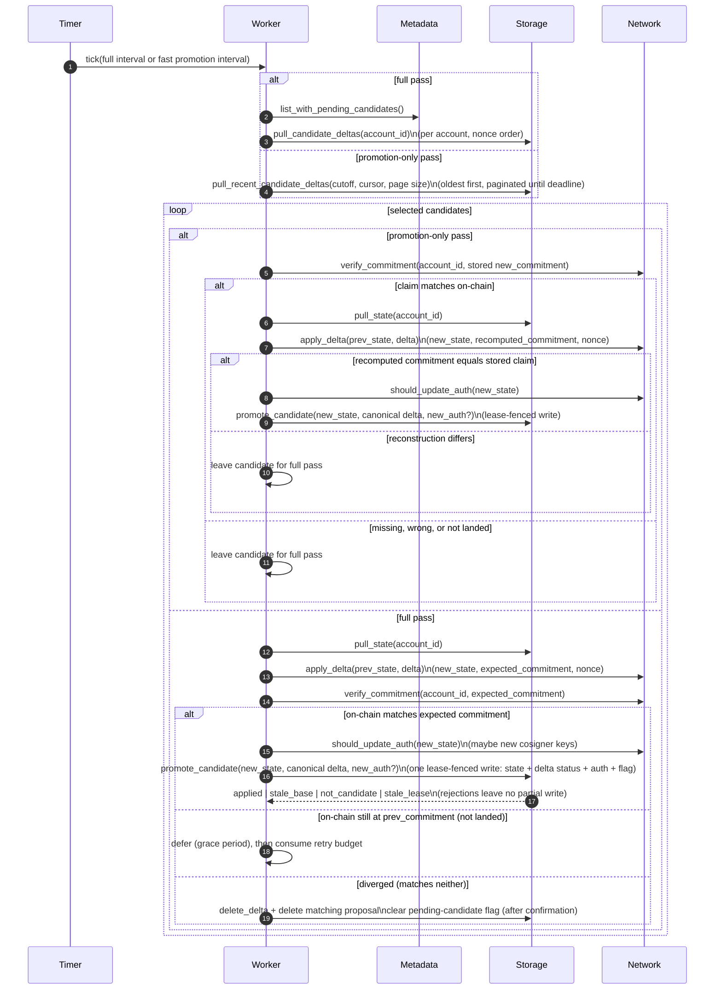
```mermaid
sequenceDiagram
  autonumber
  participant T as Timer
  participant W as Worker
  participant M as Metadata
  participant ST as Storage
  participant N as Network
  T->>W: tick(full interval or fast promotion interval)
  alt full pass
    W->>M: list_with_pending_candidates()
    W->>ST: pull_candidate_deltas(account_id)\n(per account, nonce order)
  else promotion-only pass
    W->>ST: pull_recent_candidate_deltas(cutoff, cursor, page size)\n(oldest first, paginated until deadline)
  end
  loop selected candidates
    alt promotion-only pass
      W->>N: verify_commitment(account_id, stored new_commitment)
      alt claim matches on-chain
        W->>ST: pull_state(account_id)
        W->>N: apply_delta(prev_state, delta)\n(new_state, recomputed_commitment, nonce)
        alt recomputed commitment equals stored claim
          W->>N: should_update_auth(new_state)
          W->>ST: promote_candidate(new_state, canonical delta, new_auth?)\n(lease-fenced write)
        else reconstruction differs
          W->>W: leave candidate for full pass
        end
      else missing, wrong, or not landed
        W->>W: leave candidate for full pass
      end
    else full pass
      W->>ST: pull_state(account_id)
      W->>N: apply_delta(prev_state, delta)\n(new_state, expected_commitment, nonce)
      W->>N: verify_commitment(account_id, expected_commitment)
      alt on-chain matches expected commitment
        W->>N: should_update_auth(new_state)\n(maybe new cosigner keys)
        W->>ST: promote_candidate(new_state, canonical delta, new_auth?)\n(one lease-fenced write: state + delta status + auth + flag)
        ST-->>W: applied | stale_base | not_candidate | stale_lease\n(rejections leave no partial write)
      else on-chain still at prev_commitment (not landed)
        W->>W: defer (grace period), then consume retry budget
      else diverged (matches neither)
        W->>ST: delete_delta + delete matching proposal\nclear pending-candidate flag (after confirmation)
      end
    end
  end
```

### State Machine
- candidate -> canonical | retained | discarded; retained -> canonical
  (reconciled) | superseded (deleted by a new submission at its nonce) |
  dropped (TTL expiry); discarded{client_abandoned} -> canonical
  (late-landing reconcile, within the TTL) | superseded (new submission
  at its nonce). Discarded deltas MUST NOT be returned by default APIs.

### Failure Handling
- Transient failures SHOULD be retried with backoff. Malformed candidates SHOULD be quarantined with logs/metrics.

### Concurrency
- Processing SHOULD be per-account sequential; multi-account processing MAY be parallel with bounded concurrency.
- The server processes accounts with bounded concurrency
  (`max_concurrent_accounts`, default 10); candidates within one account
  remain strictly sequential in nonce order, and every custody write is
  individually lease-fenced, so correctness does not depend on the bound.

## Guardian execution

A cosigner can hand a threshold-met, Guardian-executable proposal to Guardian, which proves,
submits and commits it. The request returns at once; everything from step 1 on runs in the
background under a per-account reservation held by a renewed, fenced lease.

### Refusals before anything is reserved
Guardian refuses synchronously, creating nothing, when the server offers no execution
(`GUARDIAN_PROVING_UNAVAILABLE`), the account is paused or released, another execution holds the
account (`GUARDIAN_EXECUTION_CONFLICT`), the proposal stores no request
(`GUARDIAN_PROPOSAL_MISSING_TRANSACTION_REQUEST`), a client candidate is pending, or the valid,
distinct cosigner signatures fall short of the effective per-procedure threshold
(`GUARDIAN_PROPOSAL_NOT_READY`).

### The fourteen steps
1. Select the valid, distinct, currently registered cosigner signatures; invalid ones are
   ignored and counted.
2. Verify the stored envelope, decode the request, and check it is Guardian-executable: it
   declares the summary's bound block, carries its auth arguments with their preimage, the
   summary binds an approval expiration, and every consumed note is pinned. Stop if the chain
   tip is already at or past the approval expiration.
3. Take the chain tip as the reference block `R` and build the chain view at `R`, tracking the
   bound block and every authenticated note's creation block.
4. Reproduce the transaction unsigned at `R` and confirm it yields the signed summary.
5. Issue Guardian's acknowledgment through the internal path, which stores no candidate.
6. Attach the cosigner signatures and the acknowledgment.
7. Execute the authorized transaction at `R`, loading public foreign accounts at `R`.
8. Re-check the executed notes against the summary and that the transaction has not expired.
9. Prove through the remote prover, retrying transient failures with capped backoff until
   the transaction's expiration.
10. Seal the transaction inputs to the validator encryption key after verifying its
    attestations.
11. Re-check that the account is still at the proposal's base, active, and guarded by this
    Guardian, and that the proven expiration is within the configured horizon.
12. **The no-retry boundary.** In one storage write, admit the candidate delta and record the
    submission evidence (transaction id, expected commitment, expiration block). Nothing after
    this point is proved or sent again.
13. Re-validate the fence; a worker that lost ownership sends nothing.
14. Send the sealed, proven transaction once.

A failure before step 12 records a `failed` outcome with its code and releases the account;
the proposal stays executable. A definite rejection at step 14 discards the candidate and
deletes the proposal. An unknown outcome leaves the execution `submitted`.

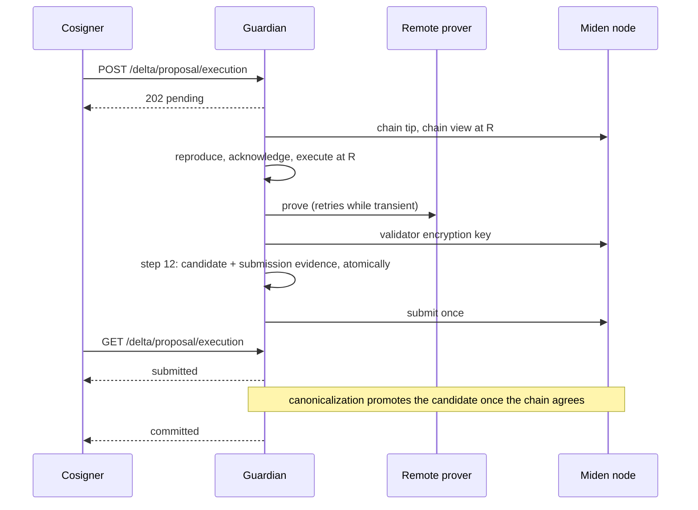
```mermaid
sequenceDiagram
    participant C as Cosigner
    participant G as Guardian
    participant P as Remote prover
    participant N as Miden node
    C->>G: POST /delta/proposal/execution
    G-->>C: 202 pending
    G->>N: chain tip, chain view at R
    G->>G: reproduce, acknowledge, execute at R
    G->>P: prove (retries while transient)
    G->>N: validator encryption key
    G->>G: step 12: candidate + submission evidence, atomically
    G->>N: submit once
    C->>G: GET /delta/proposal/execution
    G-->>C: submitted
    Note over G,N: canonicalization promotes the candidate once the chain agrees
    G-->>C: committed
```

### Reconciliation
Only promotion writes `committed`. When a worker's lease lapses, the reconciler takes the
reservation over by compare-and-set on its fence. Before the boundary it fails the attempt
(`GUARDIAN_EXECUTION_LEASE_EXPIRED`, or `GUARDIAN_EXECUTION_ABANDONED` on the first pass after a
restart). After it, it settles only from the chain:

- the account at the expected commitment: wait for promotion, write nothing;
- still at the base with the chain strictly past the expiration block: `GUARDIAN_EXECUTION_EXPIRED`;
- anywhere else: `GUARDIAN_EXECUTION_CANDIDATE_DISCARDED`;
- the chain unobservable: keep the reservation and try again next pass. Elapsed time never
  settles an execution.

A client `push_delta` is refused with `GUARDIAN_EXECUTION_CONFLICT` while a reservation is
active, and canonicalization never discards a candidate an execution owns.

## Release sweep

A background task (issue #434), independent of the canonicalization
worker, that recognises guardian switches whose `SwitchGuardian` delta
never reached this server — the offline switch path, a failed
best-effort push, a client predating the push, a switch executed while
this server was unreachable — and releases the account exactly as the
push-path hook does. It also writes a push-path release whose own write
failed. Release detection is not latency-sensitive (an undetected switch
costs stale reads and dead pending proposals, never funds or custody),
so the sweep is deliberately slow and rate-bounded.

### Configuration
- Shipped defaults: `enabled = true`, `rotation_seconds = 21600` (6 h),
  `max_rate_per_second = 5`, `page_size = 100`, `recheck_seconds = 60`,
  `confirmations = 2`. Every value has a `GUARDIAN_RELEASE_SWEEP_*` env
  override (see `docs/CONFIGURATION.md` for the bounds);
  `GUARDIAN_RELEASE_SWEEP_ENABLED=false` is the runtime kill switch.
- One replica holds the `release_sweep` lease (its own single-owner
  lease, renewed every 10 s with a 30 s TTL). A lost lease stops the
  loop; a panic in it stops the renewal too, so the lease expires and
  another replica takes over.

### Behavior
- **One paced loop.** The holder visits one account per turn: the next
  account of the rotation, or a due confirmation re-check. When both are
  due they take turns, and two visits are never closer than
  `1 / max_rate_per_second` whatever their kind, so neither can starve
  the other and together they never exceed the rate.
- **Rotation.** The walk covers every unreleased Miden account with no
  candidate in flight (the store filters both; the push path owns busy
  accounts) in `account_id` order, paced so it spreads over
  `rotation_seconds`: spacing = rotation / fleet size, recounted on every
  page refill, never below the rate floor. The cursor advances per
  visited account, so a slow node or a failed listing never skips
  accounts. A completed walk idles until `rotation_seconds` after it
  started; a fleet too large for one rotation at the rate bound simply
  takes longer. A rotation in which some accounts could not be checked
  (a failed visit, or a chain read deferred to a later visit) ends as
  `partial` rather than `completed`. Each visit reads the account's
  metadata row by id, never from the (possibly hours old) page.
- **Replica-local state.** The cursor, the confirmation streaks, the
  cached candidate post-states and history-search positions live in the
  lease holder's memory. A new holder (failover or restart) starts a
  fresh rotation and fresh streaks, which only delays a release.
- **Per visit**, cheapest first:
  1. Probe the chain once against the stored state commitment (the
     commitment alone is read from storage, without decrypting the
     state). An absent on-chain account has nothing to release.
  2. **The stored state itself**, whenever the account is on chain
     (parsed once per stored commitment). Its guardian key is this
     server's (as `/configure` validated) unless a promoted delta moved
     it and that delta's push-path release was never written, or this
     server's own ack key changed since. When it is not this server's,
     the newest canonical delta decides: if it produced the stored state
     and its ack signature verifies against this server's current key
     (the signature itself is checked, which every storage backend
     keeps), it was that switch, and the account is released with the
     evidence the push path would have written (`detected_by: delta`),
     however far the chain has moved since. Otherwise nothing is
     released: when the chain holds the stored state the account is
     reported as `own_key_mismatch`; when it moved on, the detectors
     below decide.
  3. **Chain moved past the stored base: candidate match.** Every
     pending proposal (whatever its label: the post-state's guardian key
     decides, not the client-written type) and every recoverable delta
     (`retained`, or `discarded { client_abandoned }` within
     `retained_ttl_seconds`) that chains from the stored base is applied
     to the stored state (the same `apply_delta` canonicalization uses;
     computed once per candidate and base, failures included). The
     resulting commitment is looked for on chain: first at the head
     (free: the probe already read it), then — for post-states that move
     the guardian key away — in the account's transaction history
     (`SyncTransactions`, from genesis the first time, then resuming
     after the last searched block). Transaction headers are public for
     every account and never pruned, and only the **final** state
     commitment is compared (a new account's first transaction records
     an empty initial commitment). An exact commitment proves that
     candidate executed — a lagging node cannot invent it — so the
     account is released at once with `detected_by: proposal_match` (the
     proposal id) or `recoverable_delta` (the delta nonce) and, when
     found in the history, the block of the switch transaction. Once the
     release is persisted an executed proposal is finalized (deleted)
     like a proposal whose delta canonicalized; a failed write leaves it
     for the next visit. A recoverable delta row is left to the
     reconcile pass and its TTL. This needs no published storage, so it
     covers **private** accounts, including accounts that transacted
     again under the new guardian. If the history cannot be read the
     visit falls through to the storage read, and an account whose
     storage is private is deferred (`probe_failed`) rather than reported
     opaque.
  4. **Storage read**: the guardian public key map from the account's
     **published** on-chain storage (`GetAccount` with storage-map
     details), with the observed state's nonce and the block the node
     answered at. Private accounts publish no storage; for them the sweep
     records that it cannot tell (`storage_opaque`) rather than guessing.
     A storage read at the stored commitment contradicts the probe (one
     of the two reads lagged) and is no observation. A read of a state
     whose nonce is below the stored state's is not the chain moving on
     (the stored state has not landed yet, for example just re-onboarded
     after a switch back, or the node lags) and is never evidence
     (`chain_behind_stored`). A foreign key must be observed
     `confirmations` times, each at a strictly later block: the rotation
     visit is the first, and the account is re-checked every
     `recheck_seconds` until the key is confirmed or the streak closes.
     It is then released with `detected_by: chain_sweep` and the
     `on_chain_commitment` / `stored_commitment` pair.
  - **What counts as a switch.** A guardian key found on chain (or in an
    executed candidate's post-state) is foreign only when it is neither
    this server's current key nor the stored base's. In normal operation
    the two are the same key. A server whose own ack key changed (a new
    ack secret, or the ephemeral keys a non-prod server generates on
    every boot) sees its accounts still bound to the previous key:
    `own_key_mismatch`, a warning, never a release. A key equal to this
    server's is `still_bound` (the stored state lags the chain, issue
    #345 territory); no key at all is `no_binding`.
  - Every release write is conditional on the stored state still being
    the one the evidence was proved against, atomically with that check
    (Postgres: one transaction under the metadata row lock; filesystem:
    under the metadata store's lock). `/configure` clears a release the
    same way after storing a re-onboarded state, for every existing
    account, so a re-onboarding racing a release never ends up released,
    while a release of a later state (a switch delta that replaced the
    re-onboarded one) stands. The stored state itself is left as is;
    reads keep serving the last state this server verified.
  - The sweep ignores `paused_at` like the canonicalization passes:
    pause gates client mutations, the sweep records chain truth.
- The one transaction a guarded multisig executes without this server's
  signature is the guardian key rotation, so "chain moved past the
  stored base" is either that rotation or an acknowledged delta whose
  promotion never caught up; only the detectors above tell them apart,
  and the sweep never infers a switch from a commitment mismatch alone.
